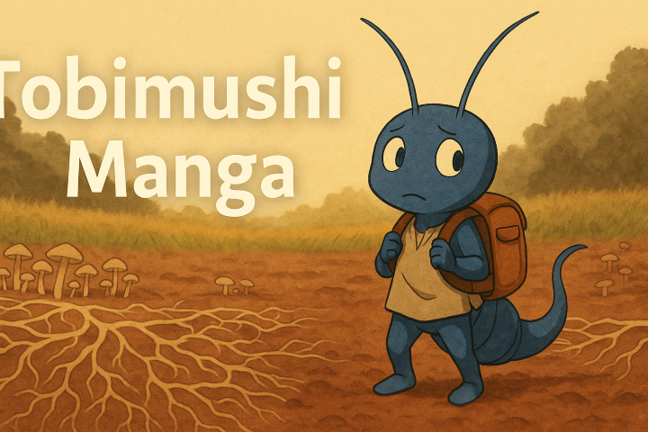
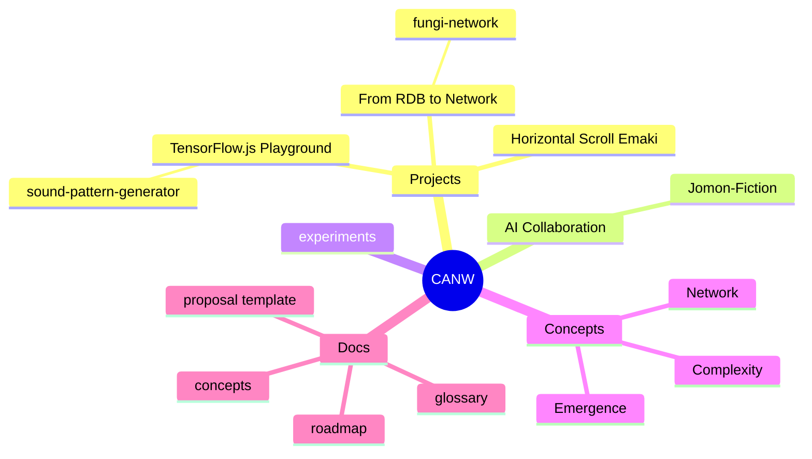

# CANW (Complexity And Network Webdesign)

CANW is an open-source project exploring "Complexity and Network Webdesign."

In the AI era, our mission is to authentically express complexity through web design, embracing biological, cultural, and emergent aspects.

## 🔑 Keywords
- Biological
- Cultural
- Emergent

## 🧭 Explore the CANW Ecosystem

### 📂 Subprojects

- [🤖 TensorFlow.js Playground](./projects/tensorflowjs-playground/README.md)  
  Play with machine learning in the browser and explore interactive AI demos.

    - [🎼 Sound Pattern Generator (MVP)](./projects/tensorflowjs-playground/sound-pattern-generator/README.md)  
   An interactive experiment to generate simple musical patterns and learn user preferences using TensorFlow.js.  

- [🌐 From RDB to Network](./projects/from-rdb-to-network/README.md)  
  A journey from structured datasets to emergent network visualizations.

  - [🍄 Fungi Network Visualizer (MVP)](./projects/from-rdb-to-network/fungi-network/README.md)  
    A minimal prototype showing how mycelial networks can be visualized from CSV data using Python + NetworkX.

  - [⛩ Shrine Network Visualizer (MVP)](./projects/from-rdb-to-network/shrine-network/README.md)  
  A cultural network prototype connecting shrines and deities based on shared worship and spatial logic.

  - [🐜 Soil Fauna Network Visualizer (MVP)](./projects/from-rdb-to-network/soil-fauna-network/README.md)  
      An ecological network prototype modeling species interactions in the soil using relational CSV and NetworkX.

- [📜 Horizontal Scroll Emaki](./projects/horizontal-scroll-emaki/README.md)  
  A web experience for enjoying picture scrolls and panoramic storytelling through side-scrolling UI.

### 🔬 Experimental Areas
- [🧪 Experiments](./experiments/README.md)

## 🤖 AI Collaboration / AI 協働層

Creative subprojects that use generative AI tools to support worldbuilding, storytelling, and visualization.  
生成 AI を活用して世界観構築・物語生成・視覚化を支援する創造的サブプロジェクト群。

### 📘 [Jomon Fiction](./ai-collaboration/Jomon-Fiction/)

Exploring the Jomon world through AI-assisted storytelling, networks, and landscape.  
AI 支援による物語・ネットワーク・地形思考で縄文世界を再構成。

### 🦠 [Tobimushi Manga](./ai-collaboration/tobimushi-manga/)

A sci-fi manga exploring soil ecology and silent mycorrhizal networks via AI-human collaboration.  
土壌生態と菌糸ネットワークを舞台に、AI と人間の協働で生まれた SF マンガ。

### 🖼️ Media & Visuals
- [📷 Media Library](./media/README.md)

### 🌐 Website
- Visit the official CANW web hub: [https://complexity-and-network-webdesign.vercel.app/](https://complexity-and-network-webdesign.vercel.app/)
- [📘 CANW Web Site](./site/README.md) — Learn how to build and contribute to the official site

## 🧠 CANW at a Glance (Mindmap)

Here’s a quick overview of the project ecosystem:

> This mindmap captures the emergent, multi-layered, and interdisciplinary nature of CANW.

## 🧭 Project Roadmap Overview

| Phase        | Period            | Goals (Highlights)                                              | Status     |
|--------------|------------------|------------------------------------------------------------------|------------|
| **Phase 1**  | Now → Q2 2025     | Launch GitHub, write docs, build initial site and MVP drafts    | ✅ Active   |
| **Phase 2**  | Q3 2025 → Q1 2026 | Build working demos (Emaki, Network, AI), community blog, refine UI | 🔜 Planned  |
| **Phase 3**  | 2026 and beyond   | Global scroll narratives, emergent frameworks, AI co-creation    | 🌌 Vision   |

📖 Full roadmap: [docs/roadmap.md](./docs/roadmap.md)

## 🌟 Contributors Welcome!
CANW is just beginning — full of possibilities, creative room, and emergent collaboration.
Whether you're into data, design, storytelling, or system thinking, we welcome you to co-create with us.

### 🆕 Propose a New Project

Have an idea you want to grow?
- ✏️ Start with our [Project Proposal Template](./docs/new_project_propesal/new_project_propesal.md)
- 🌿 Explore a live example: [Mycelium Network Mapper](./docs/new_project_propesal/sample/mycelium-network-mapper.md)
- 💬 Ready to share? Post your idea to our [💡 Proposals Discussions](https://github.com/satoshi-create/complexity-and-network-webdesign/discussions/categories/-proposals)

Your idea doesn't have to be polished — sketches, seeds, and half-formed thoughts are welcome.
We grow ideas together here.

### ✍️ Other Ways to Contribute

- 📌 Suggest new directions via [Issues](https://github.com/satoshi-create/complexity-and-network-webdesign/issues)
- 🧪 Collaborate on prototypes and experiments
- 📚 Help refine the [docs](./docs/README.md), glossary, or roadmap
- 🎨 Bring your perspective to designs, maps, or storytelling

> 🌱 Ready to co-create a web that expresses the complex as complex? Let's begin!

Thanks to all the contributors who help make CANW grow! 🌱

> 🚀 This list is still small — but growing.  
> Your ideas, your code, your curiosity are all welcome here.

---

## 📘 Learn More in the Wiki

Want to explore the philosophy, structure, and ecosystem behind CANW?

📖 [What is CANW?](https://github.com/satoshi-create/complexity-and-network-webdesign/wiki/What-is-CANW%3F)  

The Wiki is our evolving knowledge base — from conceptual roots to contribution guides.

## 📖 Documentation
- [CONTRIBUTING.md](./CONTRIBUTING.md) - Contribution guidelines
- [CODE_OF_CONDUCT.md](./CODE_OF_CONDUCT.md) - Community code of conduct

## 📜 License
This project is licensed under the MIT License.

## 🌐 SNS
Stay updated and join discussions by following CANW on social media. Let's collaboratively grow this emergent project!

