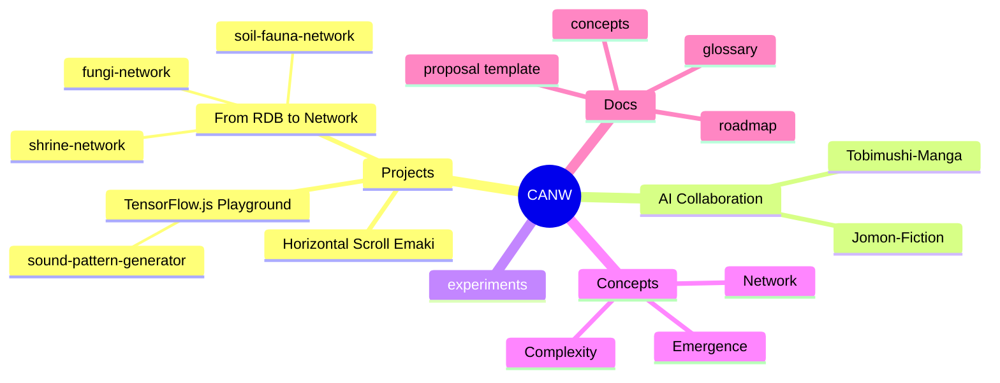

# CANW - Complexity And Network Webdesign

📘 Read this in other languages:

- [🇯🇵 日本語](./README.ja.md)

CANW is an open-source project exploring "Complexity and Network Webdesign."
In the AI era, our mission is to authentically express complexity through web design, embracing biological, cultural, and emergent aspects.

## 🔑 Keywords

- Biological
- Cultural
- Emergent

## 🧭 Explore the CANW Ecosystem

### 📂 Subprojects

- [🤖 TensorFlow.js Playground](./projects/tensorflowjs-playground/README.md)
  - [🎼 Sound Pattern Generator (MVP)](./projects/tensorflowjs-playground/sound-pattern-generator/README.md)
- [🌐 From RDB to Network](./projects/from-rdb-to-network/README.md)
  - [🍄 Fungi Network Visualizer (MVP)](./projects/from-rdb-to-network/fungi-network/README.md)
  - [⛩ Shrine Network Visualizer (MVP)](./projects/from-rdb-to-network/shrine-network/README.md)
  - [🐜 Soil Fauna Network Visualizer (MVP)](./projects/from-rdb-to-network/soil-fauna-network/README.md)
- [📜 Horizontal Scroll Emaki](./projects/horizontal-scroll-emaki/README.md)

### 🔬 Experimental Areas

- [🧪 Experiments](./experiments/README.md)

### 🤖 AI Collaboration

Creative subprojects that use generative AI tools to support worldbuilding, storytelling, and visualization.

#### 📘 [Jomon Fiction](./ai-collaboration/Jomon-Fiction/)

#### 🦠 [Tobimushi Manga](./ai-collaboration/tobimushi-manga/)

### 🖼️ Media & Visuals

- [📷 Media Library](./media/README.md)

### 🌐 Website

- [Official CANW Website](https://complexity-and-network-webdesign.vercel.app/)
- [📘 CANW Web Site Guide](./site/README.md)

---

## 🧠 CANW at a Glance (Mindmap)

---

## 🧭 Project Roadmap Overview

| Phase   | Period          | Goals                                       | Status     |
| ------- | --------------- | ------------------------------------------- | ---------- |
| Phase 1 | Now → Q2 2025   | Launch GitHub, write docs, MVP drafts       | ✅ Active  |
| Phase 2 | Q3 2025 → Q1 26 | Build demos (Emaki, Network, AI), refine UI | 🔜 Planned |
| Phase 3 | 2026 and beyond | Scroll narratives, emergent frameworks, AI  | 🌌 Vision  |

📖 Full roadmap: [docs/roadmap.md](./docs/roadmap.md)

---

## 🌟 Contributors Welcome!

CANW is just beginning — full of possibilities, creative room, and emergent collaboration.
Whether you're into data, design, storytelling, or system thinking, we welcome you to co-create with us.

---

### 🆕 Propose a New Project

- ✏️ [Project Proposal Template](./docs/new_project_propesal/new_project_propesal.md)
- 🌿 [Mycelium Network Mapper Sample](./docs/new_project_propesal/sample/mycelium-network-mapper.md)
- 💬 Proposals Discussion: [💡 Proposals](https://github.com/satoshi-create/complexity-and-network-webdesign/discussions/categories/-proposals)

---

### ✍️ Other Ways to Contribute

- 📌 Propose directions via [Issues](https://github.com/satoshi-create/complexity-and-network-webdesign/issues)
- 🧪 Join prototypes and experiments
- 📚 Help improve [docs](./docs/README.md), glossary, roadmap
- 🎨 Contribute via design, maps, storytelling

Thanks to all the contributors! 🌱

---

## 📘 Learn More in the Wiki

- [What is CANW?](https://github.com/satoshi-create/complexity-and-network-webdesign/wiki/What-is-CANW%3F)

---

## 📖 Documentation

- [CONTRIBUTING.md](./CONTRIBUTING.md)
- [CODE_OF_CONDUCT.md](./CODE_OF_CONDUCT.md)

---

## 📜 License

MIT License

---

## 🌐 Social Media

Stay updated and join the discussion — Let’s grow this emergent project together!
