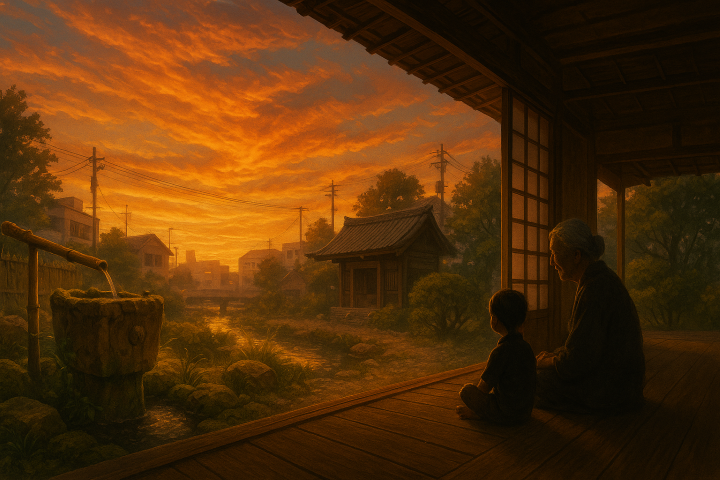
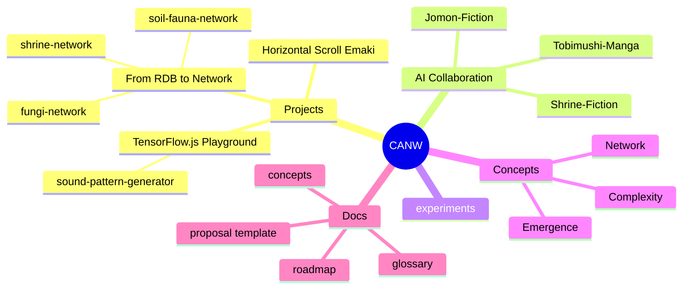

  

<h1 align="center">CANW - 複雑系とネットワークのウェブデザイン</h1>

📘 他の言語で読む:

- [🇺🇸 English](./README.md)

CANW は「複雑なことを複雑なままに表現する」ウェブデザインを探求するオープンソースプロジェクトです。
AI 時代にふさわしい、生命的・文化的・創発的な複雑性の表現を目指します。

## 🔑 キーワード

- 生命的
- 文化的
- 創発的

## 🧭 CANW のエコシステムを探る

### 📂 サブプロジェクト

- [🤖 TensorFlow.js Playground](./projects/tensorflowjs-playground/README.md)
  - [🎼 Sound Pattern Generator (MVP)](./projects/tensorflowjs-playground/sound-pattern-generator/README.md)
- [🌐 From RDB to Network](./projects/from-rdb-to-network/README.md)
  - [🍄 菌類ネットワーク可視化 (MVP)](./projects/from-rdb-to-network/fungi-network/README.md)
  - [⛩ 神社ネットワーク可視化 (MVP)](./projects/from-rdb-to-network/shrine-network/README.md)
  - [🐜 土壌動物ネットワーク可視化 (MVP)](./projects/from-rdb-to-network/soil-fauna-network/README.md)
- [📜 横スクロール絵巻](./projects/horizontal-scroll-emaki/README.md)

### 🔬 実験エリア

- [🧪 実験一覧](./experiments/README.md)

### 🤖 AI 協働層

生成 AI ツールを活用し、世界観構築・物語生成・視覚化を支援する創造的なサブプロジェクト群。
技術と創造性の架け橋として、創発的なナラティブと文化表現を育みます。

#### 📘 [Jomon Fiction](./ai-collaboration/Jomon-Fiction/)

AI 支援によって縄文時代の世界をネットワーク・地形・物語として再構成するプロジェクト。

  

#### 🦠 [Tobimushi Manga](./ai-collaboration/tobimushi-manga/)

菌糸ネットワークと土壌生態を舞台に、AI と人間の協働によって生まれた SF マンガ。

  

#### 🛕 [Shrine Fiction](./ai-collaboration/shrine-fiction/)

神社と神話のネットワークを AI 支援で可視化・生成する、霊的ナラティブの実験プロジェクト。

  

### 🖼️ メディア＆ビジュアル

- [📷 メディアライブラリ](./media/README.md)

### 🌐 ウェブサイト

- [公式 CANW サイト](https://complexity-and-network-webdesign.vercel.app/)
- [📘 サイト構築ガイド](./site/README.md)

---

## 🧠 プロジェクト概要（マインドマップ）

---

## 🧭 プロジェクトのロードマップ概要

| フェーズ   | 期間                                   | 目標（主な内容）                                            | ステータス  |
| ---------- | -------------------------------------- | ----------------------------------------------------------- | ----------- |
| フェーズ 1 | 現在〜2025 年第 2 四半期               | GitHub 開始・ドキュメント整備・初期 MVP 構築                | ✅ 実施中   |
| フェーズ 2 | 2025 年第 3 四半期〜2026 年第 1 四半期 | 実用デモ構築（絵巻・ネットワーク・AI）、UI 改良、ブログ開始 | 🔜 計画中   |
| フェーズ 3 | 2026 年以降                            | グローバルな絵巻物語・創発的フレームワーク・AI との共創     | 🌌 構想段階 |

📖 全体ロードマップ: [docs/roadmap.md](./docs/roadmap.md)

---

## 🌟 貢献者を募集中！

CANW は始まったばかり。創造と協働の余地にあふれています。
データ・デザイン・物語・システム思考——どんな視点でも大歓迎。一緒に創っていきましょう！

---

### 🆕 新しいプロジェクトを提案する

- ✏️ [プロジェクト提案テンプレート](./docs/new_project_propesal/new_project_propesal.md)
- 🌿 [Mycelium Network Mapper](./docs/new_project_propesal/sample/mycelium-network-mapper.md) の例を参考に
- 💬 [💡 提案用ディスカッション](https://github.com/satoshi-create/complexity-and-network-webdesign/discussions/categories/-proposals) に投稿

---

### ✍️ その他の貢献方法

- 📌 [Issues](https://github.com/satoshi-create/complexity-and-network-webdesign/issues) で提案や報告
- 🧪 プロトタイプや実験に参加
- 📚 [docs](./docs/README.md)、用語集、ロードマップの改善
- 🎨 デザイン・地図・ストーリーで貢献

🌱 一緒に「複雑なものを複雑なまま表現する」ウェブを育てていきましょう！

---

## 📘 詳しくは Wiki へ

- [CANW とは何か？](https://github.com/satoshi-create/complexity-and-network-webdesign/wiki/What-is-CANW%3F)

---

## 📖 ドキュメント一覧

- [CONTRIBUTING.md](./CONTRIBUTING.md) - 貢献ガイドライン
- [CODE_OF_CONDUCT.md](./CODE_OF_CONDUCT.md) - 行動規範

---

## 📜 ライセンス

このプロジェクトは MIT ライセンスで公開されています。

---

## 🌐 SNS

最新情報や対話に参加したい方は、SNS もチェックしてください！
この創発的なプロジェクトを一緒に育てましょう！
