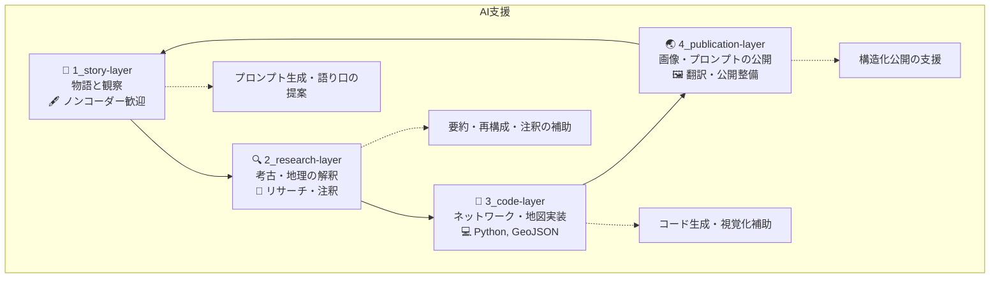

# 🤝 How to Contribute to Jomon Fiction

Jomon Fiction welcomes contributions from writers, researchers, designers, and developers. Whether you're interested in storytelling, archaeology, or visualization, your perspective enriches the project.

このプロジェクト「縄文フィクション」は、物語・調査・可視化の多層構造をもつOSSです。ストーリーに関心のある方も、技術や研究背景のある方も歓迎します！

---

## 🧭 Overview: Layered Collaboration / 多層コラボレーションの構造

各層はループ構造になっており、どの段階からでも参加可能です。

---

## ✨ You can...

| Role | Description | Skills Welcome |
|------|-------------|----------------|
| 📜 Story Contributor | 物語、キャラ、風景の執筆 | Writing / Imagination / History |
| 🔍 Research Annotator | 遺跡・地形・神話などの資料調査と解釈 | Archaeology / Geography / Mythology |
| 🧠 Visual Engineer | 地図・ネットワーク・UIの整備 | Python / NetworkX / GeoJSON / Folium |
| 🤖 AI Collaborator | プロンプト調整、画像生成、翻訳支援 | Prompt Design / Translation / Image Tools |

---

## 📂 Contribution Flow

1. リポジトリをフォークして、ブランチを作成
2. `issue` にアイデアを投稿（または既存のissueにコメント）
3. `story-layer`や`research-layer`の資料を確認
4. `pull request` を通して提案

---

## 🧵 Issue Labels / ラベル一覧

- `good first issue`: 初心者歓迎
- `story idea`: 物語ネタ
- `research`: 考古・注釈関連
- `visualization`: ネットワーク・地図・構造関連
- `translation`: 翻訳・多言語対応
- `ai-collab`: プロンプト・画像生成関連

---

## 🌍 Join Us / 参加しよう！

Jomon Fictionは、世界中の貢献者を歓迎します。GitHubだけでなく、noteやLinkedInなどの発信プラットフォームでも参加可能です。

Welcome aboard to the world of Jomon Fiction! Let’s co-create deep time stories through open-source imagination.

