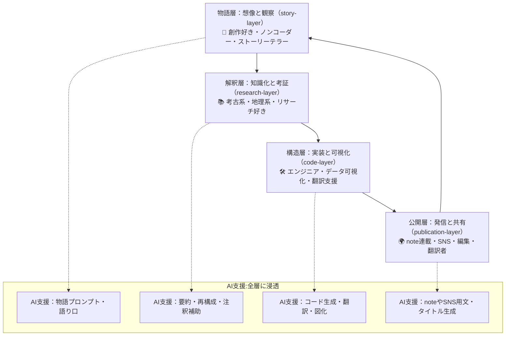

# Jomon Fiction

プロジェクト概要をここに書きます。

```mermaid
graph TD

  %% 各層の定義（役割＋コントリビュータ属性）
  S1[物語層：想像と観察（story-layer）<br>🎨 創作好き・ノンコーダー・ストーリーテラー]
  S2[解釈層：知識化と考証（research-layer）<br>📚 考古系・地理系・リサーチ好き]
  S3[構造層：実装と可視化（code-layer）<br>🛠 エンジニア・データ可視化・翻訳支援]
  S4[公開層：発信と共有（publication-layer）<br>🌍 note連載・SNS・編集・翻訳者]

  %% フロー（循環型）
  S1 --> S2 --> S3 --> S4 --> S1

  %% AI支援（層に点線で関与）
  subgraph AI支援:全層に浸透
    AI1[AI支援：物語プロンプト・語り口]
    AI2[AI支援：要約・再構成・注釈補助]
    AI3[AI支援：コード生成・翻訳・図化]
    AI4[AI支援：noteやSNS用文・タイトル生成]
  end

  S1 -.-> AI1
  S2 -.-> AI2
  S3 -.-> AI3
  S4 -.-> AI4

```
