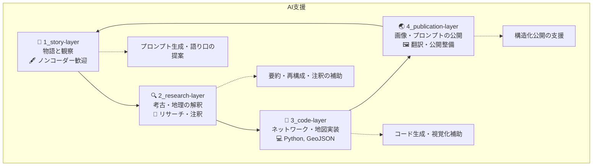

# 🌀 Jomon Fiction / 縄文フィクション

**Jomon Fiction** is a collaborative storytelling project that blends archaeology, landscape studies, and generative AI to reimagine the lives and land of the Jomon period in ancient Japan.  

このプロジェクト「縄文フィクション」は、縄文時代の人々の暮らしや風景を、考古学・ランドスケープ・AIの協助によって小説的に再構成するオープンストーリーテリングです。

---

## 🐽 Project Overview / プロジェクト概要
Jomon Fiction is envisioned as a subproject of [CANW: Complexity and Network Webdesign](https://github.com/satoshi-create/complexity-and-network-webdesign/tree/main).  
Each short story is based on hub settlements (e.g., Tadao, Aku, Shimonoya sites), and draws on a multilayered structure of narrative, terrain, and network.

Jomon Fiction は、[CANW（複雑系とネットワークのウェブデザイン）](https://github.com/satoshi-create/complexity-and-network-webdesign/tree/main) のサブプロジェクトとして構想されています。  
それぞれの短編は、拠点的集落（忠生遺跡・阿久遺跡・下野谷遺跡など）を舞台に、多層的な構造（物語／地形／ネットワーク）をもとに描かれます。

This project is built on layered components:  
このプロジェクトは以下の層で構成されています：

- `story-layer`: Narrative drafts, characters, and episode design  
  物語・キャラクター・エピソード草稿
- `research-layer`: Archaeological, geographic, and mythological research  
  考古学・地理・神話の要素調査と再構成
- `code-layer`: Network visualization and geospatial modeling (Python / GeoJSON)  
  ネットワーク可視化や地理情報構築（Python / GeoJSON）
- `publication-layer`: Structured publication of AI images, prompts, and bilingual commentary  
  AI生成画像・プロンプト・多言語解説の構造化公開

---

## 📚 Scenes / 作品一覧（MVP）

| Scene ID | Title (EN / JA) | Visual |
|----------|------------------|--------|
| `001` | The Daughter of the Magatama / 勾玉の娘 |  |

→ [📖 Read more](./4_publication-layer/scene_001_magatama/index.md)

---

## 🤖 AI Collaboration / AIとの協働

Jomon Fiction actively integrates generative AI in the creation of prompts, images, and structural design.  
本プロジェクトでは、プロンプト設計・画像生成・構造分析において生成AIの協働を積極的に活用しています。

- DALL·E: Image generation  
  DALL·E：イメージ生成
- GPT-4: Story development, translation, and geographical annotation  
  GPT-4：物語生成・翻訳・地理注釈支援
- Mermaid / NetworkX / Folium: Visualization tools  
  Mermaid / NetworkX / Folium：可視化支援

---

## 📂 Directory Structure / ディレクトリ構成

```
Jomon-Fiction/
├— story-layer/            # 小説草稿・観察・キャラ設定
├— research-layer/         # 遺跡情報・地形分析・注釈
├— code-layer/             # ネットワーク・地図可視化（Python）
├— publication-layer/      # 公開画像・プロンプト・解説
└— README.md
```

---

## 🌱 How to Contribute / 貢献するには

We welcome contributors with interest in archaeology, spatial storytelling, or networked thinking.  
考古・地形・信仰に関心のある方、ストーリーテリングやビジュアル表現が好きな方、GeoJSON, Python, Mermaid などで可視化を手伝いたい方を歓迎します。

- Interested in prehistoric cultures, Jomon archaeology, or sacred geography  
  先史文化・縄文考古・聖なる地形に関心がある方
- Passionate about digital storytelling or poetic worldbuilding  
  ストーリーテリング・詩的構築に熱意がある方
- Comfortable with open-source collaboration (GitHub, Markdown, etc.)  
  オープンソース開発（GitHub、Markdown等）に慣れている方

👉 [CONTRIBUTING.md（準備中）](./CONTRIBUTING.md)

