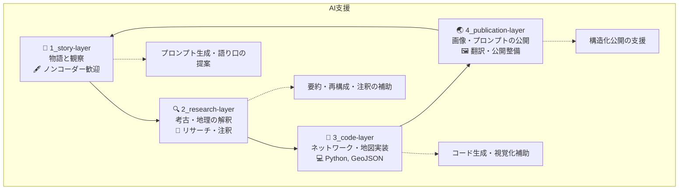

# 🌀 縄文フィクション（Jomon Fiction）

**Jomon Fiction** は、考古学・ランドスケープ・生成AIを融合し、縄文時代の人々の暮らしと風景を物語的に再構成するコラボレーション型ストーリープロジェクトです。

📘 他の言語で読む:

- [🇺🇸 English](./README.md)

---

## 🐽 プロジェクト概要

Jomon Fiction は、[CANW（複雑系とネットワークのウェブデザイン）](https://github.com/satoshi-create/complexity-and-network-webdesign/tree/main) のサブプロジェクトとして構想されています。  
各短編は、忠生・阿久・下野谷などの拠点的集落を舞台に、物語／地形／ネットワークの多層的構造によって描かれます。

プロジェクトは以下の4層で構成されています：

- `story-layer`: 物語・キャラクター・エピソード草稿
- `research-layer`: 考古学・地理・神話の調査・注釈
- `code-layer`: ネットワーク可視化・地理モデル化（Python / GeoJSON）
- `publication-layer`: AI画像・プロンプト・解説の構造化公開

---

## 📚 作品一覧（MVP）

| シーンID | タイトル | ビジュアル |
|----------|----------------------------|----------|
| `001` | 勾玉の娘 |  |

→ [📖 続きを読む](./4_publication-layer/scene_001_magatama/index.md)

---

## 🤖 AIとの協働

Jomon Fiction では、プロンプト設計、画像生成、構造整理などに生成AIを積極的に活用しています。

- DALL·E：イメージ生成
- GPT-4：物語生成、翻訳、地理注釈
- Mermaid / NetworkX / Folium：可視化ツール

---

## 📂 ディレクトリ構成

```
Jomon-Fiction/
├— story-layer/            # 小説草稿・観察・キャラクター設定
├— research-layer/         # 遺跡情報・地理・神話の注釈
├— code-layer/             # Pythonによるネットワーク・地図実装
├— publication-layer/      # AI画像・プロンプト・多言語解説
└— README.md
```



---

## 🌱 参加するには

以下のような関心・スキルを持つ方を歓迎しています：

- 縄文文化・考古学・聖なる地形に興味がある
- デジタルストーリーテリングや詩的な世界観構築が好き
- GitHubやMarkdownを使ったOSS開発に関心がある

👉 [CONTRIBUTING.md](./CONTRIBUTING.md)
