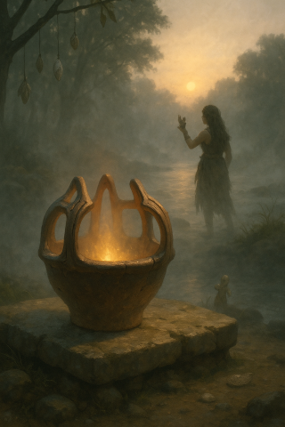
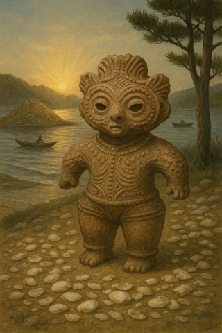

# 🌀 縄文 ZUKAN 図鑑 / Jomon ZUKAN Encyclopedia

このディレクトリは、縄文時代のキャラクター、道具、土器、土偶などを体系的に整理・保存する図鑑です。
This directory contains a structured encyclopedia of characters, tools, pottery, and dogu from the Jomon period.

---

## 🗂 ディレクトリ構成 / Directory Structure

```
zukan/
├── characters/        # キャラクター全般 / All Characters
├── tools/             # 道具・装備 / Tools and Ritual Implements
├── pottery/           # 土器類 / Jomon Pottery
├── dogu/              # 土偶類 / Clay Figurines (Dogu)
├── templates/         # テンプレート / Templates for new entries
├── index.json         # 全アイテムのメタ情報一覧 / Index of all items
└── README.md          # このファイル / This README
```

---

## 🧭 使い方 / How to Use

### 🧑‍🎨 キャラクター / Characters
- `characters/{id}/` ディレクトリに `profile.md`（日英併記）と `metadata.json`（属性情報）を配置してください。
  Place `profile.md` (bilingual) and `metadata.json` (attribute data) in each `characters/{id}/` directory.
- 画像は `images/` に `icon.png` と `full.png` を保存します。
  Save `icon.png` and `full.png` in the `images/` folder.

### 🧰 道具 / Tools
- 道具も `tools/{id}/` に `profile.md` と `metadata.json` を配置します。
  Tools also go in `tools/{id}/` with the same structure.

### 🏺 土器 / Pottery
- `pottery/{id}/` に、形式や地域、時代に応じた土器を整理します。
  Organize pottery items by type, region, and period in `pottery/{id}/`.
- 儀礼用途や火炎型など、物語と連携した構成にしてください。
  Include narrative-linked classifications such as ritual use or flame-style.

### 🐉 土偶 / Dogu
- `dogu/{id}/` に `profile.md` と `metadata.json` を配置。
  Place `profile.md` and `metadata.json` in `dogu/{id}/`.
- 「遮光器土偶」「みみずく土偶」など、祈りと記憶のネットワークを表現するアイテムを扱います。
  Covers expressive figurines like "shakoki dogu" and "mimizuku dogu" symbolizing prayer and memory.

### 🧩 テンプレート / Templates
- 新規アイテムを追加する際には、対応するテンプレートを参考にしてください。
  Use appropriate templates when adding new items:
  - `character-template.md`
  - `tool-template.md`
  - `pottery-template.md`
  - `dogu-template.md`

---

## 🛠 index.json について / About `index.json`

`zukan/index.json` は、登録されたすべてのアイテムのメタ情報を集約するインデックスです。
`zukan/index.json` is a metadata index of all registered items.

フロントエンドでの一覧表示やタグ別検索に利用されます。
Used for frontend displays and tag-based filtering.

---

## 📚 登録済みアイテム一覧 / Registered Items

### 🧰 道具 / Tools
| Image | Name | Description |
|-------|------|-------------|
|  | **勾玉 / Magatama** | 身分・記憶・癒しを象徴する装身具。火と水のあわいで登場。<br>Ornamental item symbolizing status, memory, and healing. Appears between fire and water.

### 🏺 土器 / Pottery
| Image | Name | Description |
|-------|------|-------------|
|  | **吊手土器 / Suspension Pottery** | 大森貝塚出土。調理と儀式の狭間にある深鉢型土器。<br>Unearthed from Omori Shell Mound. Deep vessel used between ritual and daily cooking.

### 🐉 土偶 / Dogu
| Image | Name | Description |
|-------|------|-------------|
|| **みみずく土偶 / Horned Owl Dogu** | 真福寺貝塚出土。夢・守護・再生を象徴する異界の使者。<br>From Shinpukuji Shell Mound. A spiritual messenger symbolizing dreams, protection, and rebirth.

---

## 💬 コントリビューション / Contributions Welcome!

- キャラクター、道具、土器、土偶の追加・翻訳・画像提供などの参加を歓迎します。
  Contributions for adding items, translations, or visuals are welcome.
- フォーマットや追加方法に不明点がある場合は、テンプレートまたは Issue にてご相談ください。
  If unsure, refer to templates or open an issue.

---

## 🌐 関連リンク / Related Links

- [Jomon Fiction](https://github.com/satoshi-create/jomon-fiction) – ストーリープロジェクトの親レポジトリ / Story project root repository
- [CANW Project](https://github.com/satoshi-create/CANW) – 複雑系とネットワークの視点から文化を捉えるプロジェクト / Project for cultural analysis via complexity and networks

