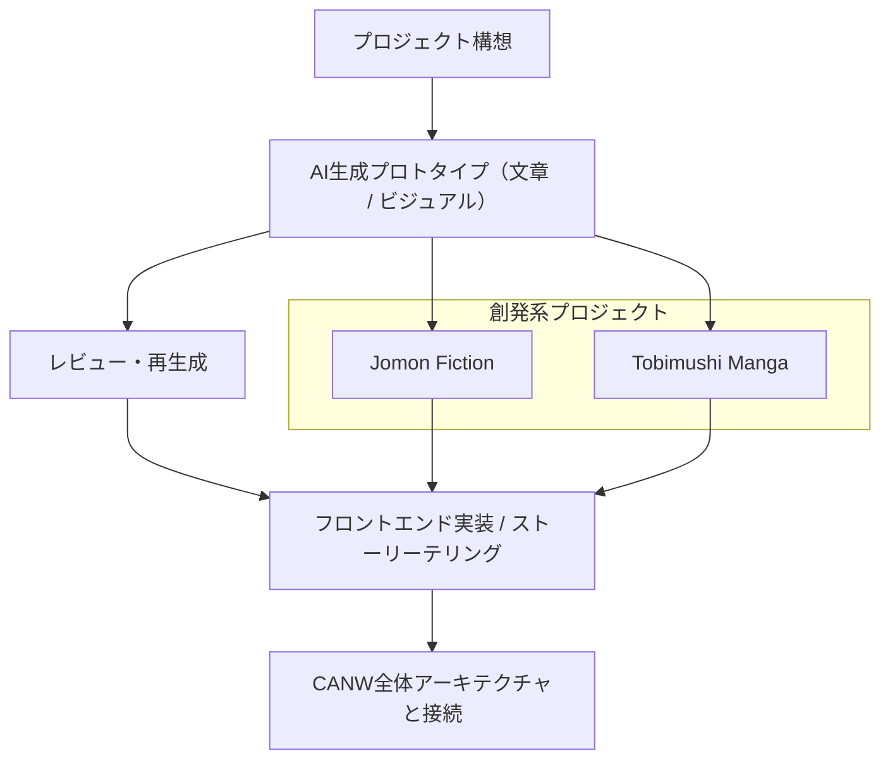

  

<h1 align="center">🤝 AI Collaboration</h1>

📘 他の言語で読む:

* [🇺🇸 English](./README.md)

> AIと共に生きた物語を描く。
> 単なる生成ツールではなく、複雑な世界を再構成するもうひとつのレイヤーとして。

このプロジェクトは、CANW（Complexity And Network Webdesign）構想の一環として展開されています。
全体の背景思想やネットワーク的アプローチについては、[CANW ルートディレクトリの README](https://github.com/satoshi-create/complexity-and-network-webdesign) をご参照ください。

---

## 🔄 概要：AI Collaboration

**AI Collaboration** は、生成AIやオートメーションツールを活用し、物語・文化・科学の創造的ネットワークを紡ぐ協働プロジェクトです。
AIが人間の洞察や問いかけに応答し、
**プロトタイプ、ストーリー、対話、可視化**の各層を再帰的に編み込む——
この協働プロセスそのものが本プロジェクトの“物語”です。

---

## 🧪 現在進行中のサブテーマ

CANWでは以下のようなテーマで試作を進めています：

* 📘 **Jomon Fiction**（縄文フィクション）

  * AIによるストーリー生成、地形思考、ネットワーク分析を通じて縄文世界を再構築。
 
* ⛩ Shrine Fiction（神社小説）

  * 流域ネットワークと神社分布をもとに、地形に根ざした神話的フィクションを構築。

* 🦠 **Tobimushi Manga**（トビムシマンガ）

  * 土壌生態系・菌糸ネットワークを舞台にしたSF漫画。AIと人間の協働ループから創作。

---

## 🤖 使用ツールと技術

現在は以下のツールやOSS技術を活用しています：

* **ChatGPT / GPT-4**: シナリオや考察文の生成、翻訳補助
* **DALL·E / Midjourney**: キャラクターデザインやシーンのビジュアル生成
* **Python + Pillow / Mermaid**: 構造図や吹き出しレイアウトの自動化
* **Next.js / React**: ビジュアルストーリーテリングのフロントエンド実装

---

## 🌐 エコシステム構造（Mermaid）

---

## 🌱 Join the Loop / 協働ループへようこそ！

AI-Collaborationは、コーダー／ノンコーダー問わず参加可能なオープンな協働基盤です。
**構想・調査・執筆・設計・可視化・発信** —— どの層からでも歓迎します！

---

## 📄 ライセンス

本プロジェクトはMITライセンスのもとで公開されています。
詳細は [LICENSE](./LICENSE) をご確認ください。

---

## 🔗 関連リンク

* AI Collaboration（GitHub）: [https://github.com/satoshi-create/complexity-and-network-webdesign/tree/main/projects/ai-collabration](https://github.com/satoshi-create/complexity-and-network-webdesign/tree/main/projects/ai-collabration)
* GitHub（CANW 全体リポジトリ）: [https://github.com/satoshi-create/complexity-and-network-webdesign](https://github.com/satoshi-create/complexity-and-network-webdesign)
* LinkedIn（海外向けの発信）: [https://www.linkedin.com/in/satoprofile/](https://www.linkedin.com/in/satoprofile/)

---

生成するだけじゃない。
生きたネットワークとして、問いかけ、編み直す。
共に紡ぐ「AIの物語」へ、ようこそ。
