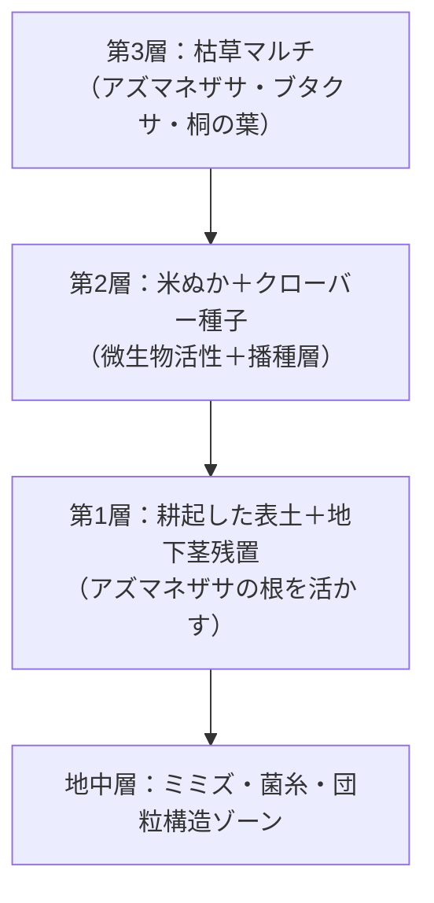

### 🗓️ 2025-04-14~2025-04-17：MVP 畝第一弾の構築

- 畝面積：約 2m×5m（約 10㎡）
- 桐の枯葉とアズマネザサ・ブタクサの枯草を使った自然マルチ
- 地表層はネザサの地下茎を活かしつつ耕起、2 層目に米ぬか 2kg ＋クローバー播種
- トウモロコシ（30cm 間隔）、ダイコン（25cm 間隔）を種付け、軽く覆土
- 枯草マルチを軽く戻し、乾燥と鳥害の対策
- 観察初日にはトビムシ、オニグモ、シロコブゾウムシを確認

### 🕷️ 観察メモ

- スピグモ（コモリグモ）とヨトウムシを確認 → 畝防御ネットワークが稼働開始か
- 桐葉の下からキノコ出現 → 菌糸ネットワークの活性化の観察が必要
- クモ・トビムシ・ミミズなどの行動は、マルチと湿度の影響を受けやすい

### 🧩 次の観察ポイント

- 芽出し状況（クローバー・ダイコン・トウモロコシ）
- 土壌動物の活動ログ → soil-fauna-log.md に記録予定
- 畝の湿度変化・菌類の分解進行
- 畝構造の Mermaid 化（layout.mmd）

### 🗺️ 畝構造（Mermaid）

この図は「自然マルチ → 分解と活性化 → 播種層 → 地中ネットワーク層」の流れを表しています。

