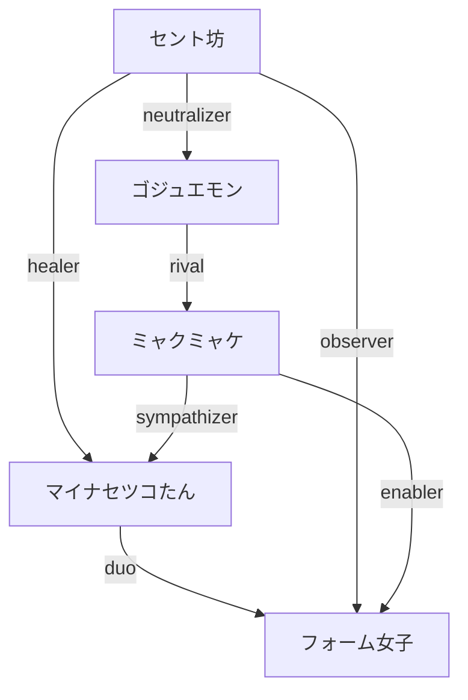

```mermaid
graph TD
    C001["ゴジュエモン"] --> |rival| C002["ミャクミャケ"]
    C003["マイナセツコたん"] --> |duo| C004["フォーム女子"]
    C005["セント坊"] --> |neutralizer| C001["ゴジュエモン"]
    C005["セント坊"] --> |healer| C003["マイナセツコたん"]
    C005["セント坊"] --> |observer| C004["フォーム女子"]
    C002["ミャクミャケ"] --> |sympathizer| C003["マイナセツコたん"]
    C002["ミャクミャケ"] --> |enabler| C004["フォーム女子"]

```
