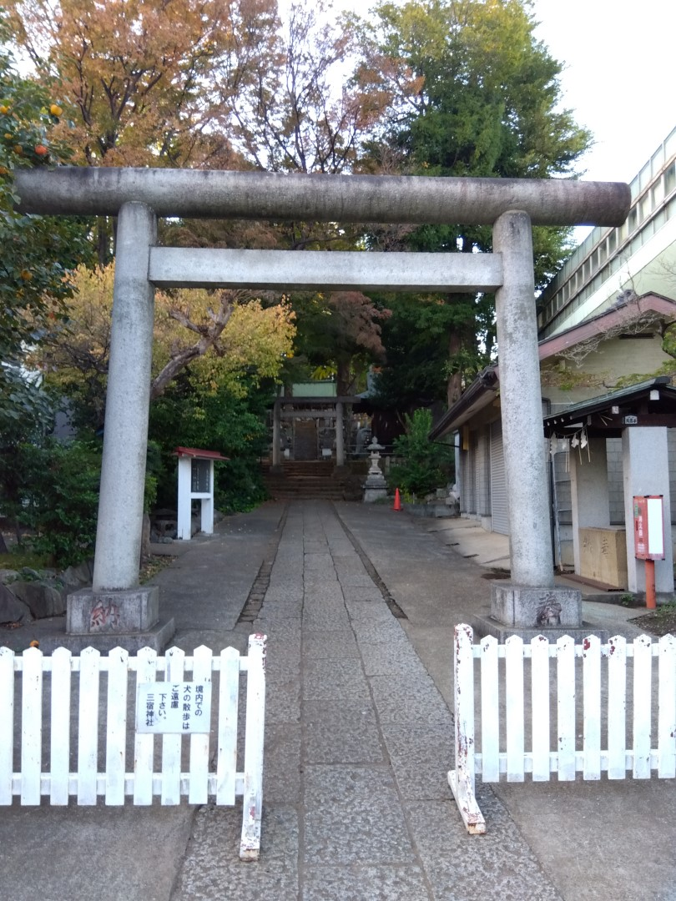
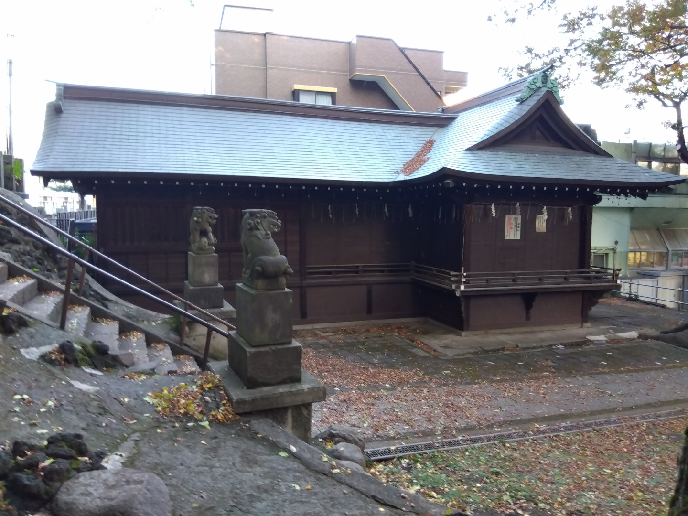
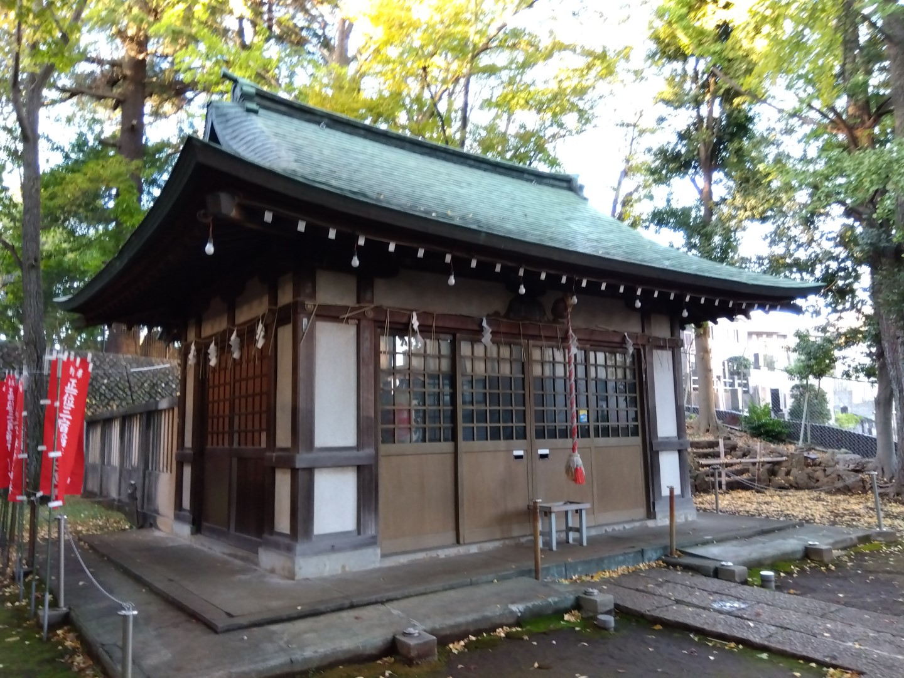
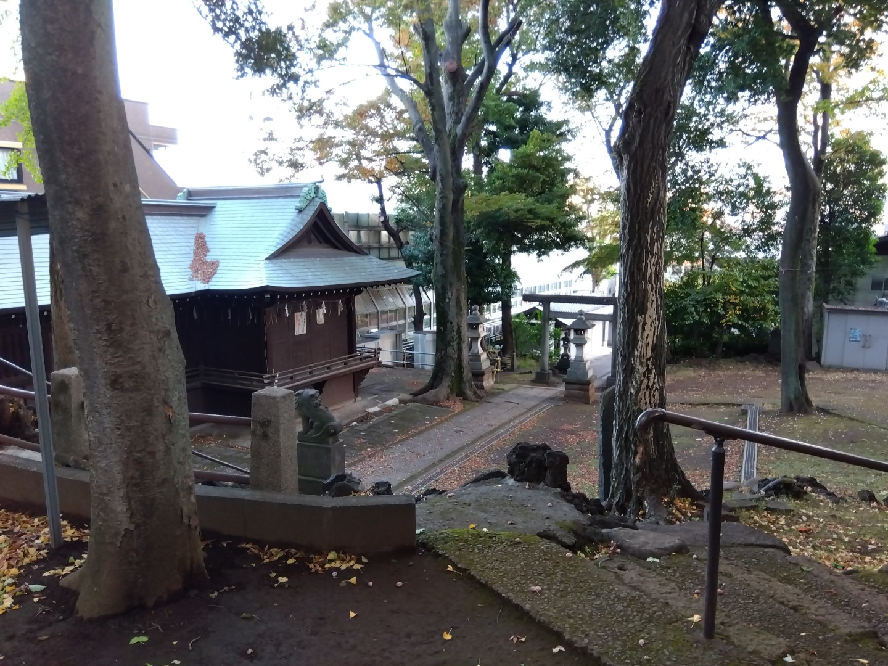
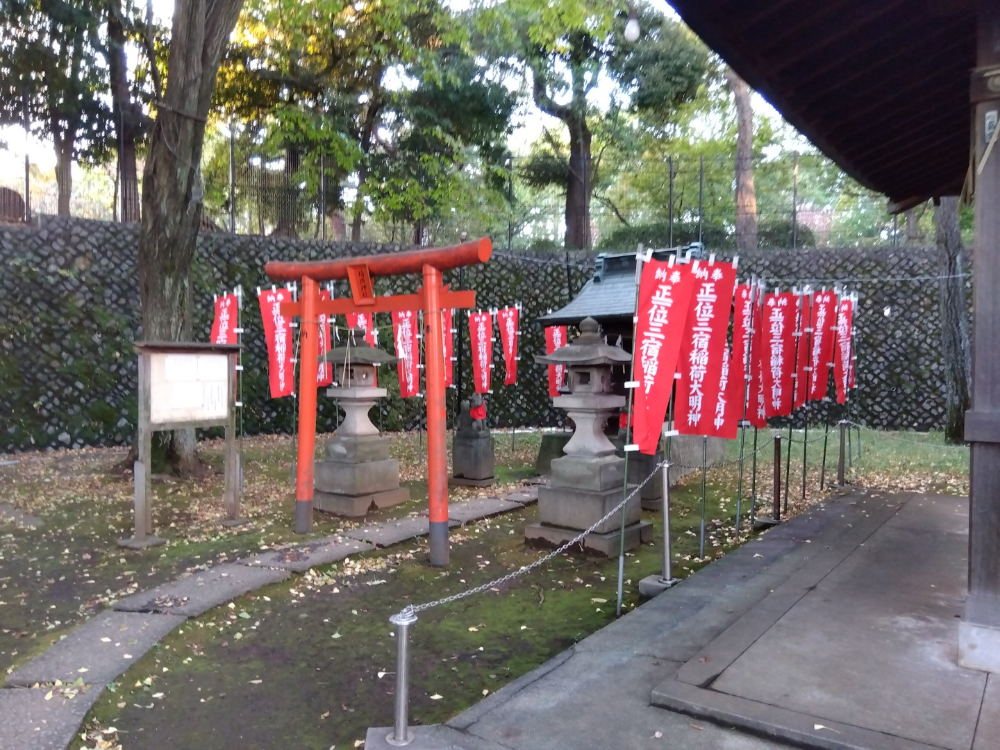
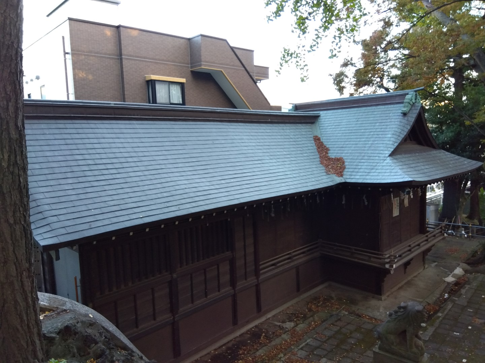
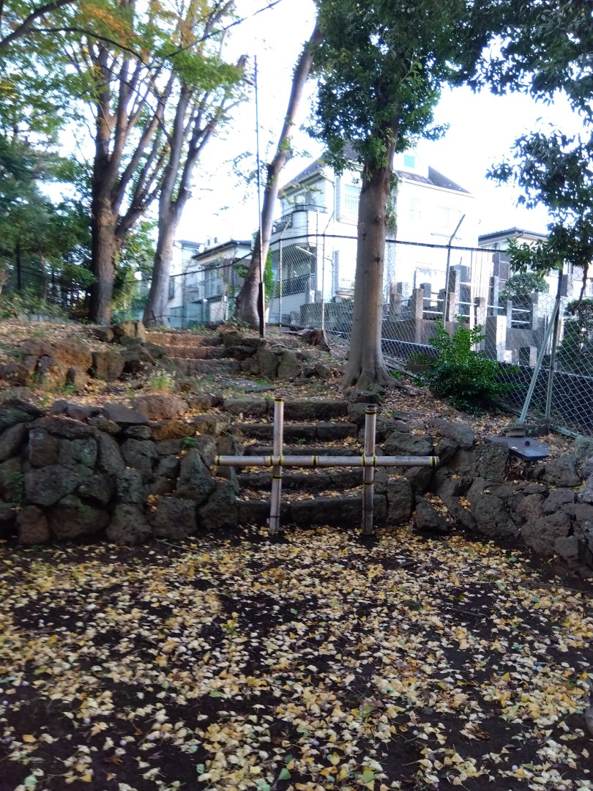
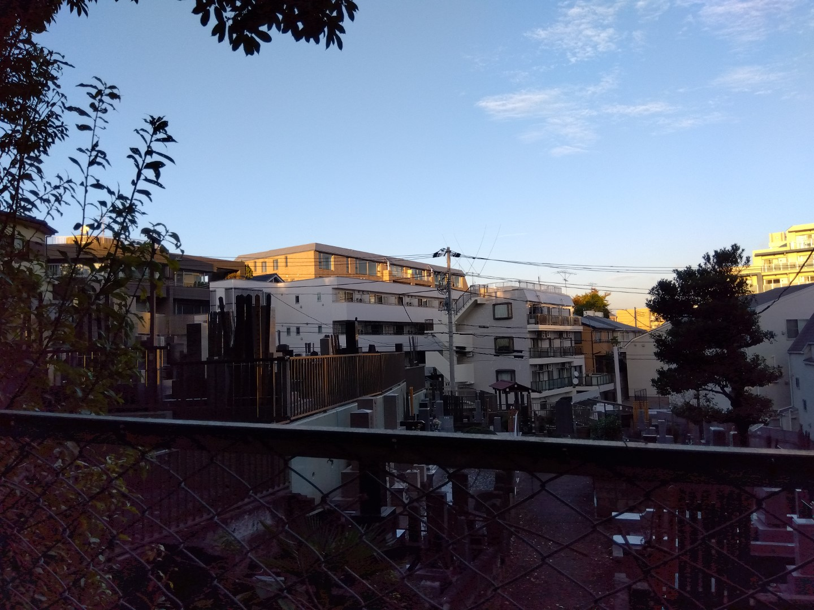

# 01_field-observation（三宿神社）

## 🗺️ 目次
- [🏛 基本情報](#-基本情報)
- [🕉 神仏習合の背景](#神仏習合の背景)
- [🔥 ポイント整理](#ポイント整理)
- [📷 パーツ観察記録](#パーツ観察記録)
  - [鳥居（Torii）](#鳥居torii)
  - [狛犬・神使（Komainu）](#狛犬神使komainu)
  - [社殿・拝殿（Shaden）](#社殿拝殿shaden)
  - [参道（Sando）](#参道sando)
  - [境内社・稲荷社（Sessha）](#境内社稲荷社sessha)
  - [神楽殿（Shamusho）](#神楽殿shamusho)
  - [石碑・その他石造物（Monuments）](#石碑その他石造物monuments)
  - [境界・社号標（Boundary Stones & Shrine Markers）](#境界社号標boundary-stones--shrine-markers)
- [🎨 Emblem 観察記録](#emblem-観察記録)
- [🌳 地形・周辺環境](#地形周辺環境)

---
## 🏛 基本情報

- **神社名**：三宿神社（みしゅくじんじゃ）
- **所在地**：東京都世田谷区三宿2丁目27-6
- **主祭神**：宇迦之御魂神（うかのみたまのかみ）、毘沙門天（大物主神）
- **社格**：旧無格社（近代社格制度では格付けなし）
- **創建**：不詳（推定：室町時代末期〜戦国時代）
- **流域**：目黒川水系（烏山川支流）
- **地形概要**：
  - 烏山川緑道の左岸台地上に立地。
  - 烏山川が目黒川に合流する直前、蛇行部中央に位置。
  - 社殿は急傾斜方向の崖上に立ち、周囲は攻撃斜面により形成された地形。
- **由緒・歴史**：
  - 創建年代は不詳だが、室町時代末期〜戦国時代の開創と推測される。
  - 世田谷城主・吉良頼康により、「三宿山多聞院」の寺内鎮守として毘沙門天が祀られたことに始まる。
  - 江戸時代初期までは神仏習合により「三宿稲荷社」とも称された。
  - 明治初年の神仏分離令により仏教色を排除し、現在の「三宿神社」に改称。
- **神仏習合の痕跡**：
  - 現在も社号標に「三宿神社」「毘沙門天」が併記されている。
  - 旧境内地に隣接する多聞寺墓所が神仏複合文化の名残を留める。
- **周辺特徴**：
  - 本殿裏手に「三宿の森緑地」（旧鎮守の森と推定）。
  - 湧水地の痕跡（ビオトープ池、井戸跡）が存在。
  - 東方に旧多聞寺墓所（現在の墓地エリア）が広がる。
- **文化財等**：
  - 特に指定文化財はないが、目黒川支流（烏山川）沿いの湧水・崖地ネットワークにおける重要なランドマーク的存在。
- **補足事項**：
  - 旧多聞院（現在の多聞寺跡地）との連関は周辺の古地図や地名に色濃く残る。
  - 世田谷城跡（現・豪徳寺周辺）とは約1km圏内の近接地にあり、地域的な連携も想定される。

---

## 🕉 神仏習合の背景

- **神仏習合の有無**：有
- **仏教関連施設との関係**：
  - 神社背後にかつての多門寺（毘沙門天を本尊とする寺院）が存在。
  - 明治期の神仏分離令以前は，三宿神社と多門寺が連携していた可能性。
- **病跡＆現在の状況**：
  - 現在も神社入口に「三宿神社」「毘沙門天」の礼語票が並立しており，病跡がある。
  - 明治期の分離以後も，地域の信仰経路に深く根付いている。

---

# 🔥 ポイント整理

| 項目 | 内容 |
|:-----|:-----|
| 神仏習合 | あり（明治前は神仏習合） |
| 仏教関連施設 | 多門寺（毘沙門天信仰） |
| 現在の病跡 | 社司に毘沙門天の礼語票が残る |

---

## 📷 2. パーツ観察記録

### 🏯 鳥居（Torii）

  

---

- 形式：**神明鳥居型**（石造直線型）
- 材質・色彩：**石材、無彩色**（朱塗りなし）
- 建設年代：推定昭和中期以前。石材表面の風化痕跡から考察。
- 設置位置：
  - 烏山川蛇行部中央、左岸台地の立ち上がり直前に設置。
- 地形との関係：
  - 台地段丘上へ上る**結界ポイント**に配置。
  - 鳥居〜参道〜拝殿が一直線に並ぶことで、自然地形に沿った直線導線を形成している。
- デザイン特徴：
  - 直線的な笠木と貫。
  - 柱間隔は広めに取られ、開放感がある。
  - 装飾性を極力排除した簡素な意匠。
  - 右柱根元に「奉納」と刻まれた献納碑。
- 周辺環境：
  - 鳥居前には簡易バリケード（現代的管理）。
  - 右手に社務所施設あり。
  - 参道は両脇に植栽と石灯籠（後方）を配置。
- 観察メモ：
  - 石鳥居であることから、地域コミュニティによる中規模な神社再建・維持活動が推測される。
  - 鳥居を境に、住宅地から台地上の聖域への空気感が切り替わる。
  - 神明鳥居らしく、自然崇拝・湧水信仰の名残を強く感じる配置。

---
### 🐲 狛犬・神使（Komainu）

  

---

- 配置形式：**一対（阿形・吽形）**
- 材質：**石造**（風化あり、苔・黒ずみあり）
- サイズ感：**中型よりやや小ぶり**
- 設置位置：
  - 石段脇、社殿広場入口に対称配置。
  - 急傾斜地の地形に合わせ、若干高低差のある台座上に据え付けられている。
- デザイン特徴：
  - 頭部が大きく、ずんぐりとした安定感のある体型。
  - 毛並みは巻き毛で細かく表現。
  - 阿形（右手側）が口を開け、子獅子または玉を抱えている。
- 表情・スタンス：
  - 両像とも正面を見据えるポーズ。
  - 威嚇というより守護・安定を意識した造形に見える。
- 文化的考察：
  - 地域の生活守護・農業守護的な役割を想定。
  - 子獅子抱えモチーフは、地域コミュニティの子孫繁栄や土地の守護の祈願を表す場合が多い。
- 観察メモ：
  - 狛犬台座と階段構造が一体化しており、社殿参拝ルートの中で自然に狛犬をくぐる導線になっている。
  - 急傾斜台地の結界ポイントとして、狛犬が精神的な門番の役割を強く担っている印象を受ける。

---

### 🏛 社殿・拝殿（Shaden）

  
  
  

---

- 社殿（拝殿・本殿覆屋）
  - 形式：**拝殿・本殿一体型覆屋**
  - 材質：
    - 木造主体。
    - 屋根は**銅板葺き**（経年で緑青化）。
  - 屋根形式：流造（ながれづくり）系、棟に控えめな破風装飾あり。
  - 外観：
    - 格子窓・簡素な柱間構成。
    - 注連縄が屋根縁に張られ、神域性を演出。
    - 賽銭箱が設置され、拝殿正面空間が確保されている。
- 地形との関係：
  - 本殿は崖地ぎりぎりに立ち、背後に広がる「三宿の森緑地」と連続する。
  - 境内社は一段上に築かれ、土地の傾斜・段差を活かした聖域ゾーニングがされている。
- 観察メモ：
  - 崖地と湧水地の境界に沿った建築配置が見事。
  - 中小規模ながら、自然地形との調和を大切にした設計思想が伝わってくる。
  - 神社建築のスケールと地形スケールが絶妙に呼応している。

---

### ⛩ 参道（Sando）

  
  

---

- 構造形式：
  - 前半：敷石舗装のほぼ水平参道。
  - 後半：石段急登部（急斜面対応型）。
- 設計特徴：
  - 鳥居〜参道〜拝殿〜本殿を一直線に結ぶシンプルなライン。
  - 平地から台地に上がる「地形遷移」を演出する導線設計。
- 材質：
  - 敷石舗装：やや粗い石材（経年劣化あり）。
  - 石段：大ぶりの自然石を積み上げて造成。
- 地形との関係：
  - 参道後半は急傾斜地（攻撃斜面）に対応するため、段差を急激にとる構成。
  - 参道途中で崖縁に沿って展開する地形アプローチ路と接続。
- 空間演出：
  - 参道の両脇に玉垣・植栽・石碑群を配して、「聖域への侵入感」を高める。
  - 階段部手前で空間がやや広がり、呼吸を整えるポイントになっている。
- 観察メモ：
  - 敷石と石段の切り替わり箇所が、心理的にも物理的にも「俗界と聖域」の境界として機能している。
  - 緑地・台地・崖地のランドスケープ構成と強く連動しており、単なる通路以上の意味を持っている。

---

### ⛩ 境内社（Sessha）・稲荷社（Inari-sha）

  

---

- 社名：
  - 正一位三宿稲荷大明神
- 形式：
  - 小型木造社殿
  - 銅板葺き（または簡易トタン葺き）
- 空間構成：
  - 朱色の小型鳥居1基を中心に、社殿・灯籠・奉納旗をコンパクトに配置。
  - 幟旗が多数立ち並び、参拝空間に鮮やかな赤色の演出効果を持たせている。
- 環境・地形：
  - 社務所脇のやや低地帯に立地。
  - 周囲を高い石垣擁壁に囲まれ、半密閉型の落ち着いた空間を形成。
- デザイン特徴：
  - 石灯籠が社殿左右を守護するように配置。
  - 鳥居〜社殿を一直線に結びつけ、参拝導線を明確化。
  - 幟旗は「正一位三宿稲荷大明神」の文字が統一フォーマットで描かれている。
- 観察メモ：
  - 本殿とは独立した守護空間が形成され、境内の多層的な信仰構造を感じさせる。
  - 湿潤な低地に立地しているため、水辺信仰や穀物豊穣祈願との関連が想定できる。
  - 赤系統の色彩集中が、参拝体験に明確な心理的アクセントを与えている。

---
### 🏠 神楽殿

  

---

- 用途：
  - 主に神輿・祭礼道具などの保管施設（神輿蔵）。
- 構造・材質：
  - 木造平屋建て。
  - 屋根は銅板葺き（経年変化で緑青化）、本社殿と意匠を統一。
  - 壁面は通気性を確保するための格子構造が強調。
- 空間特徴：
  - 正面に大開口または引き戸形式の大扉が存在する可能性（未撮影）。
  - 恒常的な接客・授与を想定していない造り。
- 地形・配置：
  - 参道〜拝殿ルートから少し外れた、やや奥まった場所に配置。
  - 湧水由来の湿潤地形を避け、台地寄りの安定地盤上に建設。
- 観察メモ：
  - 神輿蔵的機能を持つため、建物高さ・幅ともに本社殿よりは控えめ。
  - 日常的な社務・参拝客対応は、別に存在する専用社務所で行われていると考えられる。
  - 祭礼時にはこの施設から神輿が出陣する可能性が高い。

---

### 🪨 石碑・その他石造物（Monuments）

    
  

---

#### monument_01｜大黒天石像

- 形式：
  - 丸みを帯びた福々しい大黒天像。
  - 足元には人型の像（神像か？）が配置されている。
- 配置場所：
  - 神輿蔵裏手の植え込み斜面、フェンス沿いに設置。
- 状態：
  - 風雨による経年劣化あり、表面はやや摩耗。
- 環境：
  - 雑然とした緑地の一角にあり、発見には注意を要する。
- 観察メモ：
  - 境内の主流動線から外れており、隠された守護神的存在感を持つ。
  - 日常生活圏（社務エリア）と信仰圏（本殿・稲荷社）を緩やかにつなぐ存在か。

---

#### monument_02｜溶岩石基壇＋石碑

- 形式：
  - 溶岩ゴロタ石による基壇に、縦長の碑型石碑が立てられている。
- 配置場所：
  - 本殿裏手の富士塚状の小高い地形の一角。
- 内容：
  - 銘文あり（撮影解像度により未読）。
  - 記念碑、奉納碑、あるいは霊場碑の可能性あり。
- 状態：
  - 石碑本体は保存良好だが、周囲の溶岩石基壇は一部崩落気味。
- 環境：
  - 富士信仰との関連性を匂わせる地形と配置。
- 観察メモ：
  - 富士塚モチーフの可能性が高く、流域信仰・火山信仰との重層構造を示唆する。
  - 周囲には小規模な石像や奉納碑も散見される（未撮影エリアあり）。

---

### 🪧 境界・社号標（Boundary Stones & Shrine Markers）

  

---

#### boundary_01｜社号標と境界標識

- 形式：
  - 手前左：社号標（「三宿神社」）。
  - 手前右：別名標（「毘沙門天」）。
  - 奥に鳥居（石造・神明系）と参道が続く。
- 配置場所：
  - 鳥居手前の参道起点、緩やかな勾配の入口部。
- 造形・材質：
  - いずれも花崗岩製。
  - 銘文は彫り込み＋墨入れ仕上げ。
  - 「氏子中」の文字が赤字で入れられており、奉納者が氏子団体であることを示唆。
- 状態：
  - 保存状態は良好。
  - 設置後比較的新しい可能性（摩耗少ない）。
- 環境：
  - 隣接する学校施設（体育館らしき建物）が映り込む。
  - 都市化の進行を受けつつも、伝統空間を死守する意図を感じさせる配置。
- 観察メモ：
  - **三宿神社本体の信仰**（三宿エリアの氏神）と、
  - **毘沙門天信仰**（勝運・武神・財運神）が並記されている点が極めて特徴的。
  - 神仏分離以前の信仰レイヤーを暗示しており、重層的な宗教景観を今に伝える貴重な証拠。

---

## 🎨 Emblem 観察記録

### デザイン特徴
- 三つの「Y字型」構造が中央で結びつき、六角形を作る幻影的な構成
- 配色は「藍色地に白抜き」で、伝統的かつ力強い印象

### 考察
- 通常の三つ弓文紋（家紋）から次第したアレンジとみられるが、直線的なデザインが特異
- 地名「三宿」にちなみ、三つの要素が結びつくことを意図している可能性も

### 周辺観察
- 社務所壁面に掲示され、公式な社紋として認識されている様子
- 境内の他の場所（手水舎や灯立）には紋章装飾は見当たらなかった

## 🌳 地形・周辺環境 — Observations

### 🏝 地形

- 三宿神社は「烏山川緑道左岸の台地上」に位置しており、「目黒川本流との合流直前」に立地している。
- 「急嶺な崖地」（攻撃斜面）上に本殿が建ち、社殿裏から南西に向かって落ち込む地形を形成している。
- 階段や石紫によって高位差を克服しながら、神社空間が展開されている。
- 境内の中でも、高台と谷地形が伴存しており、複雑なマイクロ地形が観察できる。

### 🌳 周辺環境

- 神社裏手は「三宿の森緑地」として整備されており、「かつての鎗守の森」の名残しをとどめる。
- 緑地内には「ビオトープ池」や「井戸跡」が存在し、「湧水地」であった可能性が高い。
- 神社から東側にかけては、旧多聖寺墓所（現在の墓地エリア）が広がり、「神仏結合の歴史的景観」を今に伝えている。
- 周囲は住宅地化が進んでいるが、境内から一歩外に出ると、かつての谷地形の名残しを感じることができる。
