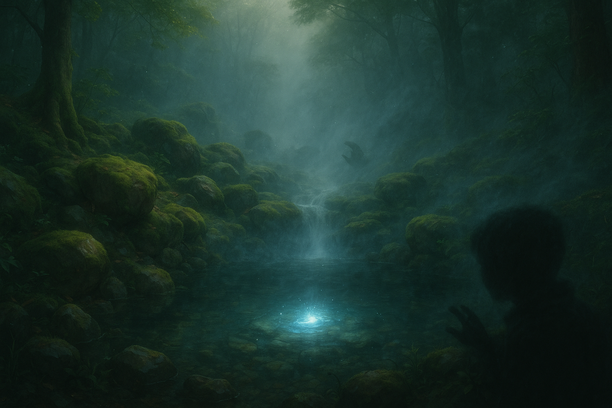
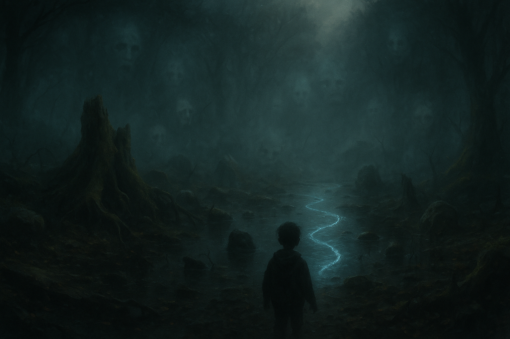
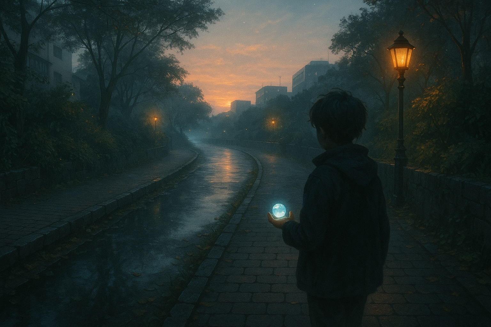
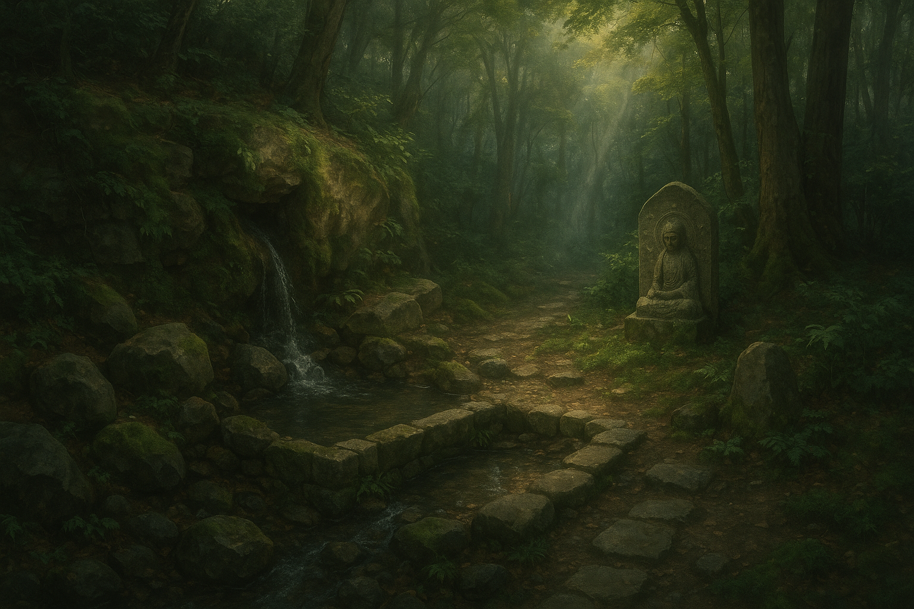
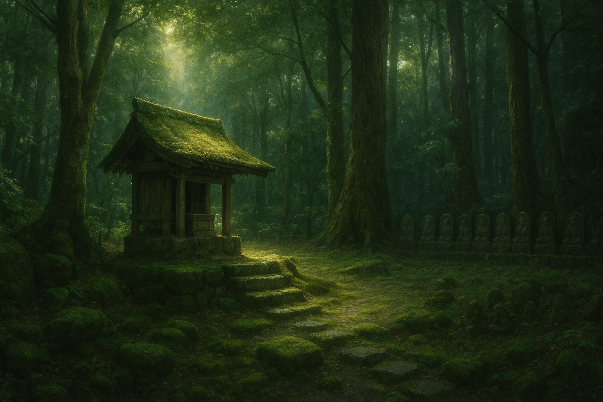

- [第0章 プロローグ 顔なきもの](#第0章-プロローグ-顔なきもの)
- [第1章 縄文湧水森シーン](#第1章-縄文湧水森シーン)
- [第2章 命の泉で最初の贈り物を受け取るシーン](#第2章-命の泉で最初の贈り物を受け取るシーン)
- [第3章 池尻＝魑魅魍魎領域への突入](#第3章-池尻魑魅魍魎領域への突入)
- [第4章 異界から現代に戻る](#第4章-異界から現代に戻る)
- [第5章 中世レイヤー突入シーン](#第5章-中世レイヤー突入シーン)
- [第6章 中世：多聞寺原型（湧水守護の祠）発見シーン](#第6章-中世多聞寺原型湧水守護の祠発見シーン)
- [第7章 水争い勃発・中世層](#第7章-水争い勃発中世層)
- [第8章 流域守護者として覚醒する](#第8章-流域守護者として覚醒する)
- [第9章 現代への帰還シーン](#第9章-現代への帰還シーン)
- [第10章 蛇崩川〜世田谷公園 縄文層ダイブ](#第10章-蛇崩川世田谷公園-縄文層ダイブ)
- [第11章 蛇神との邂逅](#第11章-蛇神との邂逅)
- [第12章 現代・蛇崩川緑道 異変と畏怖](#第12章-現代蛇崩川緑道-異変と畏怖)
- [第13章 祐天寺・祖母の語り](#第13章-祐天寺祖母の語り)
- [第14章 最終クロージング・洗練版ドラフト](#第14章-最終クロージング洗練版ドラフト)

## 第0章 プロローグ 顔なきもの

土曜日の午後だった。
冬の光は、まるで誰かのため息みたいに、細く伸びていた。

「よーし、今日は緑道をぐるっとお散歩だ！」

パパの声に連れられて、ぼくはママと一緒に、小さな手をつないで歩いた。
烏山川緑道。昔、川だった道。

アスファルトの下に、水が流れているのを、ぼくは知っていた。
それは学校では教えてくれないことだ。
でも、足の裏が、時々「ここだよ」って教えてくれるんだ。

緑のトンネルを抜けた先、目黒川のはじまりに、小さな広場があった。
車止めの柵の向こう。
そこに、それは立っていた。

黒くて、つるりとした、奇妙な像。
耳だけがついている。
顔がない。
まるで、世界から何か大切なものをなくしてしまったみたいな。

ぼくは吸い寄せられるように、近づいていった。
パパとママの声が、だんだん遠くなる。

台座は、ぼくの頭よりずっと高かった。
ぼくはつま先立ちになって、首をぐいっと伸ばした。

見上げた先で、
像は静かに、地面をのぞきこんでいた。

「…だれ？」

心の中でそうつぶやいたとき、
オブジェの耳が、かすかに震えたような気がした。

次の瞬間。

地面の下から、「ごぼ、ごぼごぼ……」と水の音がした。
アスファルトが波打つ。
広場が、ふっと闇に沈む。

目の前がぐにゃりと歪んで、
ぼくは、知らない森の中に立っていた。

湿った土。湧き出す水。鳥たちの声。
それから、
水たまりの奥で、
とてつもなく大きな影が、ぼくを見上げていた。

耳だけで、何百年も、何千年も、誰かを待っていた存在。

それは、ぼくに向かって、言葉にならない声で呼びかけた。

「おかえり」

ぼくは、小さくうなずいた。

そして、ゆっくりと、その影のほうへ、一歩を踏み出した。

## 第1章 縄文湧水森シーン

ふっと足元が柔らかくなった。

緑色の光に包まれて、
ぼくは知らない森に立っていた。

崖のような斜面が、目の前にそびえている。
その中腹から、白い霧をまきながら、
水がごうごうと噴き出していた。

湧き水だ。
崖の骨を砕き、地面を潤し、森を生かしている。

ぼくは吸い寄せられるように、湧水のもとへ歩いた。

地面はしっとりと湿っていて、
踏みしめるたびに、小さな水脈がぴちぴちと弾けた。

森は、音をたたえていた。
水が滴り落ちる音、木の葉が触れ合う音、
それから、とてもかすかに、低いうなり声のようなもの。

湧水の近くまで来ると、
霧の向こうに、何かが動いた。

小さな蛇だった。
でも、ただの蛇じゃない。
光る鱗をもち、体からは水の気配が漂っている。

蛇たちは、崖から噴き出す湧水を取り巻いて、
静かに、ぐるぐると舞っていた。

まるで、
何かを守っているかのように。

その中心に、
ぼんやりと、大きな影が見えた。

岩かと思った。

でも、
それは、ぼくを見ていた。

目を閉じているのに、わかる。

崖の中に眠る、
もっと大きな「なにか」が、
湧水と森と、命のすべてを見守り続けている。

ぼくは、
声にならない声を聞いた。

——ようこそ、もとの世界へ。

## 第2章 命の泉で最初の贈り物を受け取るシーン

ぼくは、湧き出す水のすぐそばまで来ていた。

崖の中腹から吹き出す水は、白い霧になって森を包んでいる。
湧き水の音は、生き物の息づかいみたいだった。

足元に、小さな泉ができていた。
泉の中心に、何かが光っている。

ぼくはしゃがみこんだ。

冷たい水に手を伸ばす。
水は、ぼくの指をすり抜けて、泉の底へ流れていく。

でも、光だけは、逃げなかった。

ぼくの手のひらに、
するりと、ひと粒のなにかがのった。

冷たくて、
だけど、ひどくあたたかいもの。

小さな、透明な石だった。
水のかたちをした石。

中に、微かな渦がまわっている。

なぜだか、ぼくはそれを、
「失くしちゃいけない」と思った。

見上げると、
霧の向こうに、崖の中腹から顔をのぞかせた大きな影が、
かすかにうなずいた気がした。

その瞬間。

泉の周りにいた小さな蛇たちが、
一斉にくるりと身を翻し、
水の流れに乗って森の奥へ消えていった。

ぼくの手のひらに残った、水のかたちをした石だけが、
かすかに、ぼくの心に話しかけてきた。

——これが、おまえの鍵だよ。

## 第3章 池尻=魑魅魍魎領域への突入

水のかたちをした石を手に、
ぼくは森の中を歩き出した。

足元には、小さな流れができている。
命の泉からあふれ出たばかりの、水の道だ。

水は、森の奥へと続いている。
ぼくは、その道をたどった。

やがて、森の木々が低くなり、
地面が、ぐじゅぐじゅと柔らかくなった。

湿った空気。
草むらから、無数の目が覗いている気がする。

霧が、深く、重たくなった。

水は、さらに集まり、
足元が、水たまりになった。

ぼくは水の中を、ひた、ひたと歩く。

空が低い。
音が歪む。
何かが、すぐそばで、くすくすと笑っている。

ここは——

「いけじり」

水のしっぽが、ここで渦を巻いている。

川でも、池でもない。
でも、たしかに、ここは水が尻尾を引いて溜まる場所だった。

——地名が、
ぼくの耳に、ざわざわと囁きかけた。

「池の尻（いけのしり）」

それが、ここ、「池尻」のはじまりだった。

だけど。
いま、ここにあるのは、
ただの沼じゃなかった。

うごめく影たち。
人のようで人でないもの。
水に沈みかけた顔。
根のように絡みつく腕。
ねじれた蛇のようなもの。

すべてが、ぼくを見ている。

ぼくは、
水石をぎゅっと握った。

そのとき、
石の中から、ぴたり、と震えるような脈動が伝わってきた。

湧水の心臓が、
まだ、ぼくの手の中に生きている。

魑魅魍魎たちが、
そろり、そろりと、ぼくの周りを取り囲みはじめた。

そして、
水たまりの中心——
ぼくがいる、その場所へ向かって、
闇の奥から、何か、
とても大きなものが、近づいてきた。

## 第4章 異界から現代に戻る

水たまりの奥から、
何かが、
とてつもなく大きなものが、
ぼくの方へ、ずるりずるりと這い寄ってきた。

見たくなかった。
でも、目をそらせなかった。

そのとき。

ぼくの手の中の水石が、
ひときわ強く、脈打った。

ぱん。

世界が、弾けた。

光の粒があふれて、
ぼくの視界を埋め尽くした。

気がつくと、
ぼくは、広場に立っていた。

あの、オブジェの前に。

緑道には、夕方の光が差し込んでいる。
自転車に乗ったおじさんが通りすぎていく。
犬を連れた人が笑っている。

ぼくは、
そっと自分の手を開いた。

そこには、
まだ、小さな水のかたちをした石が、のっていた。

冷たくて、
あたたかい。

夢じゃなかった。

ふりかえると、
パパとママが、広場の端で手を振っていた。

「おーい、〇〇（主人公の名前）！」

ぼくは手を振り返した。
でも、心の奥では、まだ
あの霧の中の声が、
ざわざわと響いていた。

——おかえり。

## 第5章 中世レイヤー突入シーン

ぼくは、
もう一度、
あの広場に来ていた。

パパとママは、ベンチに座って話している。
ぼくは、一人で、三宿神社のほうへ歩いていった。

水石が、
ポケットの中で、
ふるふると震えた。

社の裏手。
小さな崖地に続く道がある。
ぼくは、そこへ引き寄せられるように歩いた。

崖の中腹から、
かすかに水音が聞こえた。

ごぼ、ごぼごぼ。

あの日と、同じ音。

ぼくは、目を閉じた。

その瞬間。

ざっ。

足元の土の感触が変わった。

耳に、笛の音が聞こえた。
火の匂い。
馬のいななき。
遠くで鳴る太鼓の音。

目を開けると、
ぼくは、
知らない時代に立っていた。

崖の中腹から、
湧き水が噴き出している。

そのまわりを、
粗末な防塁と、木柵が囲っている。

男たちが、武具を身につけて立っていた。

湧水を守ろうとしている。
湧き水が、村と城の命だった。

でも、
その水を狙って、
黒い影たちが、
森の奥から、
じり、じりと近づいてきていた。

ぼくは、水石を握りしめた。

ここでも、
水は命だった。

そして、
命を守る戦いが、
すでにはじまっていた。

## 第6章 中世：多聞寺原型（湧水守護の祠）発見シーン

崖を背に、
ぼくは、小さな獣道のような小道をたどっていた。

水石が、
ポケットの中で、かすかに脈を打つ。

湿った空気。
苔のにおい。
湧水のしぶきが、細かな霧になって漂っている。

やがて、
森の奥に、ぽっかりと空いた空間が現れた。

そこに、
それはあった。

小さな、
木造の祠。

板の屋根は、苔に覆われ、
柱は、湿った蔓植物に巻きつかれている。

それでも、
祠の中からは、
確かに「何か」が、こちらを見ていた。

ぼくは、そっと、近づいた。

祠の扉は、開いていた。

中に、
小さな像が祀られていた。

それは、
怒りを湛えた顔をして、
片手に塔を持ち、
もう片方の手で何かを押さえている。

見たことのない、
でも、どこか懐かしい姿。

湧き水を、
この崖を、
森を、
流域すべてを守るために、
ここに立っている存在。

ぼくは、直感でわかった。

——毘沙門天だ。

武神。
北方守護の神。
流域の守護者。

ここは、
まだ神も仏も、
森も水も、
すべてがひとつだった時代。

祠の中から、
低く、深い声が響いた。

「流れを護れ」

言葉だったのか、
音だったのか、
ぼくにはわからなかった。

でも、
心の底に、
ずしりと、何かが刻み込まれた。

ぼくは、
そっと水石を取り出し、
祠の前に捧げた。

石は、
わずかに光った。

祠の奥から、
一筋の光が走り、
ぼくの胸に飛び込んできた。

その瞬間、
ぼくは、
この土地の流れ、
この水脈の痛み、
森の鼓動を、
すべて感じた。

そして、
約束した。

護ると。

## 第7章 水争い勃発・中世層

祠の奥から感じた鼓動が、
ぼくを立たせた。

森の奥から、
低い怒号が響いてきた。

「この水は、城のものだ！」

粗末な旗を掲げた男たちが、
湧水へ向かってなだれ込んできた。

鉄の鎧。
槍。
弓。
武士たちだった。

その後ろに、
農具を持った村人たちもいた。

崖の中腹に咲いた泉——
命の泉を、
奪うために。

湧水の周りに立っていた小さな蛇たち、
霧の精霊たちが、
怯えるように後退った。

ぼくは、
水石を握った。

地面が、
かすかに震えた。

男たちは気づかない。
森が怒りをためていることに。

崖の上から、
白い霧が降りてくる。

それは、
かつて魑魅魍魎が棲んでいた池尻沼の霧に似ていた。

——水を奪うならば、
——自らの命も差し出せ。

森が、
流域が、
ぼくにささやく。

水争いは、
生きるためのものか。
欲のためのものか。

その境界は、
もうすぐ消える。

ぼくは、水石をかざした。

世界が、
ごう、と音を立てて震えた。

## 第8章 流域守護者として覚醒する

男たちの怒声が、
崖を震わせた。

槍が、
矢が、
湧水の周囲に降り注ぐ。

小さな精霊たちが、
霧のなかで震えている。

ぼくは、
足がすくんだ。

怖かった。

だけど。

ポケットの中の水石が、
熱く、
脈打った。

ぼくは、
手を伸ばした。

水石を、
胸の前にかざした。

次の瞬間。

ぼくの体の奥深くから、
何かが溢れた。

——ごぼ、ごぼごぼ。

耳の奥で、
湧水の音が鳴った。

森のざわめきが、
崖の震えが、
水の流れが、
すべて、
ぼくの中でつながった。

ぼくは知った。

ここは、
生きている。

森も、
水も、
崖も、
空も、
流域も——

すべてが、
脈打つ命だった。

ぼくは、
水脈の一部だった。

そして、
ぼくの中にも、
水脈が流れていた。

ぼくは、
叫んだ。

声にならない声で。

水石が、
ぱあっと光った。

崖の上から、
白い霧が滝のように落ちてきた。

冷たく、
重く、
すべてを包み込む霧。

男たちの動きが止まった。

霧のなかで、
彼らは互いの姿を見失った。

水は、
ただ静かに、
崖から湧き続けていた。

ぼくは、
その中心に立っていた。

恐怖も、
迷いも、
消えていた。

ぼくは、
流域の守護者になった。

まだ小さいけれど。

まだ弱いけれど。

でも、
確かに——
ここに立っていた。

## 第9章 現代への帰還シーン

霧が、
すべてを包み込んだ。

男たちの怒号も、
槍のきらめきも、
水脈のざわめきも、
すべて、
白い世界の中に溶けていった。

ぼくは、
ただ立っていた。

水脈の中心で。

そして、
再び、
世界が、弾けた。

光。

ざわめき。

時間も、場所も、
すべてが、ぐしゃりとひしゃげた。

目を開けると——

そこは、
ふたたび広場だった。

三宿神社のすぐ近く。
緑道の端。
夕方の光が、低く傾いている。

ぼくは、
手の中の水石を見た。

かすかに、
水が流れる音がする。

でも、誰もそれには気づかない。

犬を連れた人が通りすぎる。
ベビーカーを押す家族が笑いながら歩いていく。

世界は、
何も変わっていないようだった。

でも、
ぼくにはわかった。

水脈は、ここにいる。
流域は、生きている。
ぼくは、もう知ってしまった。

ぼくは、
手の中で水石を握りしめた。

そして、
ふと気づいた。

水石の中に、
新しい微かな脈動が生まれている。

——まだ、奥がある。

まだ、
ぼくは知らない水脈が、
この街の下に、
隠れている。

物語は、
終わっていなかった。

まだ、始まったばかりだった。

## 第10章 蛇崩川〜世田谷公園 縄文層ダイブ

ぼくは、
祐天寺のおばあちゃんの家へ遊びに行く途中だった。

秋の夕暮れ。
カバンには、おばあちゃんの好きな柿のお菓子が入っている。

緑道を抜けて、
住宅街を歩く。

ふだん通らない道。

蛇崩交差点——

上目黒五丁目。

そこに差しかかったとき、
ポケットの中の水石が、
ひりつくような熱を放った。

「えっ……？」

思わず立ち止まる。

交差点の向こう。
微かに見える、
大きな樹々の影。

世田谷公園だ。

まるで、
水石がそっちへ行け、と言っているみたいだった。

信号が青に変わる。

ぼくは、
引き寄せられるように、
世田谷公園へ向かった。

公園の奥。
人通りが少ない、
古い湧水跡のあたり。

そこに立った瞬間。

——ぼん。

足元が、
抜けた。

地面が、
水になった。

世界が、
ぐにゃりと歪んだ。

次の瞬間。

ぼくは、
知らない世界に立っていた。

湿った空気。
ぬかるむ大地。
ざわめく水の音。
蔦に覆われた巨木。

そこは、
縄文時代の蛇崩川だった。

まだまっすぐでもなく、
まだ管理もされていない、
うねるように流れる水脈。

そして、
水のほとりには——

巨大な、
蛇のかたちをした影が、
静かにぼくを見下ろしていた。

## 第11章 蛇神との邂逅

巨木に絡まる蔦の奥から、
それは現れた。

長い、
うねるような影。

水たまりの上を、
音もなく滑る。

大きな蛇だった。

でも、
ただの蛇じゃない。

うねる胴体は、
ところどころ崩れかけた地面のように割れ、
その隙間から、
水がしぶきをあげていた。

ぼくは、
一歩も動けなかった。

その目が、
ぼくを見ていた。

深い。
底なしの、
水と土の記憶。

蛇神は、
ぼくに言葉をかけなかった。

ただ、
視線を向けてきた。

問いかけるように。

——おまえは、守るか。
——それとも、流れるか。

心の奥に、
そんな声が響いた気がした。

ぼくは、
手の中の水石を見た。

水石は、
かすかに震えている。

答えを、
求めている。

ぼくは、
こくりと、うなずいた。

守る。

でも、
流れることも、
壊れることも、
受け入れる。

それが、
水脈と流域の、
本当の命だから。

蛇神は、
何も言わなかった。

ただ、
巨大な身をくねらせて、
水たまりの奥へ消えていった。

水たまりの中心に、
小さな、
透き通った石が残された。

ぼくは、
それを手に取った。

それは、
蛇崩の流域そのものの記憶だった。

## 第12章 現代・蛇崩川緑道 異変と畏怖

ぼくは、
祐天寺のおばあちゃんの家に行った帰り道、
蛇崩川緑道を歩いていた。

川なんて、
ここにはない。

ずっと前に、
地下に埋められてしまった。

ぼくにとって、
ここはただの道だった。

……そのはずだった。

工事の柵が立っていた。

足元に貼られた黄色いテープ。
「注意！路面沈下のおそれ」

何人かの作業員が、
舗装をはがして、
小さな穴を覗き込んでいた。

フェンス越しに見ると、
舗装の下、
ほんのわずかに空洞ができていた。

「下水管の劣化だってさ」

横を通りすぎたおじさんが、
誰に言うでもなくつぶやいた。

——崩れてる。

その瞬間、
ポケットの中の水石が、
ひりつくように震えた。

ぼくは、
思わず立ち止まった。

耳の奥で、
ごぼ、ごぼごぼ、と
聞き覚えのある音が響く。

ただの、
ちょっとした事故。

そう思おうとした。

でも、
ぼくにはわかった。

これは、
この道の下に眠っているものの、
呼吸だった。

水の音。
地面のうねり。
なにか、
得体のしれないものが、
この下で、
まだ生きている。

急に、
冷たい汗が流れた。

ぼくは、
空を見上げた。

何もない。
ただの夕暮れ。

でも、
世界の底で、
何かが、
ずるりと身をくねらせた気がした。

それは、
怒っているようにも、
ただ、
生きようとしているだけにも思えた。

ぼくは、
初めて、
自然に対して、
本能的な「畏れ」を感じた。

コンクリートに覆われた街の下で、
まだ、
何かがうごめいている。

地霊——
蛇神——

名前もつかない何かが。

ぼくは、
水石を、
ぎゅっと握りしめた。

## 第13章 祐天寺・祖母の語り

おばあちゃんの家は、
祐天寺の小さな坂道の途中にあった。

縁側に座って、
麦茶を飲みながら、
ぼくは、
さっき蛇崩川緑道で見た工事の話をした。

「下水管がこわれてたんだって」

おばあちゃんは、
少し目を細めた。

「蛇崩かい」

ぽつりと、
そう言った。

「昔はね、あそこ、川が流れてたんだよ」

ぼくは、
びっくりした。

「え、川？どこに？」

おばあちゃんは、
縁側から外を眺めながら、
昔話を始めた。

「今の緑道の下さ。
もっとぐねぐねしてて、
水かさが増すと、すぐ溢れて、
道も田んぼも、みんな水浸しになったもんだよ」

「じゃあ、蛇崩って……」

「うん。
蛇がとぐろを巻くみたいに、
川が暴れて、
土手がくずれるから、
蛇崩（じゃくずれ）って呼ばれたんだよ」

ぼくは、
なんだか背筋が寒くなった。

川は、
ただの水じゃなかった。

生きて、
うごめいて、
街をのみこもうとする力だった。

「蛇もよく出たもんだ。
小さな蛇ならかわいいけど、
中には、
人をのむような大蛇もいるって、
子どものころは、
本気で思ってたよ」

おばあちゃんは、
くすっと笑った。

でもその笑いは、
どこか遠いところを見ているみたいだった。

ぼくは、
ポケットの中で、
水石をぎゅっと握った。

ぼくたちが立っているこの街の下に、
まだ、
うねるような流れが息づいている気がした。

昔も。
今も。
これからも。

## 第14章 最終クロージング・洗練版ドラフト

ときどき、
思い出す。

蛇崩の工事現場で感じた、
地面の下の、うごめく命のことを。

あの日、
ぼくは確かに聞いた。

水の声。
崩れる川。
生きようとする土地のざわめき。

それから何年かがたった。

ぼくは、
三宿の森緑地で、
友達と遊ぶこともあった。

ビオトープ池の水面に、
小さな蛇が泳ぐのを見たとき、
ぼくは、あのとき感じた震えを、
また思い出した。

都市の下には、
まだ流れているものがある。

崖の湧水。
崩れた川。
眠る地霊たち。

それらは、
目には見えないけれど、
確かに、
ぼくたちの足元で息づいている。

最近、
ぼくはもっと遠くまで歩くようになった。

目黒川を下っていく。

起点のあたり。
湧水の森。
縄文や中世の記憶が、
まだかすかに残る場所。

でも、
そこから流れを下っていくと、
違う時代が待っている。

江戸。

そして、
目黒不動尊。

ぼくたちが今も訪れる、
目黒川流域でいちばん有名な聖地。

崖から湧き出る水。
その下に広がる森。
水脈を守る神仏習合の祈り。

それは、
三宿の崖の湧水と、
どこか、
とてもよく似ている。

川は流れる。
時代も流れる。

縄文から中世へ、
中世から江戸へ、
そして、
今へ。

目黒川を下りながら、
ぼく自身も、
少しずつ、
広い世界へ向かっている気がする。

だけど、
忘れない。

起点の泉。
崖の湧水。
蛇崩の地霊たち。

すべての流れは、
まだ、
ぼくの中に生きている。

ぼくは、
流域の子どもだ。

——そう、
静かに思った。

