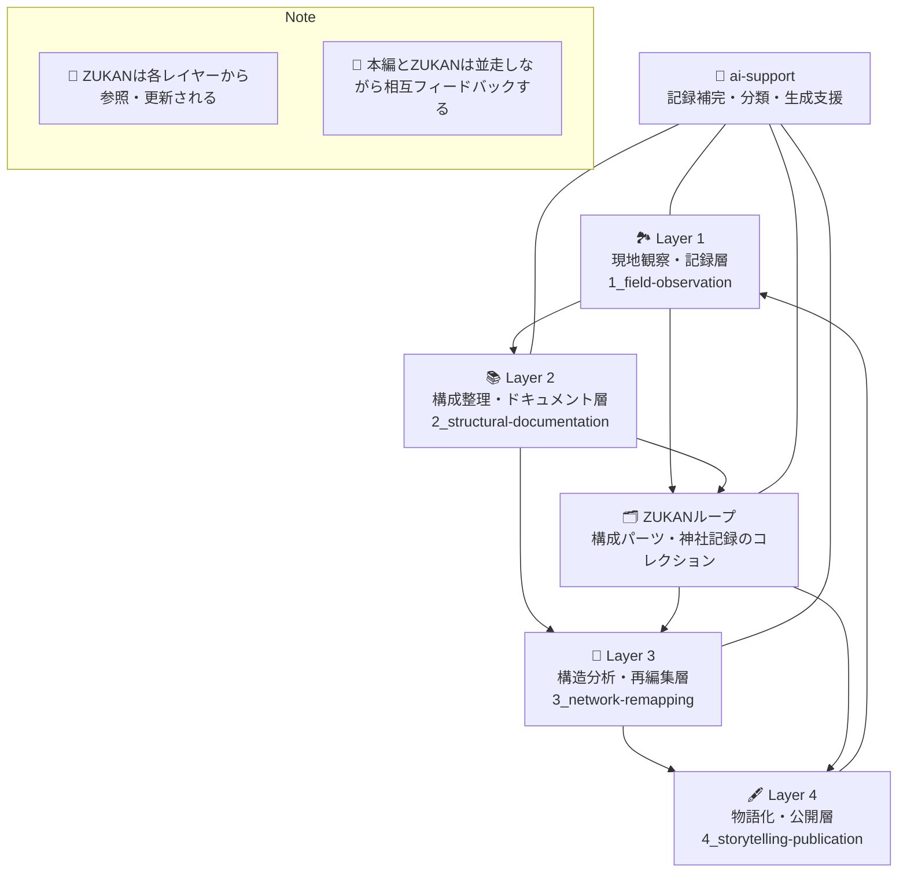

```mermaid
graph TD

%% 本編の4層ループ
L1[🏞️ Layer 1<br>現地観察・記録層<br>1_field-observation]
L2[📚 Layer 2<br>構成整理・ドキュメント層<br>2_structural-documentation]
L3[🧠 Layer 3<br>構造分析・再編集層<br>3_network-remapping]
L4[🖋️ Layer 4<br>物語化・公開層<br>4_storytelling-publication]

L1 --> L2 --> L3 --> L4 --> L1

%% ZUKANとの関係
ZK[🗂️ ZUKANループ<br>構成パーツ・神社記録のコレクション]

L1 --> ZK
L2 --> ZK
ZK --> L3
ZK --> L4

%% AI支援
AI[🤖 ai-support<br>記録補完・分類・生成支援]
AI --- L1
AI --- L2
AI --- L3
AI --- ZK

%% 説明補足
subgraph Note
  direction TB
  NK1[🔹 ZUKANは各レイヤーから参照・更新される]
  NK2[🔹 本編とZUKANは並走しながら相互フィードバックする]
end

```
