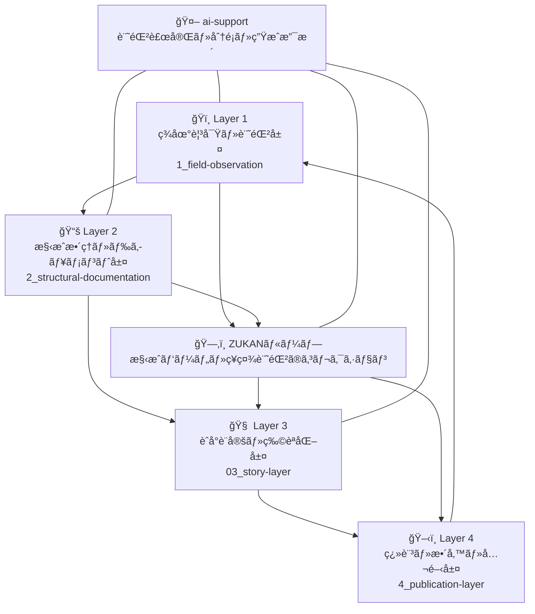

```mermaid
graph TD

%% 本編ã®4層ループ
L1[ğŸï¸ Layer 1<br>ç¾åœ°è¦³å¯Ÿãƒ»è¨˜éŒ²å±¤<br>1_field-observation]
L2[📚 Layer 2<br>構æˆæ•´ç†ãƒ»ãƒ‰ã‚­ãƒ¥ãƒ¡ãƒ³ãƒˆå±¤<br>2_structural-documentation]
L3[🧠 Layer 3<br>èˆå°è¨­å®šãƒ»ç‰©èªåŒ–層<br>03_story-layer]
L4[ğŸ–‹ï¸ Layer 4<br>翻訳・整備・公開層<br>4_publication-layer]

L1 --> L2 --> L3 --> L4 --> L1

%% ZUKANã¨ã®é–¢ä¿‚
ZK[ğŸ—‚ï¸ ZUKANループ<br>構æˆãƒ‘ーツ・ç¥ç¤¾è¨˜éŒ²ã®ã‚³ãƒ¬ã‚¯ã‚·ãƒ§ãƒ³]

L1 --> ZK
L2 --> ZK
ZK --> L3
ZK --> L4

%% AI支æ´
AI[🤖 ai-support<br>記録補完・分é¡ãƒ»ç”Ÿæˆæ”¯æ´]
AI --- L1
AI --- L2
AI --- L3
AI --- ZK

```
