# Shrine-Fiction Project 🏞️🧠💋

Shrine-Fiction is an open cultural-scientific storytelling project that reimagines Japan's ancient landscape through the lens of **geography, watersheds, and shrine networks**.
It is built upon the idea that **shrines are not isolated religious sites**, but cultural nodes rooted in terrain, springs, water systems, and human settlements.

📘 Read this in other languages:

- [🇯🇵 日本語](./README_ja.md)

## 🌐 Core Concept

> "**Terrain × Watershed × Shrine Placement × Storytelling**"
> From detailed field observations to fictional storytelling, Shrine-Fiction builds a layered structure that blends material reality with mythic imagination.

This project operates in **four iterative layers**, integrating fieldwork, documentation, narrative design, and open publication. A supplementary loop called **ZUKAN** supports the collection and classification of shrine parts, enabling comparative analysis.

## 🌀 Project Layers and AI Support

```mermaid
graph TD

%% Main 4-layer loop
L1[🏞️ Layer 1<br>Field Observation<br>1_field-observation]
L2[📚 Layer 2<br>Structural Documentation<br>2_structural-documentation]
L3[🧠 Layer 3<br>Story Design<br>3_story-layer]
L4[💋 Layer 4<br>Publication & Outreach<br>4_publication-layer]

L1 --> L2 --> L3 --> L4 --> L1

%% ZUKAN loop
ZK[🗂️ ZUKAN Loop<br>Parts Documentation & Shrine Registry]

L1 --> ZK
L2 --> ZK
ZK --> L3
ZK --> L4

%% AI support links
AI[🤖 AI Support<br>Completion, Classification, Generation]
AI --- L1
AI --- L2
AI --- L3
AI --- ZK
```

## 🧱 Components

* **Shrine Parts ZUKAN**: A digital illustrated index of torii, komainu, honden, stone tablets, and more.
* **Field Notes**: Observation records from real shrines with terrain analysis (e.g., spring locations, escarpments, lost pathways).
* **Narrative Fragments**: Mythic or speculative fiction grounded in shrine-geography networks.
* **Data + Story Fusion**: Network science meets folklore. Reality-based fiction.

## 📚 Story List (MVP)

| Scene ID | Title                          | Visual                                                                     |
|----------|--------------------------------|-----------------------------------------------------------------------------|
| `001`    | Meguro River Watershed / Mishuku Shrine |  |

→ [📖 Read More](ai-collaboration/shrine-fiction/03_story-layer/mvp-story.md)

---

## 🤝 Contributions Welcome

Whether you're into:

* Shrine mapping
* Terrain analysis
* Field sketching
* Myth-making
* AI-assisted storytelling

We welcome your insights. Join us in building a living archive of terrain-rooted Japanese shrine culture.

---

For documentation, issues, or contributions, visit:
🔗 [GitHub Shrine-Fiction Repository](https://github.com/your-org/shrine-fiction)
