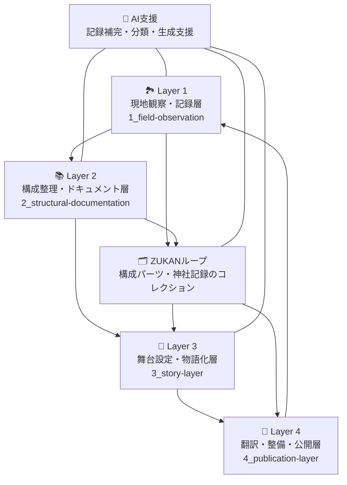

# Shrine-Fiction プロジェクト 🏞️🧠💋

Shrine-Fiction（神社フィクション）は、日本列島に広がる**地形・流域・神社ネットワーク**を手がかりに、過去と現在をつなぐ物語世界を構築する**オープン文化・科学プロジェクト**です。
神社を単なる宗教施設ではなく、「湧水・崖地・旧道」などに結びつく v（節点）として捉え直します。

📘 他の言語で読む:

- [🇺🇸 English](./README.md)

## 🌐 基本構想

> "**地形 × 流域 × 神社配置 × 物語構築**"
> 現地観察から物語まで、現実と空想を接続する多層的なループ構造を持ちます。

本プロジェクトは、現地調査、ドキュメント整理、舞台設計、公開表現の**4 つのループ層**で構成されています。
また、神社を構成するパーツの記録・比較を行う補助ループ「**ZUKAN**」を併設し、比較分析や創作支援を行います。

## 🌀 4 層構造と AI 支援

## 🧱 コンポーネント

- **神社パーツ図鑑（ZUKAN）**：鳥居・狛犬・本殿・石碑などを記録・図解したデジタル図鑑。
- **現地観察メモ**：地形（湧水・崖・旧道など）と結びつく観察記録。
- **物語断片**：神社地形ネットワークに基づく神話的・思索的フィクション。
- **データと物語の融合**：ネットワーク科学と伝承の接続。現実から発想された物語。

## 📚 作品一覧 (MVP)

| シーン ID | タイトル                | ビジュアル                                                   |
| --------- | ----------------------- | ------------------------------------------------------------ |
| `001`     | 目黒川流域／三宿神社 編 |  |

→ [📖 続きを読む](ai-collaboration/shrine-fiction/03_story-layer/mvp-story.md)

---

## 🤝 コントリビューション歓迎

以下のような方の参加を歓迎します：

- 神社マッピングや歴史地図に興味がある
- 地形・流域分析が好き
- スケッチや観察が得意
- 神話や物語の創作が好き
- AI を使って文化的プロジェクトに参加したい

あなたの知見や視点を、神社ネットワークの物語構築に活かしてみませんか？
共に“地形に根ざした日本文化のアーカイブ”を育てましょう。

---

詳細・ドキュメント・Issue 提出はこちらから：
🔗 [GitHub Shrine-Fiction Repository](https://github.com/your-org/shrine-fiction)
