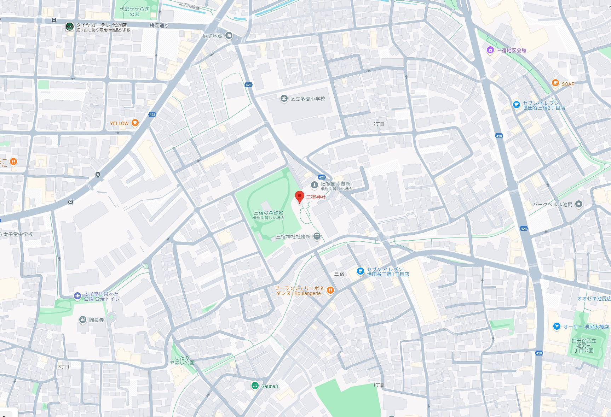
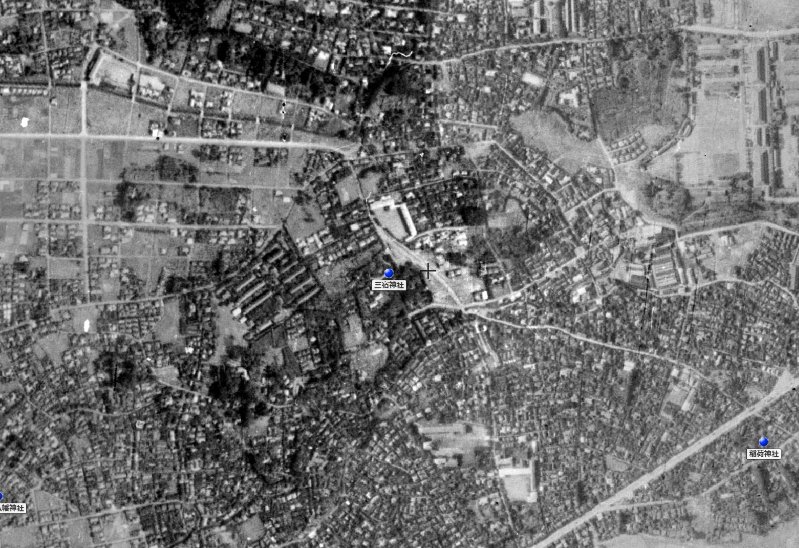
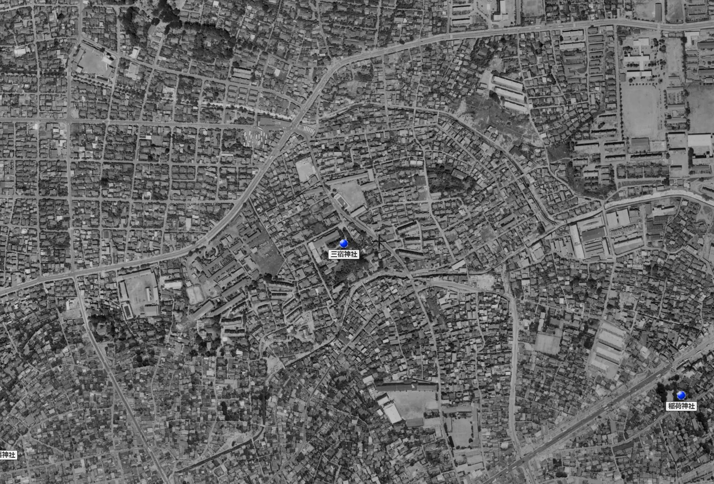

# 三宿神社（Mishuku Jinja）パーツ写真インデックス

## 🏛 神社基本情報

- 場所：東京都世田谷区三宿
- 流域：目黒川流域
- 特徴：創建不詳。北沢川・烏山川合流点。多聞寺が廃仏毀釈で廃寺となり建立

---

## ✍️ メモ・観察記録（自由記述欄）

- 烏山川緑道左岸の台地上に立地。
- 烏山川が目黒川に合流する直前の蛇行部中央に鳥居が立つ。社殿前に急傾斜あり。攻撃斜面により抉られた崖の上に本殿がある。
- 本殿の裏手には三宿の森緑地がある。公園として整備されているが、本来は当神社の鎮守の森だった可能性が濃厚。ビオトープ池・井戸があることから湧水地の可能性大。
- 本殿背後から東方を望むと、旧多聞寺墓所が見える。

---

## 🏯 鳥居（Torii）

---

## 🐲 狛犬・神使（Komainu）

---

## 🏛 社殿・拝殿（Shaden）

---

## 🛤️ 参道（Sandō）

---

## ⛩️ 境内社・末社（Sessha, Massha）

---

## 社務所・授与所（Shamusho）

  
  
社務所兼神輿蔵風建築 境内の一角に立つ横長の建築。御札授与と神輿・祭具収納を兼ねる可能性。板張り外観と結界柵が特徴的。

---

## 🪨 石碑・記念碑・民間石造物（Monument）

---

## 🪵 境界・社号標（Boundary, Shagohyō）

---

## 🎌 神紋・エンブレム（Emblem）

---

## 🏔️ 地形（Terrain）

---

## 🌱 周辺環境（Environment）

---

## 🗺️ 地図・周辺状況（Maps）

  
  
  
  
  

**備考**

- 地形分類図から、三宿神社が台地縁辺部に立地していることが明確に読み取れる。
- 航空写真から、戦前・戦後・現代にかけての鎮守の森の変遷を追跡可能。
- 湧水地と崖線との位置関係も視覚的に検証できる。

---

