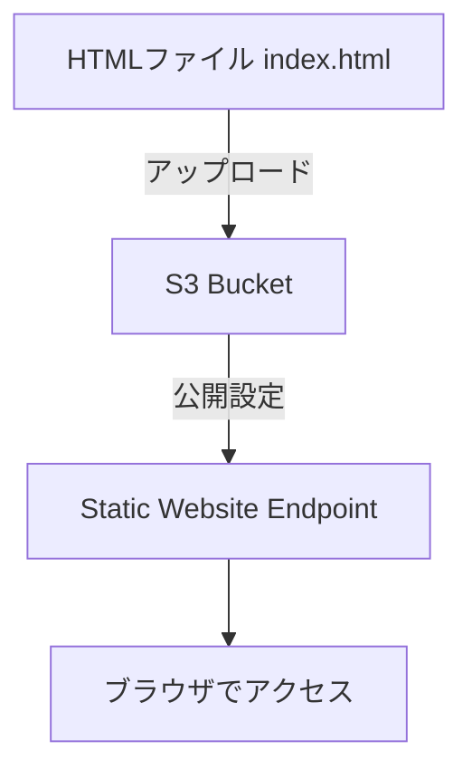

# 静的サイト公開

S3 を使って簡単に HTML を公開する手順。



# 学習ステップ

---

## 1️⃣ S3 バケット作成

- **目的**：サイトを公開するための「保管庫（バケット）」を用意
- **ポイント**：バケット名はグローバルで一意。小文字のみ、記号制限あり

### CLI 例

```bash
aws s3 mb s3://my-first-bucket-20251003

```

### チェック

```bash
aws s3 ls

```

👉 作成日時とバケット名が表示されれば成功

---

## 2️⃣ index.html 作成とアップロード

- **目的**：公開する最小構成のサイトファイルをアップロード
- **注意点**：ファイル名は必ず `index.html`（ウェブの入口になるため）

### サンプル HTML

```html
<!DOCTYPE html>
<html>
  <head>
    <meta charset="UTF-8" />
    <title>Hello Cloud</title>
  </head>
  <body>
    <h1>Hello from AWS S3!</h1>
  </body>
</html>
```

### アップロード

```bash
aws s3 cp index.html s3://my-first-bucket-20251003/

```

### 確認

```bash
aws s3 ls s3://my-first-bucket-20251003/

```

---

## 3️⃣ 静的ウェブサイトホスティングの有効化

- **目的**：S3 に保存したファイルを「ウェブサイト」として公開できるようにする
- **デフォルト文書**として `index.html` を指定する

### コマンド

```bash
aws s3 website s3://my-first-bucket-20251003/ --index-document index.html

```

### 確認

S3 ダッシュボード → バケット → 「プロパティ」 → 「静的ウェブサイトホスティング」 → 有効化済み

---

## 4️⃣ バケットポリシーの適用（公開許可）

- **目的**：インターネットから誰でも `GetObject` できるようにする
- **注意点**：デフォルトではバケットは非公開、AccessDenied が出る

### ポリシーファイル（bucket-policy.json）

```json
{
  "Version": "2012-10-17",
  "Statement": [
    {
      "Effect": "Allow",
      "Principal": "*",
      "Action": "s3:GetObject",
      "Resource": "arn:aws:s3:::my-first-bucket-20251003/*"
    }
  ]
}
```

### 適用

```bash
aws s3api put-bucket-policy --bucket my-first-bucket-20251003 --policy file://bucket-policy.json

```

---

## 5️⃣ 公開 URL で動作確認

- **URL 形式**

  ```
  http://<バケット名>.s3-website-<リージョン>.amazonaws.com

  ```

  例：

  ```
  http://my-first-bucket-20251003.s3-website-ap-northeast-1.amazonaws.com

  ```

👉 ブラウザで「Hello from AWS S3!」が表示されれば成功

---

## 6️⃣ CloudFront ディストリビューション作成

- **目的**：世界中のユーザーに対して最寄りの拠点から配信（CDN）する
- **Origin**：S3 のエンドポイントを指定

### コマンド

```bash
aws cloudfront create-distribution \
  --origin-domain-name my-first-bucket-20251003.s3.ap-northeast-1.amazonaws.com \
  --default-root-object index.html > cloudfront.json

```

👉 成功すると `DomainName` と `Id` が返る

例：`d3estvsmqhxwn3.cloudfront.net`

---

## 7️⃣ デプロイ待ち

- CloudFront は作成後すぐには使えない
- 状態が `"InProgress"` → `"Deployed"` に変わるまで **10〜20 分**
- この間アクセスすると 403 / 404 になることもある

### 状態確認

```bash
aws cloudfront get-distribution --id <DistributionId>

```

### 完了後アクセス

```
https://d3estvsmqhxwn3.cloudfront.net/index.html

```

---

## 8️⃣ S3 を非公開化（推奨）

- **目的**：S3 直アクセスを遮断し、CloudFront 経由のみアクセス可能にする（セキュリティ強化）

### 手順

1. **パブリックアクセスブロックを再度有効化**

```bash
aws s3api put-public-access-block \
  --bucket my-first-bucket-20251003 \
  --public-access-block-configuration '{
    "BlockPublicAcls": true,
    "IgnorePublicAcls": true,
    "BlockPublicPolicy": true,
    "RestrictPublicBuckets": true
  }'

```

1. **CloudFront OAI / OAC を作成して、S3 にだけアクセス許可を与える**

   （ここは追加学習ステップ）

---

# ✅ まとめ

- **S3** → バケット作成～ポリシー設定で静的サイト公開が可能
- **CloudFront** → CDN 経由で世界中に高速配信可能
- **実務では** S3 を非公開化し、CloudFront 専用に権限を与えるのがベストプラクティス
