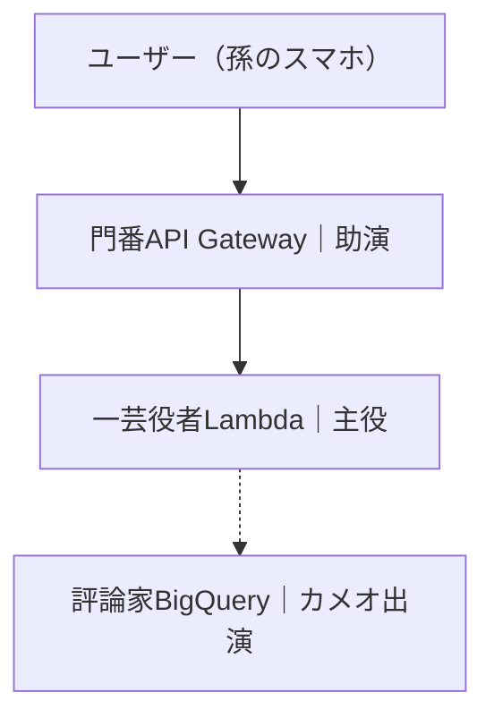

# サーバーレス API

AWS Lambda で簡単な API を構築する手順。

---

## 📑 目次
- [概要](#サーバーレス-api)
- [構成図](#構成図)
- [🪜 Step 1: Lambda 関数を作成](#-step-1-lambda-関数を作成)
- [🪜 Step 2: 関数を ZIP 化（Windows PowerShell の場合）](#-step-2-関数を-zip-化windows-powershell-の場合)
- [🪜 Step 3: IAM ロールを作成（Lambda 実行権限）](#-step-3-iam-ロールを作成lambda-実行権限)
- [🪜 Step 4: Lambda 関数を AWS にデプロイ](#-step-4-lambda-関数を-aws-にデプロイ)
- [🪜 Step 5: API Gateway を作成](#-step-5-api-gateway-を作成)
- [🪜 Step 6: status リソースを作成](#-step-6-status-リソースを作成)
- [🪜 Step 7: GET メソッドを追加し、Lambda と統合](#-step-7-get-メソッドを追加しlambda-と統合)
- [🪜 Step 8: API Gateway に Lambda 実行権限を付与](#-step-8-api-gateway-に-lambda-実行権限を付与)
- [🪜 Step 9: API をデプロイ](#-step-9-api-をデプロイ)
- [🪜 Step 10: 動作確認（ブラウザ or curl）](#-step-10-動作確認ブラウザ-or-curl)

---

### 🪜 Step 1: Lambda 関数を作成

作業ディレクトリを作る

mkdir usecase03_lambda
cd usecase03_lambda

関数ファイルを作成

echo 'import json
def lambda_handler(event, context):
message = {"message": "黒飴は奈良中央センターに到着しました！（Hello from Lambda!）"}
return {
"statusCode": 200,
"headers": {"Content-Type": "application/json; charset=utf-8"},
"body": json.dumps(message, ensure_ascii=False)
}' > lambda_function.py

### 🪜 Step 2: 関数を ZIP 化（Windows PowerShell の場合）

Compress-Archive -Path lambda_function.py -DestinationPath function.zip -Force

### 🪜 Step 3: IAM ロールを作成（Lambda 実行権限）

trust-policy.json

{
"Version": "2012-10-17",
"Statement": [
{
"Effect": "Allow",
"Principal": {"Service": "lambda.amazonaws.com"},
"Action": "sts:AssumeRole"
}
]
}

aws iam create-role `  --role-name lambda-ex-role`
--assume-role-policy-document file://trust-policy.json

aws iam attach-role-policy `  --role-name lambda-ex-role`
--policy-arn arn:aws:iam::aws:policy/service-role/AWSLambdaBasicExecutionRole

### 🪜 Step 4: Lambda 関数を AWS にデプロイ

aws lambda create-function `  --function-name hello-nara-api`
--runtime python3.9 `  --role arn:aws:iam::<アカウントID>:role/lambda-ex-role`
--handler lambda_function.lambda_handler `
--zip-file fileb://function.zip

✅ 動作確認

aws lambda invoke --function-name hello-nara-api --payload '{}' response.json
type response.json

### 🪜 Step 5: API Gateway を作成

aws apigateway create-rest-api --name "NaraDeliveryAPI"

取得した "id" を <API_ID> に置き換える。

### 🪜 Step 6: /status リソースを作成

aws apigateway get-resources --rest-api-id <API_ID>
aws apigateway create-resource `  --rest-api-id <API_ID>`
--parent-id <ROOT_ID> `
--path-part status

### 🪜 Step 7: GET メソッドを追加し、Lambda と統合

aws apigateway put-method `  --rest-api-id <API_ID>`
--resource-id <RESOURCE_ID> `  --http-method GET`
--authorization-type "NONE"

aws apigateway put-integration `  --rest-api-id <API_ID>`
--resource-id <RESOURCE_ID> `  --http-method GET`
--type AWS_PROXY `  --integration-http-method POST`
--uri arn:aws:apigateway:ap-northeast-1:lambda:path/2015-03-31/functions/arn:aws:lambda:ap-northeast-1:<ACCOUNT_ID>:function:hello-nara-api/invocations

### 🪜 Step 8: API Gateway に Lambda 実行権限を付与

aws lambda add-permission `  --function-name hello-nara-api`
--statement-id apigateway-permission `  --action lambda:InvokeFunction`
--principal apigateway.amazonaws.com `
--source-arn arn:aws:execute-api:ap-northeast-1:<ACCOUNT_ID>:<API_ID>/\*/GET/status

### 🪜 Step 9: API をデプロイ

aws apigateway create-deployment `  --rest-api-id <API_ID>`
--stage-name dev

### 🪜 Step 10: 動作確認（ブラウザ or curl）

https://<API_ID>.execute-api.ap-northeast-1.amazonaws.com/dev/status

✅ 期待されるレスポンス

{"message": "黒飴は奈良中央センターに到着しました！（Hello from Lambda!）"}
