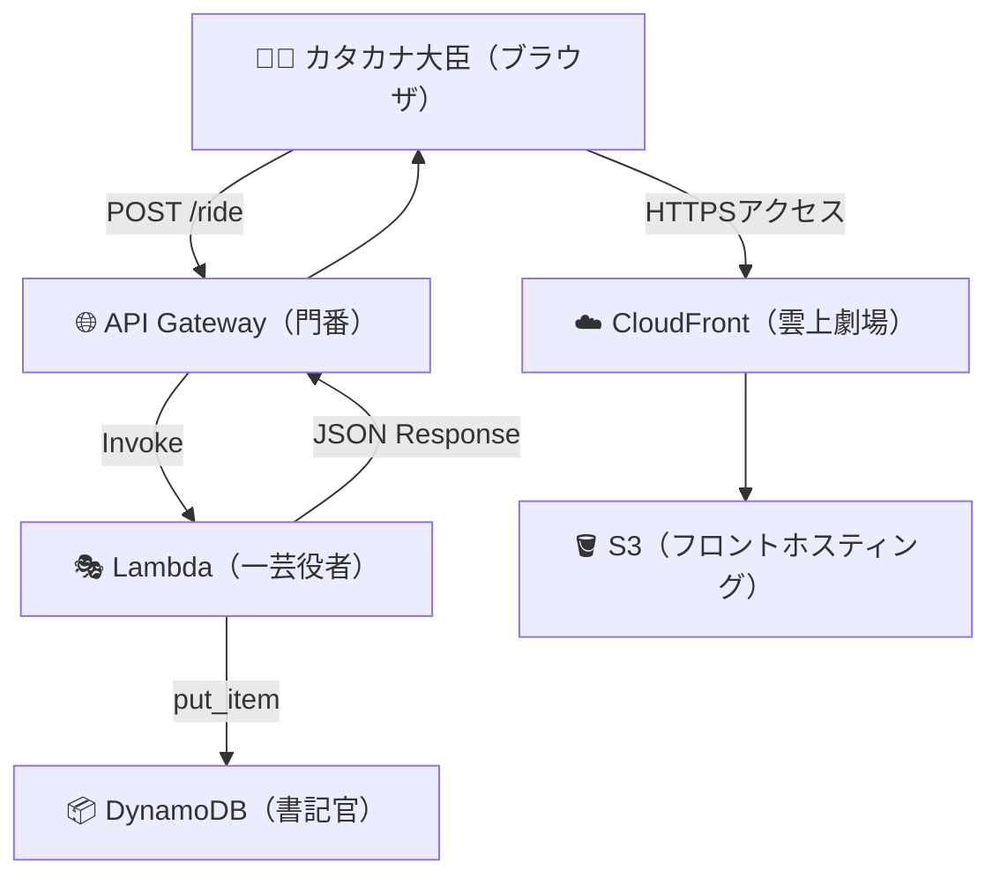

# 📘 AWS ハンズオン：UseCase 04 - 動的 Web アプリ

クラウド三部作（DynamoDB / Lambda / API Gateway）＋ S3 ＋ CloudFront

---

## 📑 目次

1. [概要](https://www.notion.so/Web-273994f0dfcd81aa8426f3917f83f0a6?pvs=21)
2. [アーキテクチャ構成図](https://www.notion.so/Web-273994f0dfcd81aa8426f3917f83f0a6?pvs=21)
3. [ハンズオンの流れ](https://www.notion.so/Web-273994f0dfcd81aa8426f3917f83f0a6?pvs=21)
   - [Step1：DynamoDB テーブル作成](https://www.notion.so/Web-273994f0dfcd81aa8426f3917f83f0a6?pvs=21)
   - [Step2：Lambda 関数の作成](https://www.notion.so/Web-273994f0dfcd81aa8426f3917f83f0a6?pvs=21)
   - [Step3：Lambda に実行ロール付与](https://www.notion.so/Web-273994f0dfcd81aa8426f3917f83f0a6?pvs=21)
   - [Step4：API Gateway 作成と統合](https://www.notion.so/Web-273994f0dfcd81aa8426f3917f83f0a6?pvs=21)
   - [Step5：API をデプロイして URL 発行](https://www.notion.so/Web-273994f0dfcd81aa8426f3917f83f0a6?pvs=21)
   - [Step6：フロントエンド作成](https://www.notion.so/Web-273994f0dfcd81aa8426f3917f83f0a6?pvs=21)
   - [Step7：CORS 設定とブラウザ確認](https://www.notion.so/Web-273994f0dfcd81aa8426f3917f83f0a6?pvs=21)
   - [Step8：CloudWatch でログ確認](https://www.notion.so/Web-273994f0dfcd81aa8426f3917f83f0a6?pvs=21)
4. [Appendix：S3 ＋ CloudFront 公開（OAC 対応）](https://www.notion.so/Web-273994f0dfcd81aa8426f3917f83f0a6?pvs=21)
5. [参考資料](https://www.notion.so/Web-273994f0dfcd81aa8426f3917f83f0a6?pvs=21)

---

## 🧭 概要

このハンズオンでは、AWS のサーバーレスサービスを用いて

**「ブラウザから API を叩く動的 Web アプリ」** を構築します。

> 📚 寸劇テーマ：
>
> 書記官 DynamoDB、親分 Lambda、門番 API Gateway、
>
> そしてフロント担当カタカナ大臣たちが力を合わせて、
>
> 「クラウドで動く配車アプリ」を完成させます。

---

## 🏗️ アーキテクチャ構成図



---

## 🪶 ハンズオンの流れ

---

### Step1：DynamoDB テーブル作成

📖 **担当：書記官 DynamoDB**

```bash
aws dynamodb create-table \
  --table-name RideOrders \
  --attribute-definitions AttributeName=orderId,AttributeType=S \
  --key-schema AttributeName=orderId,KeyType=HASH \
  --billing-mode PAY_PER_REQUEST

aws dynamodb list-tables

```

テーブル名：`RideOrders`

主キー：`orderId`（String）

---

### Step2：Lambda 関数の作成

🎭 **担当：一芸役者 Lambda**

```bash
zip function.zip lambda_function.py

aws lambda create-function \
  --function-name handleRideRequest \
  --zip-file fileb://function.zip \
  --handler lambda_function.lambda_handler \
  --runtime python3.12 \
  --role arn:aws:iam::<アカウントID>:role/lambda-ex-role

```

`lambda_function.py` の例：

```python
import json
import boto3
import random

dynamodb = boto3.resource('dynamodb')
table = dynamodb.Table('RideOrders')

def lambda_handler(event, context):
    order_id = str(random.randint(1, 999)).zfill(3)
    driver = "ゴジュエモンタクシー"
    eta = "3分後"
    table.put_item(Item={"orderId": order_id, "driverName": driver, "eta": eta, "status": "on_the_way"})
    return {
        "statusCode": 200,
        "headers": {
            "Access-Control-Allow-Origin": "*",
            "Access-Control-Allow-Methods": "POST, GET, OPTIONS",
            "Access-Control-Allow-Headers": "Content-Type"
        },
        "body": json.dumps({"orderId": order_id, "driverName": driver, "eta": eta})
    }

```

---

### Step3：Lambda に実行ロール付与

🪪 **担当：親分の許可証**

```bash
aws iam attach-role-policy \
  --role-name lambda-ex-role \
  --policy-arn arn:aws:iam::aws:policy/AmazonDynamoDBFullAccess

```

これで Lambda が DynamoDB へ書き込み可能に。

---

### Step4：API Gateway 作成と統合

🚪 **担当：門番 API Gateway**

```bash
aws apigateway create-rest-api --name "RideOrderAPI"
aws apigateway get-resources --rest-api-id <api_id>

aws apigateway create-resource \
  --rest-api-id <api_id> \
  --parent-id <root_id> \
  --path-part ride

aws apigateway put-method \
  --rest-api-id <api_id> \
  --resource-id <resource_id> \
  --http-method POST \
  --authorization-type "NONE"

aws apigateway put-integration \
  --rest-api-id <api_id> \
  --resource-id <resource_id> \
  --http-method POST \
  --type AWS_PROXY \
  --integration-http-method POST \
  --uri arn:aws:apigateway:ap-northeast-1:lambda:path/2015-03-31/functions/arn:aws:lambda:ap-northeast-1:<アカウントID>:function:handleRideRequest/invocations

```

Lambda 呼び出し許可を追加 👇

```bash
aws lambda add-permission \
  --function-name handleRideRequest \
  --statement-id apigateway-access \
  --action lambda:InvokeFunction \
  --principal apigateway.amazonaws.com \
  --source-arn arn:aws:execute-api:ap-northeast-1:<アカウントID>:<api_id>/*/POST/ride

```

---

### Step5：API をデプロイして URL 発行

🎬 **担当：舞台公開チーム**

```bash
aws apigateway create-deployment \
  --rest-api-id <api_id> \
  --stage-name prod

```

📡 デプロイ URL 例：

```
https://<api_id>.execute-api.ap-northeast-1.amazonaws.com/prod/ride

```

---

### Step6：フロントエンド作成

🧑‍💻 **担当：カタカナ大臣とフロントちゃん**

```html
<!DOCTYPE html>
<html lang="ja">
  <head>
    <meta charset="UTF-8" />
    <title>ゴジュエモンタクシー配車アプリ</title>
  </head>
  <body>
    <h1>🚕 ゴジュエモンタクシー 配車アプリ</h1>
    <button id="callRide">配車リクエストする</button>
    <div id="result"></div>

    <script>
      const apiUrl =
        "https://<api_id>.execute-api.ap-northeast-1.amazonaws.com/prod/ride";
      document
        .getElementById("callRide")
        .addEventListener("click", async () => {
          const res = await fetch(apiUrl, { method: "POST" });
          const data = await res.json();
          document.getElementById("result").innerHTML = `
        ✅ 配車完了！<br>
        Order ID: ${data.orderId}<br>
        ドライバー: ${data.driverName}<br>
        到着予定: ${data.eta}
      `;
        });
    </script>
  </body>
</html>
```

---

### Step7：CORS 設定とブラウザ確認

🌐 **担当：ブラウザとクラウドの共演**

Lambda のレスポンスに以下を追加済み 👇

```python
"headers": {
    "Access-Control-Allow-Origin": "*",
    "Access-Control-Allow-Methods": "POST, GET, OPTIONS",
    "Access-Control-Allow-Headers": "Content-Type"
}

```

ローカル HTML から fetch() が成功すれば OK。

---

### Step8：CloudWatch でログ確認

🪶 **担当：ゴジュエモン（監視係）**

```bash
aws logs describe-log-streams \
  --log-group-name "/aws/lambda/handleRideRequest" \
  --order-by LastEventTime \
  --descending --max-items 3

aws logs get-log-events \
  --log-group-name "/aws/lambda/handleRideRequest" \
  --log-stream-name "<latest_stream_name>" \
  --limit 20

```

---

## Appendix：S3 ＋ CloudFront 公開（OAC 対応）

1️⃣ S3 に index.html をアップロード（ACL 不要）

2️⃣ CloudFront でオリジン設定を `ride-app-web-xxxx.s3.ap-northeast-1.amazonaws.com` に変更

3️⃣ Origin Access Control (OAC) を作成して紐づけ

4️⃣ S3 ポリシーを以下のように設定 👇

```json
{
  "Effect": "Allow",
  "Principal": { "Service": "cloudfront.amazonaws.com" },
  "Action": "s3:GetObject",
  "Resource": "arn:aws:s3:::ride-app-web-xxxx/*",
  "Condition": {
    "StringEquals": {
      "AWS:SourceArn": "arn:aws:cloudfront::<アカウントID>:distribution/<distribution_id>"
    }
  }
}
```

結果：

- CloudFront 経由：✅ 正常表示
- S3 直アクセス：🚫 403 Forbidden
