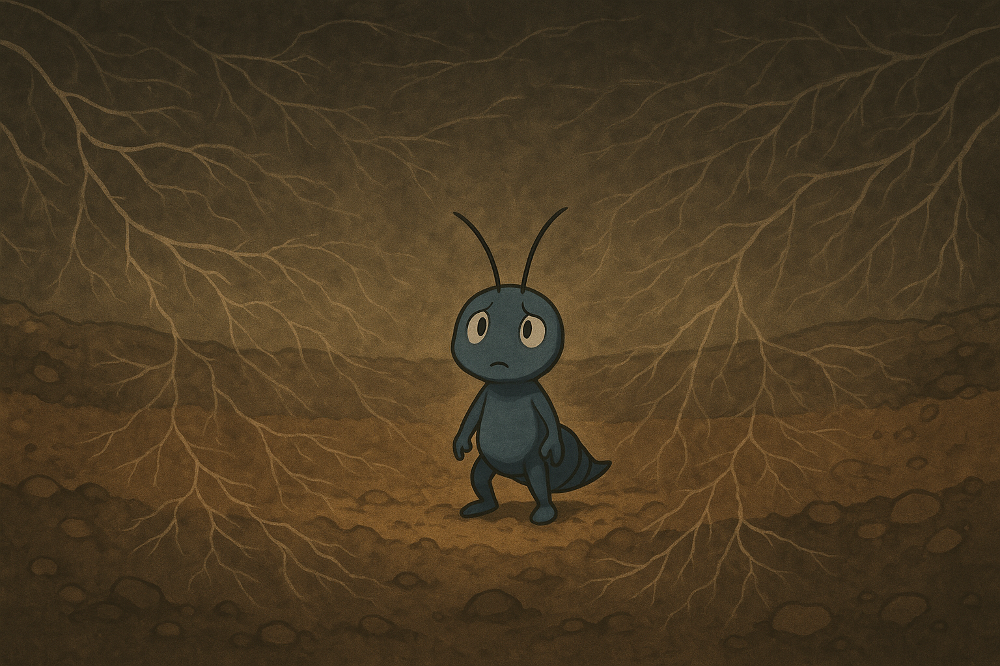
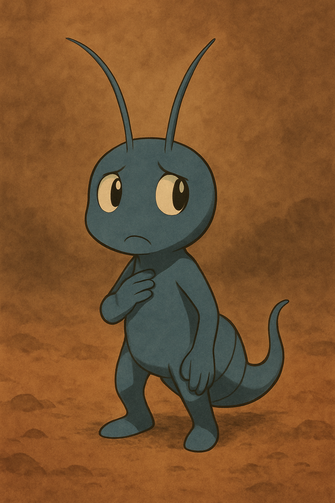
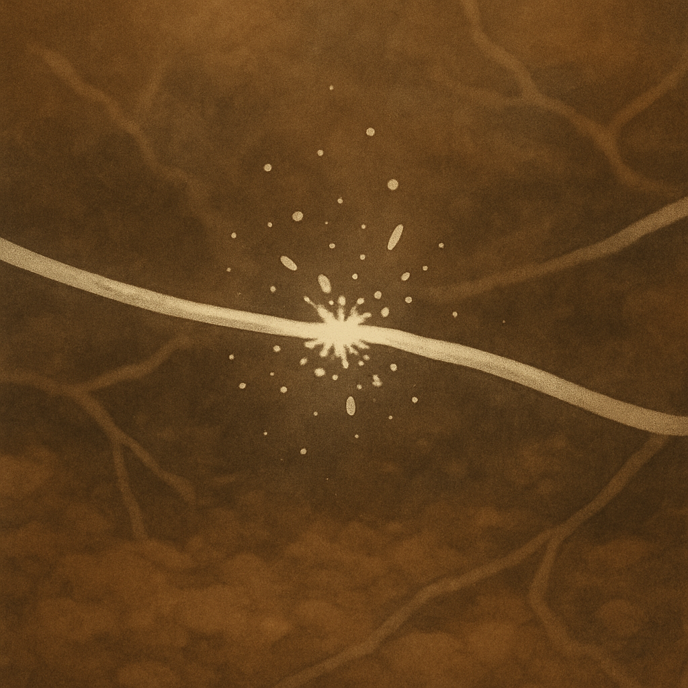

# 📄 Page 01 Layout - Episode 01

This document outlines the page layout structure for the first scene of Episode 01: “A Hint of Silence.”
/ このドキュメントは、Episode 01 シーン 01「静寂の兆し」に対応するページ構成案を記述します。

---

## 🖼️ Visual Flow / ビジュアルの流れ（3 コマ構成）

### Panel 1 / コマ ①

- 📷 イメージ：地中の断面図。菌糸ネットワークが徐々に消えゆく様子。
- 💬 吹き出し（ナレーション）：「朝。聞こえるはずの“音”が、ない。」
- 🧠 解説メモ：静寂の異常を印象付けるオープニング。構図は俯瞰＋広がり。

### Panel 2 / コマ ②

- 📷 イメージ：トビノが中央で耳を澄ます（触角が緊張している）
- 💬 モノローグ：「…また静かだ。菌の歌が聞こえない。」
- 🧠 解説メモ：キャラと感覚の接続。視点を近づけて感情を見せる。

### Panel 3 / コマ ③

- 📷 イメージ：菌糸が“プツッ”と切れたような描写。波紋が途絶える。
- 💬 セリフ：「これは…断線？」
- 🧠 解説メモ：静から動への一歩。次の跳躍シーンへの予兆として演出。

---

## 🎯 構成意図 / Composition Goals

- 1 ページで “異変”と “感知” を描き切ること
- 空間と静寂をテーマに、読み手に「耳を澄ませる体験」を与える

---

## 🔗 References / 参照元

- `dialogue.md`：セリフ・モノローグ参照
- `storyboard-sketches/scene-01.md`：構図と動線
- `visual-assets/episode-01/`：画像素材
- `ai-support/image-prompts-scene01.md`：生成プロンプト

> 🧩 このページは今後、吹き出しレイヤー、演出タイミング、注釈表示（科学メタレイヤー）と統合されていきます。
