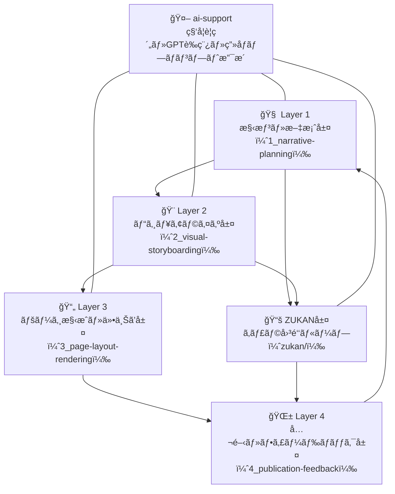

# Tobimushi Manga README

```mermaid
graph TD

%% 層構造（番å·ä»˜ãã§æ˜ç¤ºï¼‰
L1[🧠 Layer 1<br>構想・文案層<br>（1_narrative-planning）]
L2[🨠Layer 2<br>ビジュアライズ層<br>（2_visual-storyboarding）]
L3[📄 Layer 3<br>ページ構æˆãƒ»ä»•ä¸Šã’層<br>（3_page-layout-rendering）]
L4[🌱 Layer 4<br>公開・フィードãƒãƒƒã‚¯å±¤<br>（4_publication-feedback）]
ZK[📚 ZUKAN層<br>キャラ図鑑ループ<br>（zukan/）]

%% 基本ループ（本編ã®æ§‹æˆé †ï¼‰
L1 --> L2 --> L3 --> L4 --> L1

%% ZUKANã¯æ§‹æƒ³å±¤ã¨ä¸¦èµ°ã—ãªãŒã‚‰æ´¾ç”Ÿå¯èƒ½
L1 --> ZK
L2 --> ZK
ZK --> L4

%% 横断レイヤー（AI支æ´å±¤ï¼‰
AI[🤖 ai-support<br>科学è¦ç´„・GPTè‰ç¨¿ãƒ»ç”»åƒãƒ—ロンプト支æ´]

AI --- L1
AI --- L2
AI --- L3
AI --- ZK

```
