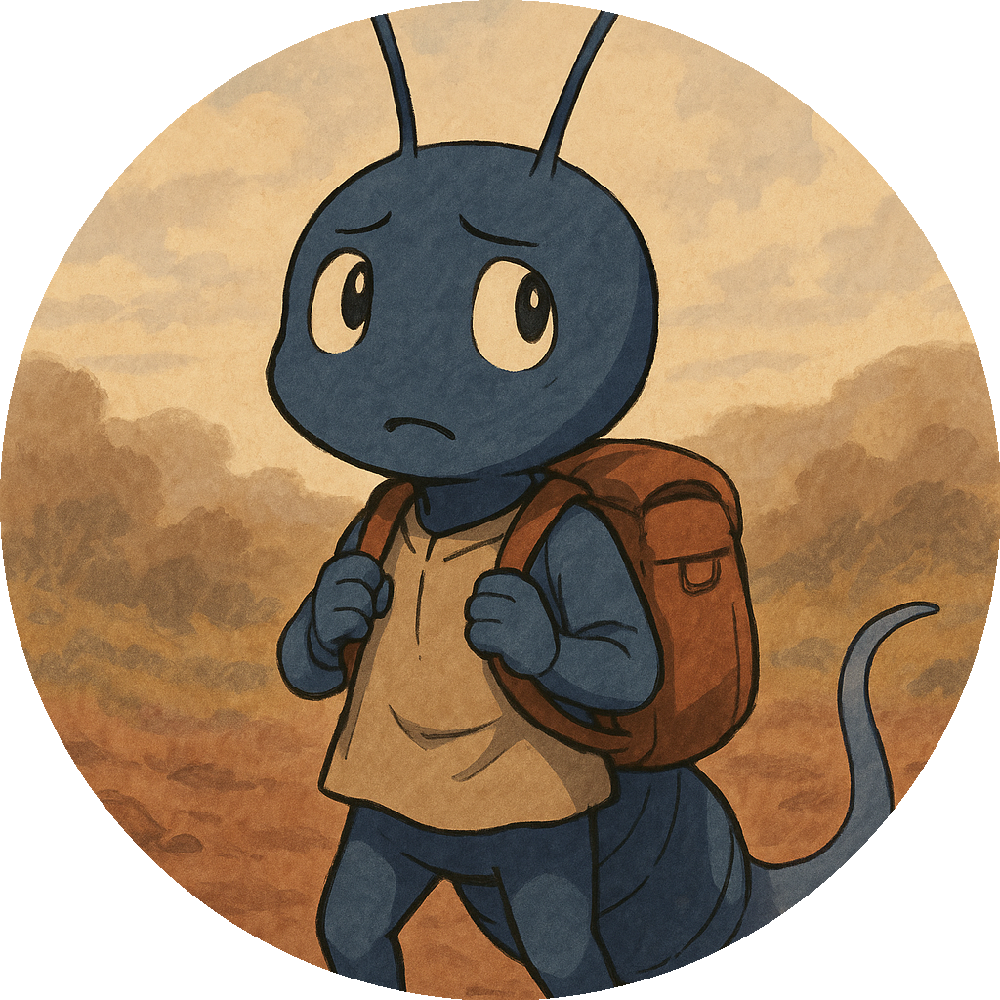

# 📚 ZUKAN - Tobimushi Manga Character Encyclopedia / キャラクター図鑑

**ZUKAN** is an open visual guide to all the characters and creatures featured in the Tobimushi Manga project. / **ZUKAN**は、Tobimushi Manga プロジェクトに登場するキャラクターや生物を記録・共有・発展させていく**オープン図鑑**です。

While the main story follows a narrative loop, this ZUKAN grows independently, blending observation, imagination, AI support, and scientific knowledge into an evolving OSS ecosystem. / 本編とは独立して成長できるこの ZUKAN は、観察・空想・AI 支援・科学的知識が交差する場所として、誰もが参加できる OSS 的創作エコシステムをめざしています。

---

## 🧬 What is a ZUKAN? / ZUKAN とは？

- "Zukan" is a Japanese word for an illustrated knowledge book or field guide. / 「図鑑」（Zukan）は、日本語で「視覚的に記録された知識の集合体」
- Like a Pokédex, our ZUKAN is a space to document, branch, and evolve characters living in the soil ecosystem. / ポケモンの“Pokedex”のように、**土壌生態系に生きるキャラを記録・派生・進化**させていく拡張型図鑑です。
- You don’t need to draw — just names, traits, and concepts are welcome! / 絵が描けなくても、名前・性格・科学的背景だけでも OK！

---

## 🌀 Directory Structure / ディレクトリ構成

```
zukan/
├── data/characters.json         ← Registered character data / 登録済キャラクターの構造データ
├── prompts/character-ideas.md  ← Idea sketches and drafts / アイデアスケッチ・草案メモ帳
├── visual-assets/characters/   ← Character images / 各キャラクターの画像
└── README.md                   ← This file / このファイル
```

---
## 🔍 Registered Characters / 登録済キャラクター一覧

<table>
  <tr>
    <th>Icon</th><th>Name</th><th>Species</th><th>Type</th><th>Description</th>
  </tr>
  <tr>
    <td></td>
        <td>Tobino / トビノ</td>
    <td>Collembola</td>
    <td>Networker</td>
    <td>A curious springtail who reconnects fungal networks.</td>
  </tr>
</table>

---

## 🔧 Example JSON structure / characters.json の構造例

```json
{
  "id": "tobino",
  "name": { "ja": "トビノ", "en": "Tobino" },
  "species": "Collembola",
  "type": "networker",
  "role": ["disperser", "signal-carrier"],
  "description": {
    "ja": "菌糸ネットワークの断線を感知し、しるしを辿って世界を跳ね回る小さな旅人。",
    "en": "A tiny traveler who senses disruptions in the mycorrhizal network."
  },
  "appearance": {
    "color": "pale brown",
    "features": ["antennae", "furcula", "tiny claws"]
  },
  "related_to": ["spigumo", "mimizone"],
  "origin": { "source": "episode-01", "created_by": "satoshi" },
  "image": "visual-assets/characters/tobino.png"
}
```

---

## 🚀 Want to add your own character? / あなたも 1 キャラ登録してみませんか？

### 👣 Steps / ステップ

1. Write your idea in `character-ideas.md` / `character-ideas.md` に新しいキャラ案を書く
2. Optionally add an image (drawn or AI-generated) / 画像を追加（AI 生成・手描きどちらでも OK）
3. Register to `characters.json` or open an Issue / `characters.json` に登録、または Issue で提案

### 🪄 Good First Ideas / かんたんスタートの例

- Turn your favorite soil creature into a character / 好きな土壌生物をキャラにする
- Add a “rival” or “ally” to an existing character / 既存キャラにライバルや仲間を追加
- Create a being inspired by a real scientific paper / 論文や観察から着想したキャラを創作

---

## 🌍 About the word "ZUKAN" / “ZUKAN”という言葉について

> “ZUKAN” is a Japanese term meaning “visual encyclopedia.” In this project, it serves as a collective, evolving character guide blending science and storytelling. / “ZUKAN”は、日本語で「視覚図鑑」を意味します。このプロジェクトでは、科学と物語が交差する創作図鑑として、OSS 的に進化していきます。

Join us in growing this ZUKAN like a fungal network — unpredictable, beautiful, and full of life. / 菌糸ネットワークのように、分岐し、つながり、広がっていく ZUKAN を一緒に育てましょう。
