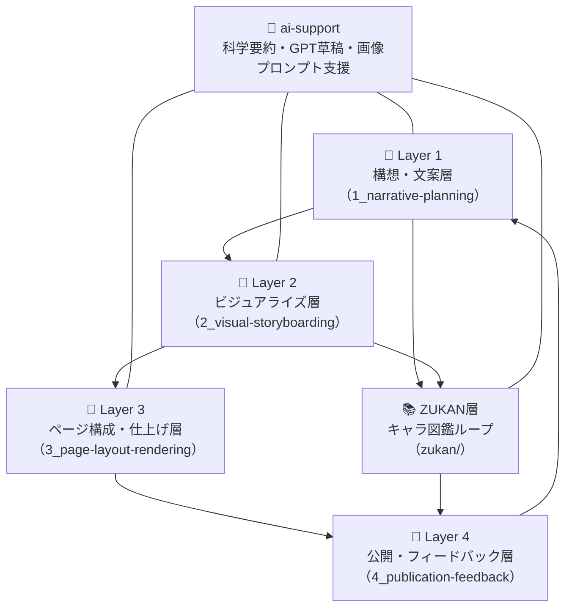

# 🤝 How to Contribute to Tobimushi Manga / トビムシマンガへの貢献方法

**Tobimushi Manga** invites artists, writers, ecologists, coders, and curious minds to co-create a soil-ecology-based manga through open collaboration.  
このプロジェクト「トビムシマンガ」は、物語・土壌科学・画像生成・視覚表現が交差するOSSです。創作・科学・表現のいずれかに関心のある方の参加を歓迎します！

---

## 🧭 Overview: Layered Collaboration / 多層コラボレーションの構造

各層はループ構造になっており、どの段階からでも参加可能です。

---

## ✨ You can... / あなたにできること

| Role | Description | Skills Welcome |
|------|-------------|----------------|
| ✏️ Narrative Contributor | キャラ・セリフ・物語の設計 | Writing / Storyboarding / Observation |
| 🎨 Visual Assistant | パネルや絵コンテのレイアウト支援 | Figma / Design Thinking / Manga Layout |
| 📄 Layout Supporter | ページ統合・吹き出し整形 | Markdown / Python(Pillow) / Image Editing |
| 📚 Zukan Curator | キャラ・道具・環境などの図鑑整備 | Taxonomy / Diagram Design / Ecology |
| 🤖 AI Prompt Tuner | プロンプト設計・翻訳支援・画像調整 | Prompt Design / GPT / DALL·E / Multilingual |

---

## 📂 Contribution Flow / 貢献の手順

1. リポジトリをフォークし、作業ブランチを作成
2. `issue` にアイデアや改善提案を投稿（または既存issueに参加）
3. 該当層のディレクトリにあるREADMEやテンプレートを参考に作業
4. `pull request` を送信して提案・反映

---

## 🧵 Issue Labels / ラベルの種類

- `good first issue`: 初心者歓迎のタスク
- `narrative`: セリフ・キャラ・構想系
- `layout`: 構成・吹き出し・ページ設計
- `zukan`: 図鑑キャラ・道具系
- `visualization`: コマ・構図の視覚補助
- `ai-collab`: 画像生成・プロンプト設計
- `translation`: 多言語対応支援

---

## 🌍 Join Us / 参加しよう！

Tobimushi Mangaは、科学と表現の融合に挑むコラボレーターを世界中から歓迎します。GitHubでのコード貢献だけでなく、noteやFigmaを通じた視覚的・構想的な参加も大歓迎です！

Welcome to the soil world of Tobino and its silent networks. Let’s build open manga, together. 🦠📘

