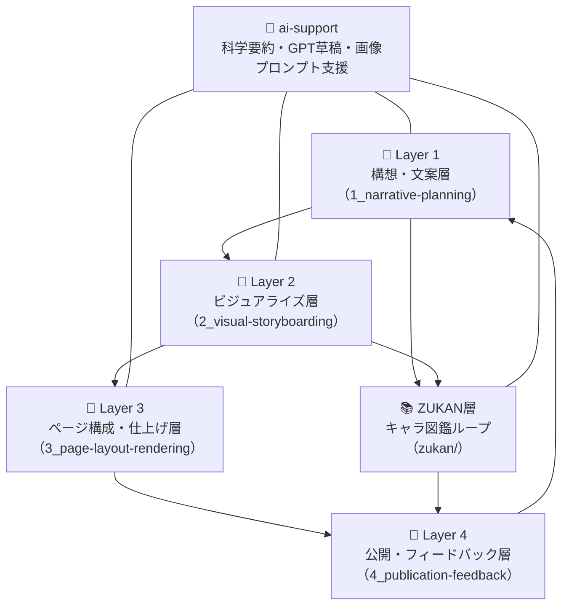

# 🦠 Tobimushi Manga / トビムシマンガ

**Tobimushi Manga** is a collaborative storytelling project where soil ecology, network science, and generative AI intersect to create a new kind of science fiction manga.  
このプロジェクト「トビムシマンガ」は、土壌生態・ネットワーク科学・生成AIの交差から生まれた、新しいかたちのサイエンス・フィクション漫画を創作する協働プロジェクトです。

---

## 🌿 Project Overview / プロジェクト概要

Tobimushi Manga is envisioned as a sister project to [CANW: Complexity and Network Webdesign](https://github.com/satoshi-create/complexity-and-network-webdesign).  
Each episode centers around Tobino, a springtail navigating a silent fungal network, combining scientific concepts with metaphorical narrative.

本プロジェクトは、[CANW（複雑系とネットワークのウェブデザイン）](https://github.com/satoshi-create/complexity-and-network-webdesign) の姉妹プロジェクトとして構想されており、菌糸ネットワークの沈黙に気づいた主人公「トビノ」の旅を軸に、科学と比喩が交錯する物語を展開します。

The project is structured across the following creative layers:  
このプロジェクトは以下の創作層で構成されています：

- `1_narrative-planning/`: Character, scene, and dialogue planning  
  キャラクター・場面・セリフの構想と設計
- `2_visual-storyboarding/`: Page and panel composition  
  ページ・コマ構成の絵コンテ化
- `3_page-layout-rendering/`: Image layout and composite output  
  吹き出しや演出を加えたレイアウト編集
- `4_publication-feedback/`: Final publication and feedback loop  
  公開および読者のフィードバック層
- `zukan/`: A growing encyclopedia of characters and tools  
  登場キャラクターや道具の図鑑（ZUKAN）層



---

## 📖 Episode 01 / 第1話（MVP）

| Page | Title | Visual |
|------|-------|--------|
| `page-01` | The Silence Beneath / 沈黙の地中 |  |

→ [📘 Read episode](./4_publication-feedback/episode-01.md)

---

## 🤖 AI Collaboration / AIとの協働

Tobimushi Manga actively integrates generative AI in both creative and structural layers.  
本プロジェクトでは、構想・草稿・画像生成・データ構造のすべてにおいて生成AIとの協働を活用しています。

- GPT-4: Scene prompts, story expansion, bilingual writing  
  GPT-4：シーンプロンプト・物語展開・英日翻訳
- DALL·E: Character and environment images  
  DALL·E：キャラクターや背景のビジュアル生成
- Python + Pillow: Speech bubble rendering  
  Python + Pillow：吹き出し統合処理

---

## 📂 Directory Structure / ディレクトリ構成

```
tobimushi-manga/
├── 1_narrative-planning/     # キャラ・場面・セリフ構想
├── 2_visual-storyboarding/   # 絵コンテ・構図設計
├── 3_page-layout-rendering/  # ページ構成・レイアウト合成
├── 4_publication-feedback/   # 公開・フィードバック層
├── zukan/                    # キャラ・道具図鑑（ZUKAN）
└── README.md
```

---

## 🌱 How to Contribute / 貢献するには

We welcome contributors interested in soil ecology, storytelling, or open science + manga fusion.  
土壌生態、ストーリーテリング、マンガ表現、オープンサイエンスの融合に関心がある方、歓迎します。

- Interested in fungi, microbes, and underground ecosystems  
  菌・微生物・地中生態に関心のある方
- Passionate about visual storytelling and poetic narratives  
  詩的世界観やビジュアル表現を創作したい方
- Familiar with Markdown, GitHub, or generative tools  
  MarkdownやGitHub、生成AIを使ってみたい方

👉 [CONTRIBUTING.md](./CONTRIBUTING.md)

