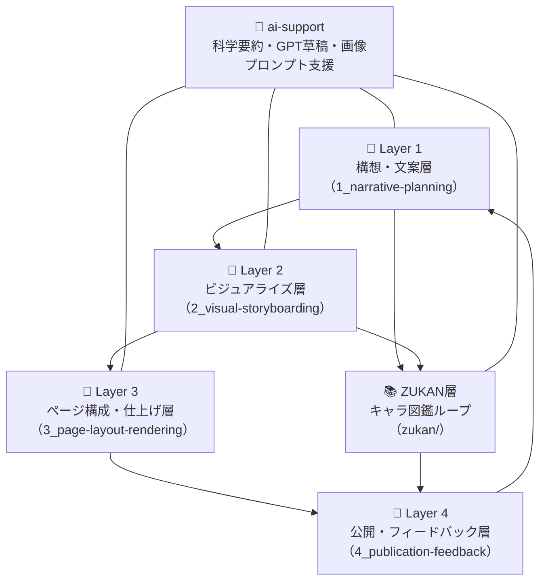

# Tobimushi Manga README

```mermaid
graph TD

%% 層構造（番号付きで明示）
L1[🧠 Layer 1<br>構想・文案層<br>（1_narrative-planning）]
L2[🎨 Layer 2<br>ビジュアライズ層<br>（2_visual-storyboarding）]
L3[📄 Layer 3<br>ページ構成・仕上げ層<br>（3_page-layout-rendering）]
L4[🌱 Layer 4<br>公開・フィードバック層<br>（4_publication-feedback）]
ZK[📚 ZUKAN層<br>キャラ図鑑ループ<br>（zukan/）]

%% 基本ループ（本編の構成順）
L1 --> L2 --> L3 --> L4 --> L1

%% ZUKANは構想層と並走しながら派生可能
L1 --> ZK
L2 --> ZK
ZK --> L4

%% 横断レイヤー（AI支援層）
AI[🤖 ai-support<br>科学要約・GPT草稿・画像プロンプト支援]

AI --- L1
AI --- L2
AI --- L3
AI --- ZK

```
