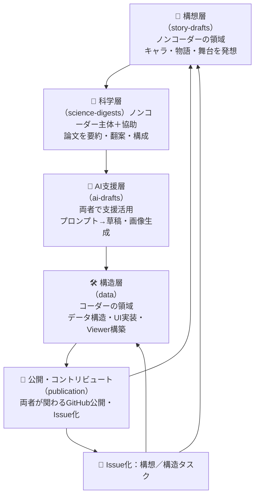

# 🐛 Tobimushi Manga – An Open Fiction Ecosystem

**AI × Soil Ecology × Fiction × Open Collaboration**  

---

## 🌱 Why a Springtail? / なぜトビムシ？

Springtails (Collembola) are tiny, resilient creatures in the soil ecosystem. Though invisible to most, they quietly maintain the balance of microbial life by dispersing fungal spores and hopping across underground habitats.
In **Tobimushi Manga**, we reimagine the springtail as a character named **Tobino**: a hesitant but sensitive jumper who senses when fungal communication is lost—and begins to leap in search of reconnection.

トビムシ（小粒蝠）は、人の目には満足に見えないほど小さく、地下の生態系の要所で気づかれずに仕事をしている「覚りなきネットワーカー」です。
このプロジェクトでは、そんなトビムシを「トビノ」というキャラクターとして再描写。こわごわしいけど仕事人なネットワーカーとして、壊れた生態の繋がりをたずねて躍ねていきます。

---

## 🔄 The 4+1 Layer Creative Loop / 創作を支える4+1層構造

---

## 📆 MVP Outputs / MVPで作成したコンテンツ

- **Story-Drafts**: Episode 01 - "The Morning the Mycelium Went Silent"
- **Scientific Digest**: Fungal networks, Collembola as dispersers and indicators
- **AI Drafts**: GPT drafts, image prompts, DALL·E-generated Tobino illustration
- **Data**: `characters.json`, `episodes.json`, multilingual draft loop
- **Publication**: Markdown-based story pages (EN/JA), ready for GitHub Pages / note / ZINE

---

## 🛍️ Related Projects / 関連プロジェクト

- [from-RDB-to-Network / fungi-network](https://github.com/satoshi-create/complexity-and-network-webdesign/tree/main/projects/from-rdb-to-network/fungi-network):
  Visualizes fungal communication through network graphs. 菌糸ネットワークを可視化。

- [from-RDB-to-Network / soil-fauna-network](https://github.com/satoshi-create/complexity-and-network-webdesign/tree/create/tobimushi-manga/projects/from-rdb-to-network/soil-fauna-network):
  Models functional roles of soil microfauna as data networks. 土壌動物ネットワークの試み。
