# 🦠 Tobimushi Manga

**Tobimushi Manga** is a collaborative storytelling project where soil ecology, network science, and generative AI intersect to create a new kind of science fiction manga.

---

## 🌿 Project Overview

Tobimushi Manga is envisioned as a sister project to [CANW: Complexity and Network Webdesign](https://github.com/satoshi-create/complexity-and-network-webdesign).  
Each episode centers around Tobino, a springtail navigating a silent fungal network, combining scientific concepts with metaphorical narrative.

The project is structured across the following creative layers:

- `1_narrative-planning/`: Character, scene, and dialogue planning
- `2_visual-storyboarding/`: Page and panel composition
- `3_page-layout-rendering/`: Image layout and composite output
- `4_publication-feedback/`: Final publication and feedback loop
- `zukan/`: A growing encyclopedia of characters and tools

```mermaid
graph TD

%% 層構造（番号付きで明示）
L1[🧠 Layer 1<br>Narrative Planning<br>（1_narrative-planning）]
L2[🎨 Layer 2<br>Visual Storyboarding<br>（2_visual-storyboarding）]
L3[📄 Layer 3<br>Page Rendering<br>（3_page-layout-rendering）]
L4[🌱 Layer 4<br>Publication & Feedback<br>（4_publication-feedback）]
ZK[📚 ZUKAN層<br>Encyclopedia Layer<br>（zukan/）]

%% 基本ループ（本編の構成順）
L1 --> L2 --> L3 --> L4 --> L1

%% ZUKANは構想層と並走しながら派生可能
L1 --> ZK
L2 --> ZK
ZK --> L4

%% 横断レイヤー（AI支援層）
AI[🤖 ai-support<br>Prompts, Drafts, Visuals, Scripts]

AI --- L1
AI --- L2
AI --- L3
AI --- ZK

```




## 📖 Episode 01

| Page | Title | Visual |
|------|----------------------|--------|
| `page-01` | The Silence Beneath |  |

→ [📘 Read episode](./4_publication-feedback/episode-01.md)

---

## 🤖 AI Collaboration

Tobimushi Manga actively integrates generative AI in both creative and structural layers.

- GPT-4: Scene prompts, story expansion, bilingual writing
- DALL·E: Character and environment images
- Python + Pillow: Speech bubble rendering

---

## 📂 Directory Structure

```
tobimushi-manga/
├── 1_narrative-planning/     # Narrative planning and dialogue
├── 2_visual-storyboarding/   # Panel composition and sketches
├── 3_page-layout-rendering/  # Final layouts and image output
├── 4_publication-feedback/   # Published output and response loop
├── zukan/                    # Character & tool encyclopedia
└── README.md
```

---

## 🌱 How to Contribute

We welcome contributors interested in soil ecology, storytelling, or open science + manga fusion.

- Interested in fungi, microbes, and underground ecosystems
- Passionate about visual storytelling and poetic narratives
- Familiar with Markdown, GitHub, or generative tools

👉 [CONTRIBUTING.md](./CONTRIBUTING.md)

📘 Read this in Japanese: [README.ja.md](./README.ja.md)
