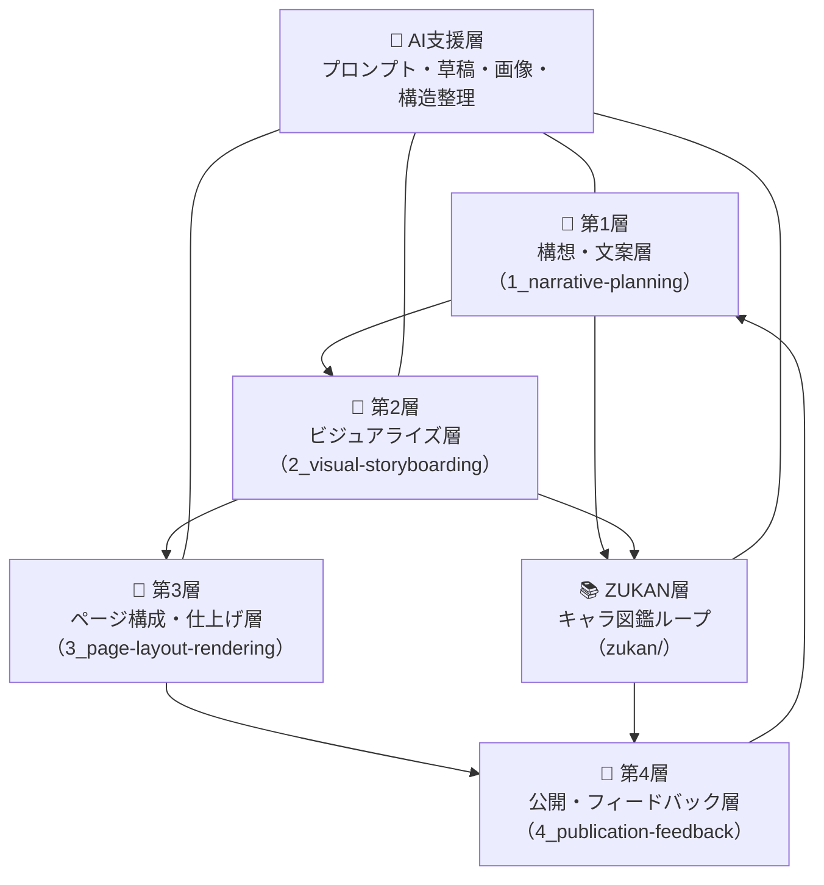
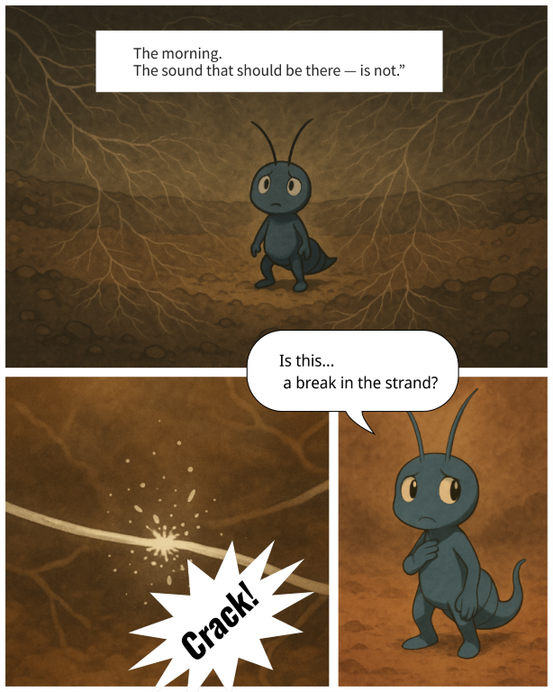

# 🦠 トビムシマンガ（Tobimushi Manga）

**トビムシマンガ** は、土壌生態・ネットワーク科学・生成AIの交差から生まれた、新しいかたちのサイエンス・フィクション漫画を創作する協働プロジェクトです。

📘 他の言語で読む:

- [🇺🇸 English](./README.md)

---

## 🌿 プロジェクト概要

Tobimushi Manga は、[CANW（複雑系とネットワークのウェブデザイン）](https://github.com/satoshi-create/complexity-and-network-webdesign) の姉妹プロジェクトとして構想されています。  
沈黙する菌糸ネットワークを舞台に、主人公「トビノ」が地中を旅する物語を通して、科学的視点と比喩的世界観を交差させます。

本プロジェクトは以下の創作層で構成されています：

- `1_narrative-planning/`: キャラクター・場面・セリフの構想と設計
- `2_visual-storyboarding/`: ページ・コマ構成の絵コンテ化
- `3_page-layout-rendering/`: 吹き出しや演出を加えたレイアウト編集
- `4_publication-feedback/`: 公開および読者のフィードバック層
- `zukan/`: 登場キャラクターや道具の図鑑（ZUKAN）層



---

## 📖 第1話（MVP）

| ページ | タイトル | ビジュアル |
|--------|------------|------------|
| `page-01` | 沈黙の地中 |  |

→ [📘 第1話を読む](./4_publication-feedback/episode-01.md)

---

## 🤖 AIとの協働

Tobimushi Manga では、構想・草稿・画像生成・データ構造のすべてにおいて、生成AIとの協働を活用しています。

- GPT-4：シーンプロンプト、物語展開、日英翻訳
- DALL·E：キャラクターや背景のビジュアル生成
- Python + Pillow：吹き出しや演出の統合処理

---

## 📂 ディレクトリ構成

```
tobimushi-manga/
├── 1_narrative-planning/     # キャラ・場面・セリフ構想
├── 2_visual-storyboarding/   # 絵コンテ・構図設計
├── 3_page-layout-rendering/  # ページ構成・レイアウト合成
├── 4_publication-feedback/   # 公開・フィードバック層
├── zukan/                    # キャラ・道具図鑑（ZUKAN）
└── README.md
```

---

## 🌱 参加するには

以下のような方の参加を歓迎します：

- 菌・微生物・地中生態に関心がある方
- 詩的世界観やビジュアルストーリーテリングに魅力を感じる方
- Markdown, GitHub, 生成AIを使ってみたい方

👉 [CONTRIBUTING.md](./CONTRIBUTING.md)
