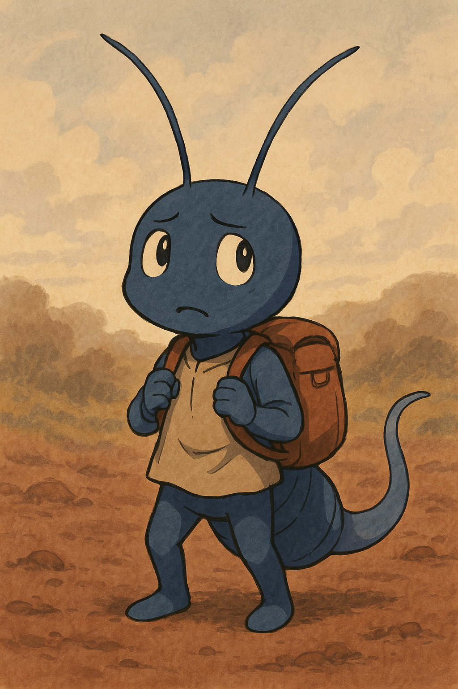

# Episode 01: The Morning the Mycelium Went Silent

## Chapter 1: The Voice of Fungi Fades

_菌糸が切れた朝に – 第 1 章「菌の声が消えた」_

---

### 🍄 Fiction / 小説本文

The soil was still damp, but the hum was gone.
No spores whispered. No threads pulsed.
Tobino paused, antennae swaying through empty signals.
This silence wasn't peace. It was absence.
The earth held its breath.

With a flick of his body, he leapt—
not in fear,
but in search of a voice that once echoed beneath his feet.

土はまだ湿っていた。だが、響きがなかった。  
胞子のささやきも、菌糸の脈動も消えていた。  
トビノは動きを止め、触角を空（くう）へ揺らした。  
この静けさは、安らぎではない。  
「不在」だった。

トビノは体をひねり、跳ねた──  
恐れからではなく、  
かつて足元で囁いていた“声”を探しに。

---

### 🧠 Character Notes

**Tobino（トビノ）**
A young, fragile springtail. Sensitive to vibrations and fungal signals.
His jump is not just locomotion—it is a way of listening.

---

### 🧪 Scientific Context

- Collembola interact with fungal networks by feeding and dispersing spores.
- Disruption in mycorrhizal communication is common under stress (e.g. drought).
- Collembola may act as mobile agents for network restoration.

[Read the scientific digest →](../science-digests/summary01.md)

---

### 🎨 Visual Reference

A depiction of Tobino at the moment of realization.
Dim soil, faded fungal threads, wide eyes filled with quiet resolve.

---

### 🤖 Generated Drafts

- GPT Draft A:
  > “The soil was damp, but the hum was gone...”
- GPT Draft B:
  > “They’re gone,” he whispered to no one. “But maybe… not everywhere.”

[See the AI draft →](../ai-drafts/gpt-draft-01.md)

---

### 🔗 Project Layers Referenced

- 🧠 story-drafts/episode-01.md
- 🧪 science-digests/summary01.md
- 🤖 ai-drafts/gpt-draft-01.md
- 🎨 visual-assets/episode-01/tobino.png
