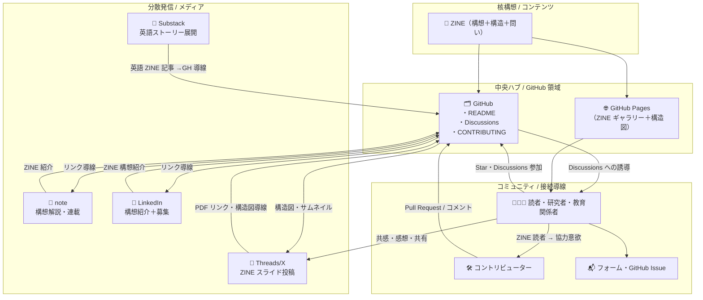

```mermaid
graph TD
subgraph 核構想 / コンテンツ
ZINE["📘 ZINE（構想＋構造＋問い）"]
end

subgraph 中央ハブ / GitHub 領域
GH["🗂️ GitHub<br>・README<br>・Discussions<br>・CONTRIBUTING"]
GHP["🌐 GitHub Pages<br>（ZINE ギャラリー＋構造図）"]
end

subgraph 分散発信 / メディア
NOTE["📝 note<br>構想解説・連載"]
LINKEDIN["💼 LinkedIn<br>構想紹介＋募集"]
THREADS["📱 Threads/X<br>ZINE スライド投稿"]
SUBSTACK["📧 Substack<br>英語ストーリー展開"]
end

subgraph コミュニティ / 接続導線
USER["🧑‍🤝‍🧑 読者・研究者・教育関係者"]
CONTRIB["🛠️ コントリビューター"]
FORM["📬 フォーム・GitHub Issue"]
end

ZINE --> GH
ZINE --> GHP

GH -->|リンク導線| NOTE
GH -->|リンク導線| LINKEDIN
GH -->|構造図・サムネイル| THREADS
GH -->|Discussions への誘導| USER
GHP --> USER

NOTE -->|ZINE 紹介| GH
LINKEDIN -->|ZINE 構想紹介| GH
THREADS -->|PDF リンク・構造図導線| GH
SUBSTACK -->|英語 ZINE 記事 →GH 導線| GH

USER -->|Star・Discussions 参加| GH
USER -->|共感・感想・共有| THREADS
USER -->|ZINE 読者 → 協力意欲| CONTRIB
CONTRIB -->|Pull Request / コメント| GH
USER --> FORM

```
