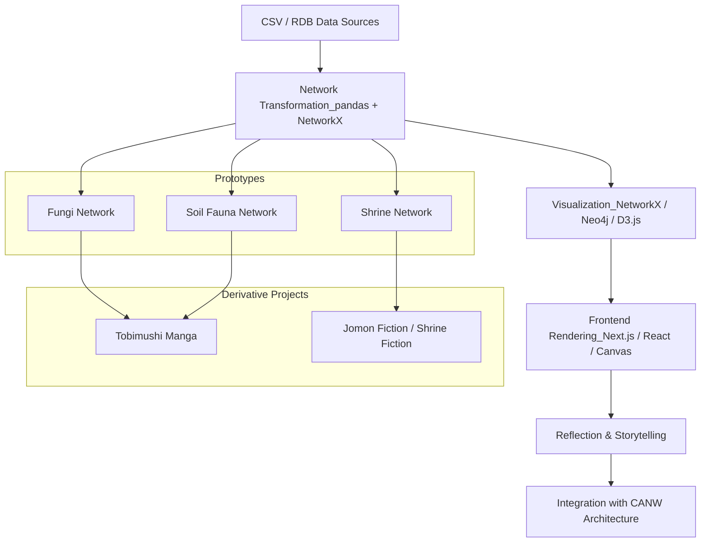

  

<h1 align="center">🌐 from-RDB-to-Network</h1>

📘 Read in other languages:

* [🇯🇵 日本語](./README_ja.md)

> From rigid structures to living systems — a journey in rethinking data.
> 

This project is part of **CANW** (Complexity And Network Webdesign).
For the broader vision and conceptual architecture of CANW, please refer to the [root README](https://github.com/satoshi-create/complexity-and-network-webdesign).

---

## 🔄 Overview: From RDB to Network

**From RDB to Network** is an experimental project that transforms relational data into network graphs using Python (pandas + NetworkX).

Disparate CSVs and SQL tables are reconnected through the lens of **relationships**,
reconstructing data into a **web of interconnected meaning**.
The transformation process itself becomes a story — a shift from static records to living systems.

---

## 🧪 Current Prototypes

Within the CANW ecosystem, we are developing use-case prototypes such as:

* 🍄 **Fungi Network**

  * Modeling fungal hyphal structures from CSV data and visualizing their network dynamics
* ⚩ **Shrine Network**

  * Mapping shrines worshiping the same deity and visualizing their geographic and relational networks
* 🐜 **Soil Fauna Network**

  * Representing co-occurrence and predator-prey relations among soil organisms as ecological graphs

---

## 🛠 Tech Stack & OSS Approach

Currently, the pipeline is built using Python (pandas + NetworkX), with the following principles:

* Entities and relationships are defined in CSV format
* Node attributes and labeled edges enrich semantic context
* Layout emphasizes **spatial structures**, not random positioning

📎 GitHub repository:
[https://github.com/satoshi-create/from-rdb-to-network](https://github.com/satoshi-create/from-rdb-to-network)

---

## 🌐 Ecosystem Flow (Mermaid)

---

## 📄 License

This project is licensed under the MIT License.
See [LICENSE](./LICENSE) for details.

---

## 🔗 Related Links

* GitHub (From RDB to Network): [https://github.com/satoshi-create/complexity-and-network-webdesign/tree/main/projects/from-rdb-to-network](https://github.com/satoshi-create/complexity-and-network-webdesign/tree/main/projects/from-rdb-to-network)
* GitHub (CANW Main Repository): [https://github.com/satoshi-create/complexity-and-network-webdesign](https://github.com/satoshi-create/complexity-and-network-webdesign)
* LinkedIn (Global Outreach): [https://www.linkedin.com/in/satoprofile/](https://www.linkedin.com/in/satoprofile/)

---

**What is data?**
Let’s rethink its potential — from rigid structures to living networks.
