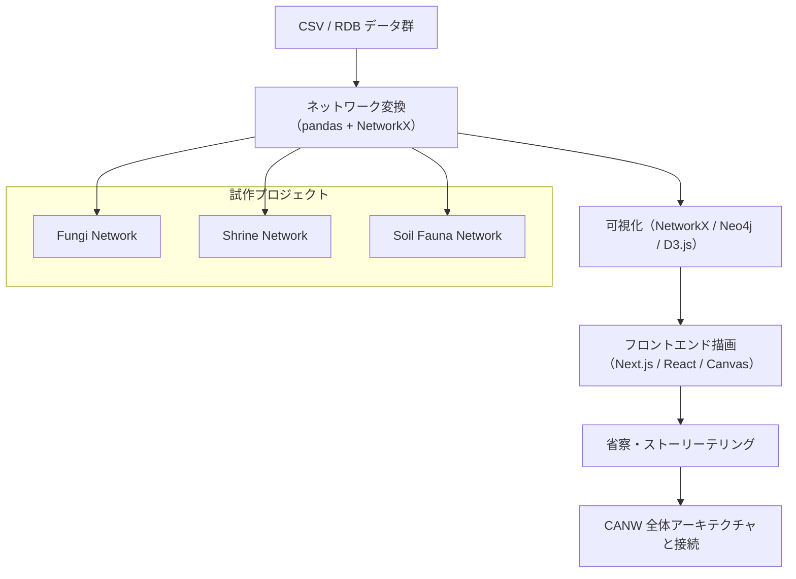

  

<h1 align="center">🌐 from-RDB-to-Network</h1>

📘 他の言語で読む:

- [🇺🇸 English](./README.md)

> 静的な構造から、生きたシステムへ —— データの再構築の旅。

このプロジェクトは、CANW（Complexity And Network Webdesign）構想の一環として展開されています。
全体の背景思想やネットワーク的アプローチについては、[CANW ルートディレクトリの README](https://github.com/satoshi-create/complexity-and-network-webdesign) をご参照ください。

---

## 🔄 概要：From RDB to Network

「From RDB to Network」は、リレーショナルデータを Python（pandas + NetworkX）などを用いて**ネットワーク図として視覚化**する試みです。

一見バラバラな CSV 群や SQL テーブルが、関係性という視点で繋がり、
**ネットワーク（関係の束）として再構成**されるプロセスそのものが、このプロジェクトの“物語”です。

---

## 🧪 現在展開中のサブテーマ

CANW では以下のようなテーマで試作を進めています：

* 🍄 **Fungi Network**（菌類）

  * 菌糸のネットワーク構造を CSV でモデル化し、ネットワーク図として可視化
* ⛩ **Shrine Network**（神社）

  * 同じ神を祀る神社や流域ごとの配置をネットワークで接続
* 🐜 **Soil Fauna Network**（土壌動物）

  * 土壌中の生物同士の共起関係・捕食関係をネットワークで再現

---

## 🛠 技術と OSS 展開

現在は、Python（pandas + NetworkX）をベースに、以下のような形式で整備を進めています：

* CSV 形式でエンティティとリレーションを定義
* ノード属性やラベル付きエッジを反映し、視覚的な意味づけを強化
* 可視化レイアウトはランダム配置ではなく**空間構造に基づく配置**を重視

---

## 🌐 エコシステム構造（Mermaid）

---

## 📄 ライセンス

本プロジェクトはMITライセンスのもとで公開されています。
詳細は [LICENSE](./LICENSE) をご確認ください。

---

## 🔗 関連リンク

* From RDB to Network（GitHub）: [https://github.com/satoshi-create/complexity-and-network-webdesign/tree/main/projects/from-rdb-to-network](https://github.com/satoshi-create/complexity-and-network-webdesign/tree/main/projects/from-rdb-to-network)
* GitHub（CANW 全体リポジトリ）: [https://github.com/satoshi-create/complexity-and-network-webdesign](https://github.com/satoshi-create/complexity-and-network-webdesign)
* LinkedIn（海外向けの発信）: [https://www.linkedin.com/in/satoprofile/](https://www.linkedin.com/in/satoprofile/)

---

データとは何か。
その可能性を、もう一度考えてみませんか？

堅苦しい構造から、生きたネットワークへ。
