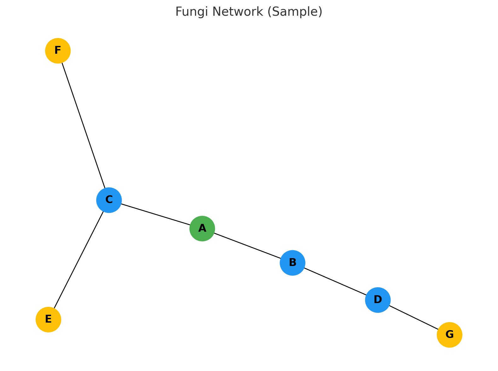

# 🍄 Fungi Network Visualizer

This project explores the structure and growth of fungal mycelium networks using simple ecological graph models.
This is a minimal working example of visualizing fungal mycelium networks using CSV/JSON data and Python (NetworkX).  
It’s designed to be simple, visual, and open-ended — a seed for more complex projects within the "from-RDB-to-Network" journey.

> A sample visualization of fungal mycelium-like network using NetworkX.

[]
(https://colab.research.google.com/github/satoshi-create/complexity-and-network-webdesign/blob/main/projects/from-rdb-to-network/fungi-network/notebooks/fungi-network.ipynb)

---

## 📊 Goals

- ✅ Visualize fungal networks as static graphs using NetworkX and matplotlib
- ✅ Start from simple CSV/JSON data formats for accessibility
- 🔄 Explore different network topologies (grid, tree, random)
- 🛤️ Demonstrate a pathway from static data to interactive visualization
- 🧪 Serve as a conceptual prototype for future data-driven network modeling

> Although this MVP uses CSV/JSON, the structure is compatible with RDB-based workflows (e.g. SQLite, Supabase) for future extension.

---

## 🚀 MVP Scope & Steps

| Step | Description |
|------|-------------|
| 1️⃣  | Load node and edge data from `sample-network-nodes.csv` and `sample-network-edges.csv` |
| 2️⃣  | Build a NetworkX graph with `node_type` and `weight` attributes |
| 3️⃣  | Visualize with matplotlib (color-coded nodes, weighted edges) |
| 4️⃣  | Export the result as PNG and embed in this README |
| 5️⃣  | Optionally run the same logic in a Colab notebook (`notebooks/fungi-network.ipynb`) |

> 🧬 Fungal networks show us that intelligence isn’t centralized — it’s distributed, adaptive, and relational.  
> That’s exactly what open-source and collaborative design aim for.

---

## 📂 Structure

- `data/`: Sample network datasets (`*.csv`, `*.json`)
- `scripts/`: Python scripts for loading and visualizing with NetworkX
- `notebooks/`: Google Colab–ready interactive notebooks

## 🧠 Want to take this further?

- Add interactivity with D3.js, Dash, or Streamlit
- Convert CSV/JSON to RDB and explore query-driven graphs
- Use real-world ecological or mycological data

Pull requests and ideas welcome! 🌱

