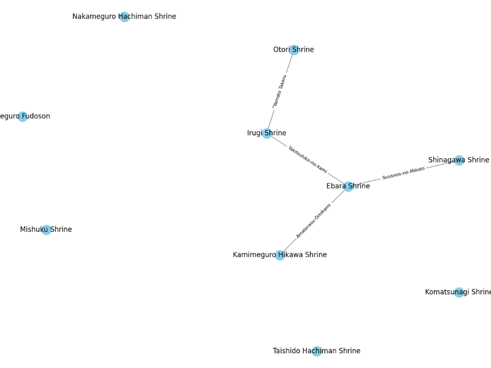
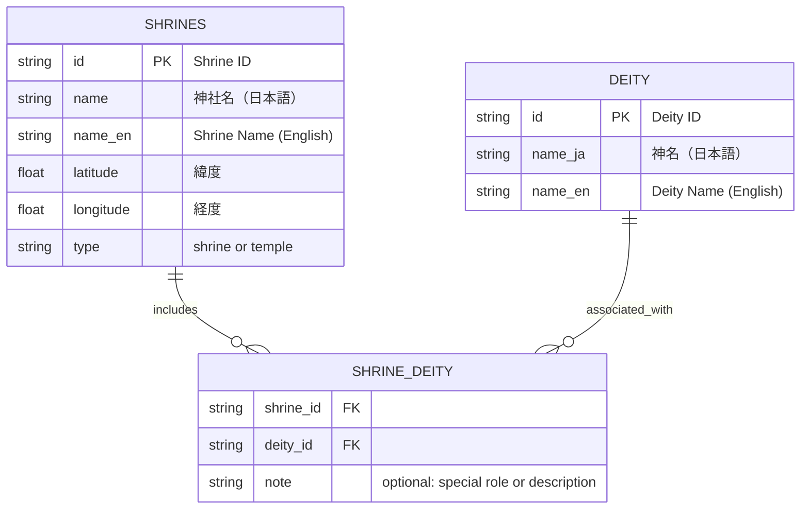
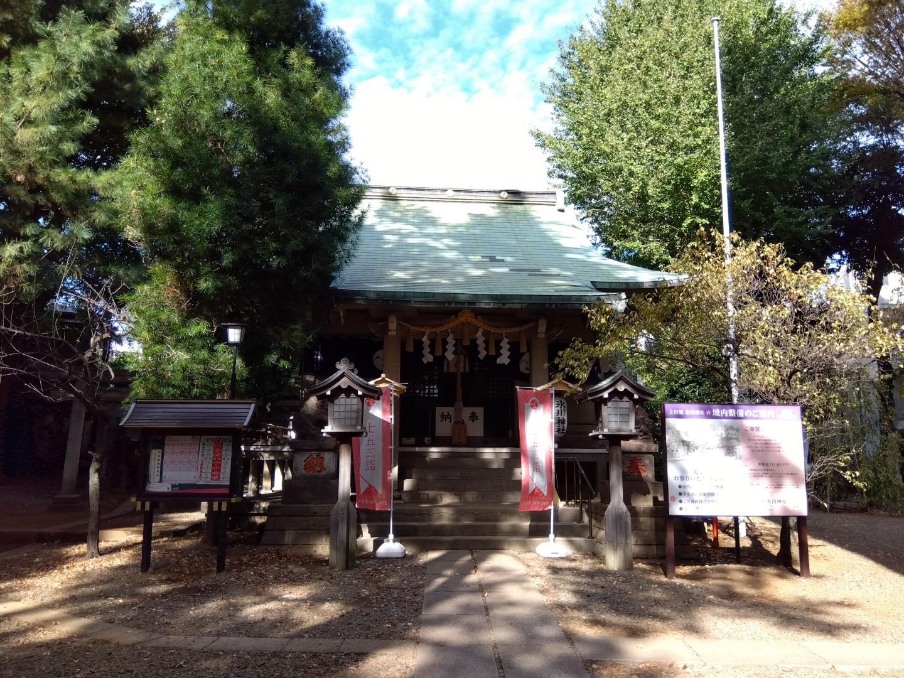
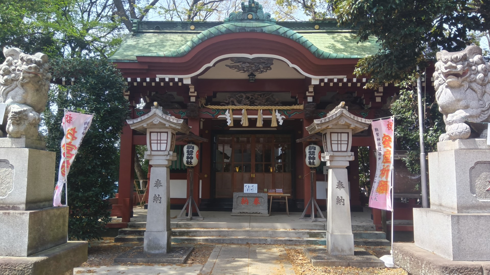
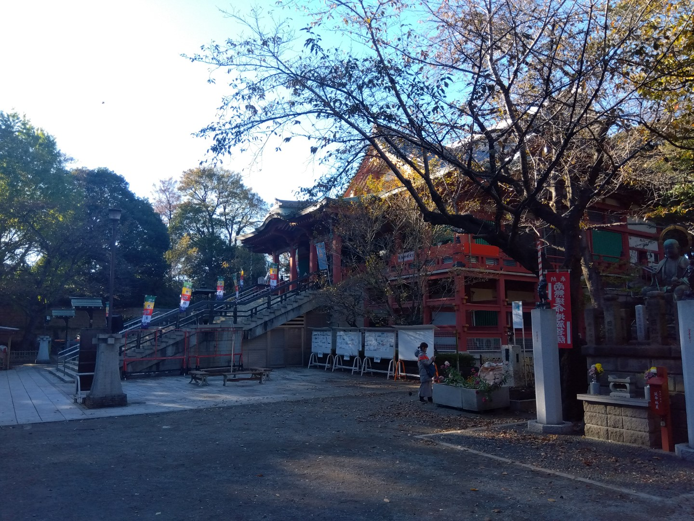
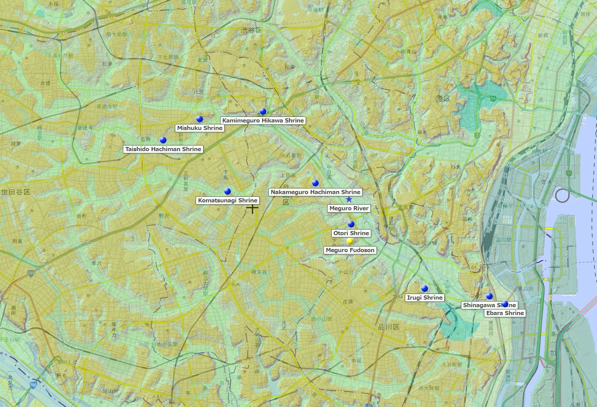

# ⚩ Shrine Network Visualizer / 神社ネットワーク・ビジュアライザー

This project visualizes shrine-deity relationships as a cultural network rooted in geography and watershed logic.  
このプロジェクトは、神社と神々の関係を地形や流域の視点から結びなおし、文化的ネットワークとして可視化することを目的とします。

📘 他の言語で読む:

- [🇺🇸 English](./README_ja.md)


---

## 🧪 Features / 特徴

- Bipartite graph: **Shrines × Deities**  
  神社と神々の二層構造ネットワーク
- Auto-generate edges between shrines sharing the same deity  
  同じ神を祭る神社同士を自動で繋ぐ
- NetworkX-based modeling and export (.graphml, .png)  
  NetworkX を使ったグラフ生成とエクスポート
- Visualize with matplotlib or Jupyter Notebook  
  matplotlib、Jupyter Notebook による可視化
- Ready for geospatial overlays (GSI Maps, GeoJSON)  
  地理院地図や GeoJSON との連携も可能



[]
(https://colab.research.google.com/github/satoshi-create/complexity-and-network-webdesign/blob/create/shrine-network/projects/from-rdb-to-network/shrine-network/notebooks/shrine_network_with_relational_data.ipynb)

---
## 🧩 Data Model / データモデル

Below is the ER diagram of the three core CSVs used to construct the shrine-deity network.

以下は、神社×神々ネットワークを構築するための3つのCSVのER図です：



---

## 📊 Goals / 目標

- Build cultural networks from CSV/JSON data  
  CSV/JSON による文化ネットワークの構築
- Explore spatial-symbolic patterns across shrine locations  
  神社配置における地形的、象徴的パターンを探索
- Prototype for multi-layered cultural graphs  
  多層的文化グラフのプロトタイプ

---


## 🚀 MVP Steps / MVP のステップ

| Step | Description (EN / JP)                                         |
| ---- | ------------------------------------------------------------- |
| 1    | Load shrine and deity data from CSV / CSV データを読み込む    |
| 2    | Create edges for shared deities / 同神社をエッジで繋ぐ        |
| 3    | Generate NetworkX graph / NetworkX でグラフ生成               |
| 4    | Export graph / グラフをエクスポート                           |
| 5    | Visualize or map with Jupyter, GSI / ノートブックや地図と連携 |

---

## 🏠 Shrine Examples / 神社の例

<div align="center">
<table>
  <tr>
    <td align="center">
      <br/>
      <strong>Kamimeguro Hikawa Shrine</strong><br/>
      上目黒氷川神社<br/>
      Susanoo-no-Mikoto（素戔嗚尊）
    </td>
    <td align="center">
      <br/>
      <strong>Komatsunagi Shrine</strong><br/>
      駒繋神社<br/>
      Takemikazuchi-no-Kami（武甕槌命）
    </td>
  </tr>
  <tr>
    <td align="center">
      <br/>
      <strong>Meguro Fudōson (Ryūsenji)</strong><br/>
      目黒不動尊<br/>
      Fudō Myōō（不動明王）
    </td>
    <td align="center">
      <br/>
      <strong>Mishuku Shrine</strong><br/>
      三宿神社<br/>
      Ōyamatsumi-no-Kami（大山祇命）
    </td>
  </tr>
</table>
</div>

---

## 🗾 GSI Mapping / 国土地理院マッピング



👉 [View on GSI Maps (Meguro Fudō Area) / 国土地理院の地図で見る（目黒不動周辺）](https://maps.gsi.go.jp/#14/35.635012/139.685755/&base=std&ls=std%7Canaglyphmap_color%2C0.47%7Cexperimental_landformclassification1%2C0.56&blend=0&disp=111&lcd=experimental_landformclassification1&vs=c1g1j0h0k0l0u0t0z0r0s0m0f0)

👉 [View on Google Map (Meguro Fudō Area) / グーグルマップの地図で見る（目黒不動周辺）](https://maps.app.goo.gl/ekTJ6fZX6zTnPSL66)

📎 [Download shrine-locations.geojson / shrine-locations.geojson をダウンロード](./data/shrine_meguro-river.geojson)

> You can upload the above GeoJSON file onto the GSI map to visualize shrine locations as a custom layer.  
> 上記の GeoJSON ファイルを国土地理院地図にアップロードすることで、神社の位置をカスタムレイヤーとして可視化できます。

---

## 📂 Structure / ファイル構成

```
shrine-network/
├── data/        # CSV, JSON data of shrines & deities
├── notebooks/   # Jupyter notebooks for exploration
├── public/images/      # Shrine photos, GSI screenshots
└── README.md
```

---

## 🧠 Future Ideas / 発展案

- GeoJSON & GSI for interactive mapping  
  地図上での動的可視化
- Extend to temples and ruins  
  寺院や遺跡も統合
- D3.js, Streamlit for tourism  
  観光対応アプリへの発展

---

## 🗂 Sources / データ出典

- Official websites of shrines / 各神社公式情報
- GSI maps by Japan GSI / 国土地理院地図

Pull requests and ideas welcome! プルリクエストやアイディア大歓迎です！

**Tags:** `#network-thinking` `#shinto` `#gis` `#bipartite-graph` `#cultural-data` `#open-data`
