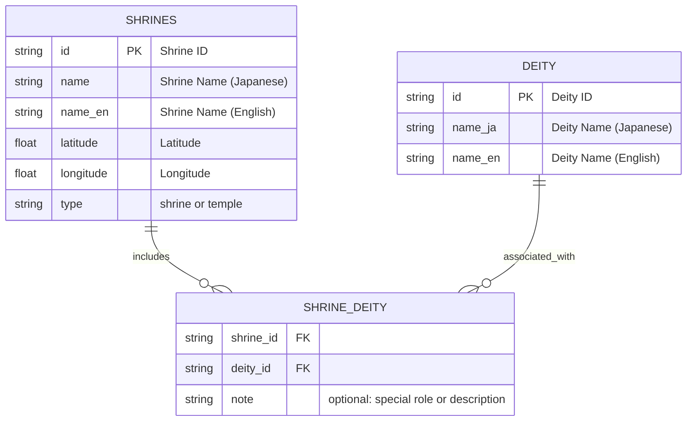

# ⚩ Shrine Network Visualizer

This project visualizes shrine-deity relationships as a cultural network rooted in geography and watershed logic.

📘 Read this in other languages:

- [🇯🇵 日本語](./README_ja.md)

---

## 🧪 Features

- Bipartite graph: **Shrines × Deities**
- Auto-generate edges between shrines sharing the same deity
- NetworkX-based modeling and export (.graphml, .png)
- Visualize with matplotlib or Jupyter Notebook
- Ready for geospatial overlays (GSI Maps, GeoJSON)


[](https://colab.research.google.com/github/satoshi-create/complexity-and-network-webdesign/blob/create/shrine-network/projects/from-rdb-to-network/shrine-network/notebooks/shrine_network_with_relational_data.ipynb)

---

## 🧩 Data Model

Below is the ER diagram of the three core CSVs used to construct the shrine-deity network:



---

## 📊 Goals

- Build cultural networks from CSV/JSON data
- Explore spatial-symbolic patterns across shrine locations
- Prototype for multi-layered cultural graphs

---

## 🚀 MVP Steps

| Step | Description |
|------|-------------|
| 1    | Load shrine and deity data from CSV |
| 2    | Create edges between shrines sharing the same deity |
| 3    | Generate NetworkX graph |
| 4    | Export the graph (PNG/graphml) |
| 5    | Visualize or map with Jupyter or GSI tools |

---

## 🏠 Shrine Examples

<div align="center">
<table>
  <tr>
    <td align="center">
      <br/>
      <strong>Kamimeguro Hikawa Shrine</strong><br/>
      Susanoo-no-Mikoto
    </td>
    <td align="center">
      <br/>
      <strong>Komatsunagi Shrine</strong><br/>
      Takemikazuchi-no-Kami
    </td>
  </tr>
  <tr>
    <td align="center">
      <br/>
      <strong>Meguro Fudōson (Ryūsenji)</strong><br/>
      Fudō Myōō
    </td>
    <td align="center">
      <br/>
      <strong>Mishuku Shrine</strong><br/>
      Ōyamatsumi-no-Kami
    </td>
  </tr>
</table>
</div>

---

## 🗾 GSI Mapping


👉 [View on GSI Maps (Meguro Fudō Area)](https://maps.gsi.go.jp/#14/35.635012/139.685755/&base=std&ls=std%7Canaglyphmap_color%2C0.47%7Cexperimental_landformclassification1%2C0.56&blend=0&disp=111&lcd=experimental_landformclassification1&vs=c1g1j0h0k0l0u0t0z0r0s0m0f0)  
👉 [View on Google Map (Meguro Fudō Area)](https://maps.app.goo.gl/ekTJ6fZX6zTnPSL66)  
📎 [Download shrine-locations.geojson](./data/shrine_meguro-river.geojson)

> You can upload the above GeoJSON file to GSI maps to display shrine locations as a custom overlay.

---

## 📂 Structure

```
shrine-network/
├── data/        # CSV, JSON data of shrines & deities
├── notebooks/   # Jupyter notebooks for exploration
├── public/images/  # Shrine photos, GSI screenshots
└── README.md
```

---

## 🧠 Future Ideas

## What You Can Do with Python (Network & Analysis)

| Difficulty | Theme                    | Python Tools                               | What You Can Do                                                                      | Expected Outcomes of Visualization & Analysis                                         |
|------------|-------------------------|-------------------------------------------|--------------------------------------------------------------------------------------|---------------------------------------------------------------------------------------|
| 🟢 Low     | Spatial Data Management | GeoPandas, Shapely, pyproj                | - Manage shrine data (lat/lon) as GIS data<br>- Overlay with terrain and river layers | - Link shrine location characteristics with terrain layers to **test spatial hypotheses** |
| 🟢 Low     | Network Science         | NetworkX, pandas                          | - Analyze centrality and detect communities in deity networks<br>- Visualize shrine interconnections | - Visualize the structure of deity networks to **discover hidden relationships**          |
| 🟢 Low     | Visualization & Mapping | Folium, Plotly, Matplotlib, Kepler.gl     | - Visualize shrine networks on interactive maps<br>- Popups for deities and shrine legends | - Enable intuitive understanding of **spatial trends in shrine and deity networks**       |
| 🔴 High    | Terrain Data Analysis   | Rasterio, GDAL                            | - Analyze elevation data (DEM) and shading<br>- Visualize shrine relationships to DEM data | - Quantify the correlation of terrain and shrine placement to **reveal geographic contexts** |
| 🔴 High    | Spatial Statistics      | scipy, PySAL, geopandas                   | - Analyze spatial autocorrelation (e.g., Moran’s I)<br>- Conduct statistical analysis of distances and clustering | - Quantify spatial biases to **statistically verify cultural and religious patterns**     |

---

## 🗂 Sources

- Official websites of shrines
- GSI maps by Japan GSI

Pull requests and ideas welcome! 🌿

**Tags:** `#network-thinking` `#shinto` `#gis` `#bipartite-graph` `#cultural-data` `#open-data`

📘 Read this in Ja
