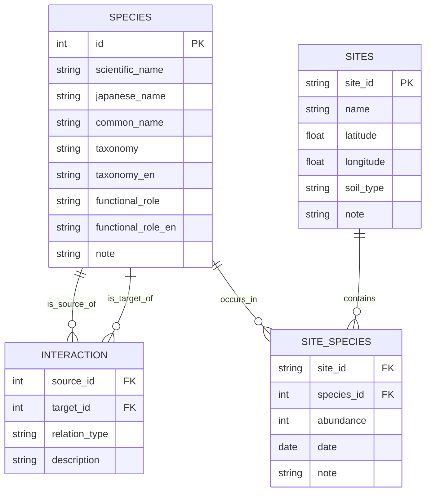

# 🕼 Soil Fauna Network Visualizer

This project visualizes soil fauna interaction networks as ecological graphs, inspired by the complexity of belowground life.
As a sister project to the “Fungi Network Visualizer,” it explores how micro- and mesofauna co-create dynamic ecosystems through predation, mutualism, and detritus processing.
Originally designed as an MVP in the "from-RDB-to-Network" journey, this tool demonstrates how relational ecological data can be transformed into meaningful network structures.

📘 Read this in other languages:

- [🇯🇵 日本語](./README_ja.md)

---

## 🧪 Features

* Species interaction modeling from relational CSV data
* NetworkX-based construction with trophic and ecological roles
* White-stroked Japanese labels for full readability
* Static graph visualization with matplotlib (PNG export ready)
* Ready-to-run Colab notebook and customizable scripts

> A minimal working example showing how species interaction networks emerge from simple CSV-based relational data.

---

## 🤩 Data Model

Below is the ER diagram of the three core CSVs used to construct the soil fauna interaction network.

---

## 📊 Goals

* ✅ Visualize species interactions in Japanese using NetworkX
* ✅ Start from intuitive, editable CSV files for species and relations
* ✅ Highlight ecological roles with color coding and font effects
* 🛤️ Connect to real site data with `site_species.csv` and `sites.csv`
* 🔁 Encourage extensions with ecological or educational data

> While this MVP is static and small-scale, its structure supports scaling into full RDB-backed networks and interactive visualization environments.

---

## 🚀 MVP Scope & Steps

| Step | Description (EN)                                                           |
| ---- | -------------------------------------------------------------------------- |
| 1️⃣  | Load species and interaction data from `species.csv` and `interaction.csv` |
| 2️⃣  | Construct a directed graph with roles and labels (Japanese names)          |
| 3️⃣  | Visualize the network with node colors and white-outlined text             |
| 4️⃣  | Export to PNG and embed as documentation asset                             |
| 5️⃣  | Run and edit the logic in `notebooks/soil-fauna-network-demo-ja.ipynb`     |

> 🐛 Soil fauna embody decentralized, adaptive systems. Mapping their interactions reflects not only biodiversity, but a model of collaborative intelligence.

---

## 📂 Structure

* `data/`: CSV files for species, interactions, and site-specific occurrences
* `scripts/`: Python script for visualization and export (static PNG)
* `notebooks/`: Colab-friendly Jupyter notebook with step-by-step execution

---

## 🧠 Want to take this further?

| 🥇 Difficulty | 🌐 Theme                   | 🛠️ Python Tools                                           | 🔧 What You Can Do                                                   | 💡 Expected Effects of Visualization & Analysis                        |
|----------------|--------------------------|------------------------------------------------------------|----------------------------------------------------------------------|----------------------------------------------------------------------|
| 🟢 Low         | **Basic Visualization**  | `matplotlib`, `networkx.draw`                              | - Static network graph visualization - Color nodes/edges by attributes | Intuitive understanding of network structures Overview of observation relationships |
| 🔵 Medium      | **Data Visualization**   | `plotly`, `folium`, `geopandas`                            | - Interactive network visualization - Mapping observation points on a map  | Understand spatial distribution Visually link relationships with environmental data |
| 🔵 Medium      | **Network Analysis**     | `networkx`, `community`, `igraph`                          | - Node centrality & community detection - Modularity & connectivity analysis | Identify key species/groups in networks Deepen understanding of complex ecosystems |
| 🔵 Medium      | **Spatial Analysis**     | `pysal`, `scipy.spatial`                                   | - Spatial autocorrelation (Moran’s I) - Spatial clustering         | Detect biodiversity hotspots and distribution patterns Inform conservation & management decisions |
| 🔴 High        | **Multilayer Networks**  | `networkx.MultiGraph`, `multinetx`, `igraph`               | - Integrate with fungal networks - Compare & merge multilayer networks | Visualize relationships across different ecological layers Understand complex systems as networks |
| 🔴 High        | **Dynamic Network Analysis** | `matplotlib.animation`, `plotly`, `tulip`                  | - Visualize seasonal/time-series changes in networks - Compute dynamic metrics like time-based centrality | Track temporal changes in species interactions & environmental responses Build ecosystem dynamics models |
| 🔴 High        | **Environmental Data Prediction** | `scikit-learn`, `xgboost`, `lightgbm`, `pandas`            | - Machine learning models for soil fauna distribution - Correlation & prediction with environmental factors | Predict soil fauna networks from environmental conditions Apply to conservation and adaptive scenarios |

---

## 📌 Data Notes

* Species names, roles, and interactions are mock data based on real soil ecology
* Japanese labels are rendered with Meiryo and white stroke for legibility

Pull requests, forks, and fungi-fauna mashups welcome! 🌱

**Tags:** `#network-thinking` `#soil-fauna` `#complexity` `#ecology` `#from-RDB-to-network` `#mvp`
