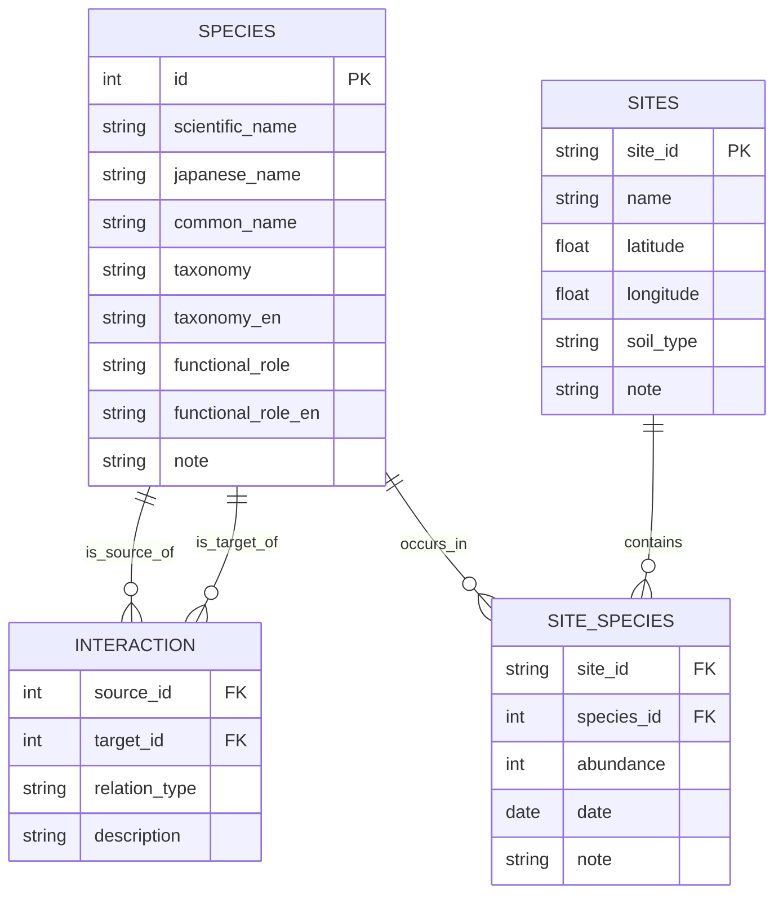

```mermaid
erDiagram

    SPECIES {
        int id PK
        string scientific_name
        string japanese_name
        string common_name
        string taxonomy
        string taxonomy_en
        string functional_role
        string functional_role_en
        string note
    }

    INTERACTION {
        int source_id FK
        int target_id FK
        string relation_type
        string description
    }

    SITE_SPECIES {
        string site_id FK
        int species_id FK
        int abundance
        date date
        string note
    }

    SITES {
        string site_id PK
        string name
        float latitude
        float longitude
        string soil_type
        string note
    }

    SPECIES ||--o{ INTERACTION : is_source_of
    SPECIES ||--o{ INTERACTION : is_target_of
    SPECIES ||--o{ SITE_SPECIES : occurs_in
    SITES ||--o{ SITE_SPECIES : contains
```
