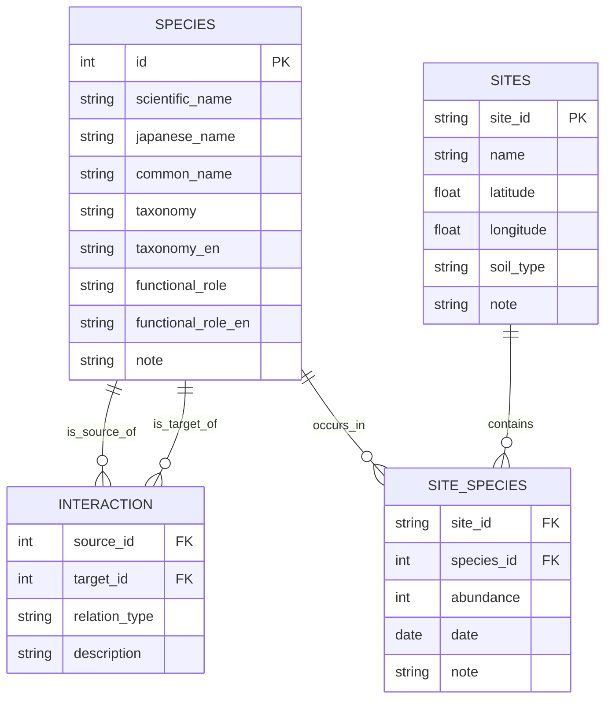

# 🐜 Soil Fauna Network Visualizer｜土壌動物ネットワーク・ビジュアライザー

This project visualizes soil fauna interaction networks as ecological graphs, inspired by the complexity of belowground life.  
As a sister project to the “Fungi Network Visualizer,” it explores how micro- and mesofauna co-create dynamic ecosystems through predation, mutualism, and detritus processing.  
Originally designed as an MVP in the "from-RDB-to-Network" journey, this tool demonstrates how relational ecological data can be transformed into meaningful network structures.  

本プロジェクトは、土壌中の小さな動物たちによる相互作用ネットワークを、生態学的グラフとして可視化します。
「Fungi Network Visualizer（菌糸ネットワーク・ビジュアライザー）」の姉妹プロジェクトとして、捕食・共生・分解などを通じて土壌生態系を形づくる動物たちのネットワークに注目します。
このツールは、「from-RDB-to-Network」ジャーニーの一環として設計されたMVP（最小実装プロトタイプ）であり、リレーショナルデータを意味あるネットワーク構造へと変換する例を提示します。

🧪 Features｜主な機能:

- Species interaction modeling from relational CSV data  
  CSV形式のリレーショナルデータから種間関係をモデリング
- NetworkX-based construction with trophic and ecological roles  
  NetworkXで構築したネットワークに、生態的役割を属性として付与
- White-stroked Japanese labels for full readability  
  日本語ラベルに白フチ（視認性強化）を適用
- Static graph visualization with matplotlib (PNG export ready)  
  matplotlibによる静的グラフ表示（PNG出力対応）
- Ready-to-run Colab notebook and customizable scripts  
  Google Colabでもそのまま動作するノートブック付き
  

[]
(https://colab.research.google.com/github/satoshi-create/complexity-and-network-webdesign/blob/soil-fauna-network/projects/from-rdb-to-network/soil-fauna-network/notebooks/soil-fauna-network_demo_en.ipynb)

> A minimal working example showing how species interaction networks emerge from simple CSV-based relational data.  
> シンプルなCSVベースのリレーショナルデータから、種間ネットワークがどのように立ち現れるかを示す最小動作例です。

---
## 🧩 Data Model / データモデル

Below is the ER diagram of the three core CSVs used to construct the soil fauna interaction network.  
以下は、土壌動物ネットワークを構築するために使用される3つの主要なCSVファイルのER図です：

---

## 📊 Goals｜プロジェクトの目的

- ✅ Visualize species interactions in Japanese using NetworkX  
  ✅ NetworkXを使って、日本語ラベル付きの種間ネットワークを可視化
- ✅ Start from intuitive, editable CSV files for species and relations  
  ✅ わかりやすく編集可能なCSV形式でデータをスタート
- ✅ Highlight ecological roles with color coding and font effects  
  ✅ 生態的な役割に応じた色分けと視認性強化ラベルを実装
- 🛤️ Connect to real site data with `site_species.csv` and `sites.csv`  
  🚂 `site_species.csv`や`sites.csv`を用いた空間拡張にも対応
- 🔁 Encourage extensions with ecological or educational data  
  🔁 教育用途や拡張研究のベースとしても利用可能

> While this MVP is static and small-scale, its structure supports scaling into full RDB-backed networks and interactive visualization environments.  
> このMVPは静的で小規模な可視化にとどまりますが、その構造はRDB連携やインタラクティブ拡張にも対応可能なものになっています。

---

## 🚀 MVP Scope & Steps｜MVPの構成とステップ

| Step | Description (EN)                                                               | 説明（JP）                                                  |
|------|----------------------------------------------------------------------------------|-------------------------------------------------------------|
| 1️⃣   | Load species and interaction data from `species.csv` and `interaction.csv`     | `species.csv`と`interaction.csv`から種と関係のデータを読み込み       |
| 2️⃣   | Construct a directed graph with roles and labels (Japanese names)              | 種の役割と日本語ラベルを属性とした有向グラフを構築                   |
| 3️⃣   | Visualize the network with node colors and white-outlined text                 | ノードの色分けと白フチラベルを用いてネットワークを描画               |
| 4️⃣   | Export to PNG and embed as documentation asset                                 | 出力をPNG画像として保存し、READMEに組み込み                         |
| 5️⃣   | Run and edit the logic in `notebooks/soil-fauna-network-demo-ja.ipynb`         | Colabで編集・実行できるノートブックで再現可能                       |

> 🐛 Soil fauna embody decentralized, adaptive systems. Mapping their interactions reflects not only biodiversity, but a model of collaborative intelligence.  
> 土壌動物たちは、分散的・適応的なシステムを構成しています。その関係性をマップ化することは、生命の多様性だけでなく、協働的知性のモデルを描くことにもつながります。

---

## 📂 Structure｜ディレクトリ構成

- `data/`: CSV files for species, interactions, and site-specific occurrences  
  種情報・関係・出現地点を記録したCSVファイル
- `scripts/`: Python script for visualization and export (static PNG)  
  ネットワーク構築とPNG出力のためのPythonスクリプト
- `notebooks/`: Colab-friendly Jupyter notebook with step-by-step execution  
  Colab対応のJupyterノートブック

## 🧠 Want to take this further?｜さらに発展させるには？

- Add interactivity with PyVis, Plotly, or Streamlit  
  PyVisやPlotly、Streamlitでインタラクティブ化
- Integrate environmental metadata (soil type, moisture, etc.)  
  土壌条件（pH、水分など）との連携
- Combine with fungi-network for cross-kingdom interaction models  
  fungi-networkと組み合わせた菌類×動物ネットワーク
- Build education-friendly views or ecology-based games  
  教育用の可視化、あるいはエコロジカルなミニゲームの素材として応用

## 📌 Data Notes｜データについて

- Species names, roles, and interactions are mock data based on real soil ecology  
  種名・機能的役割・関係性は、実際の土壌生態学に基づいた仮想データです
- Japanese labels are rendered with Meiryo and white stroke for legibility  
  日本語ラベルは Meiryo フォント＋白フチで描画されています

Pull requests, forks, and fungi-fauna mashups welcome! 🌱  
Pull Request・Fork・菌類×動物のMashupなど、どしどし歓迎します！🌱

**Tags:** `#network-thinking` `#soil-fauna` `#complexity` `#ecology` `#from-RDB-to-network` `#mvp`

