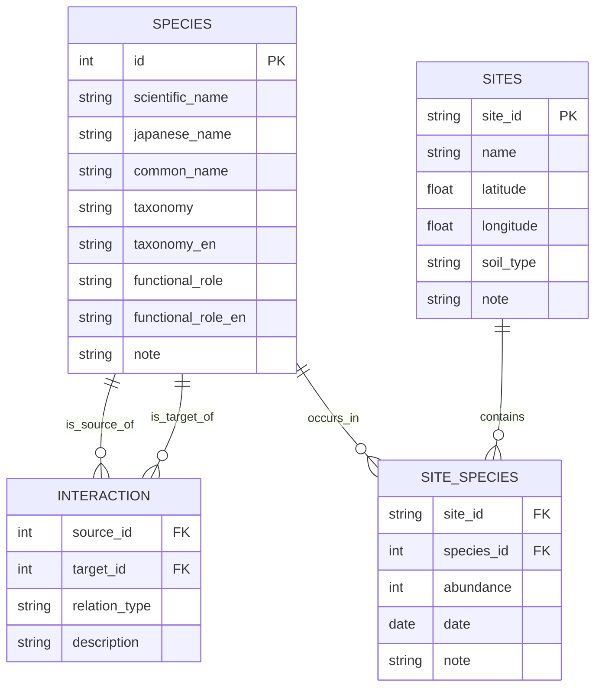

# 🕼 土壌動物ネットワーク・ビジュアライザー

本プロジェクトは、土壌中の小さな動物たちによる相互作用ネットワークを、生態学的グラフとして可視化します。
「Fungi Network Visualizer」の姉妻プロジェクトとして、捕食・共生・分解などを通じて土壌生態系を形づくる動物たちのネットワークに注目します。
このツールは、「from-RDB-to-Network」ジャーニーの一環として設計されたMVPであり、リレーショナルデータを意味あるネットワーク構造へと変換する例を提示します。

📘 他の言語で読む:

- [🇺🇸 English](./README.md)

---

## 🧪 主な機能

* CSV形式のリレーショナルデータから種間関係をモデリング
* NetworkXで構築したネットワークに、生態的役割を属性として付与
* 日本語ラベルに白フチを適用して視認性を強化
* matplotlibによる静的グラフ表示、PNGとして出力可能
* Google Colabでそのまま動作するノートブック付き

> シンプルなCSVデータから、種間の関係ネットワークがどのように現れるかを示すMVPです。

---

## 🤩 データモデル

以下は、土壌動物ネットワークを構築するために使用される3つの主要なCSVファイルのER図です：

---

## 📊 プロジェクトの目的

* ✅ NetworkXを使って、日本語ラベル付きの種間ネットワークを可視化
* ✅ わかりやすく編集可能なCSV形式でデータをスタート
* ✅ 生態的役割に応じた色分けと視認性強化ラベルを実装
* 🛤️ `site_species.csv`や`sites.csv`を用いた空間拡張にも対応
* 🔁 教育用途や拡張研究のベースとしても利用可能

> このMVPは静的で小規模な可視化にとどまりますが、その構造はRDB連携やインタラクティブ拡張にも対応可能なものになっています。

---

## 🚀 MVPの構成とステップ

| Step | 説明 (日本語)                                       |
| ---- | ---------------------------------------------- |
| 1️⃣  | `species.csv`と`interaction.csv`から種と関係のデータを読み込む |
| 2️⃣  | 種の役割と日本語ラベルを属性とした有向グラフを構築                      |
| 3️⃣  | ノードの色分けと白フチラベルを用いてネットワークを描画                    |
| 4️⃣  | PNG画像として保存し、READMEに組み込み                        |
| 5️⃣  | Colabで編集・実行できるノートブックで再現可能                      |

> 🐛 土壌動物たちは、分散的・適応的なシステムを構成しています。その関係性をマップ化することは、多様性だけでなく、協働的知性のモデルを描くことにもつながります。

---

## 📂 ディレクトリ構成

* `data/`: 種情報・関係・出現地点を記録したCSVファイル
* `scripts/`: ネットワーク構築とPNG出力のためのPythonスクリプト
* `notebooks/`: Colab対応のJupyterノートブック

---

## 🧠 さらに発展させるには

| 🥇 難易度 | 🌐 テーマ                    | 🛠️ Pythonツール例                                           | 🔧 具体的にできること                                                  | 💡 可視化・分析による期待効果                                           |
|-----------|--------------------------|------------------------------------------------------------|----------------------------------------------------------------------|----------------------------------------------------------------------|
| 🟢 低     | **基本可視化**            | `matplotlib`, `networkx.draw`                              | - ネットワークの静的グラフ表示 - ノード・エッジの属性で色分け         | ネットワーク構造の直感的な把握 観察記録の関係性を俯瞰する            |
| 🔵 中     | **データビジュアライゼーション**  | `plotly`, `folium`, `geopandas`                            | - インタラクティブなネットワーク可視化 - 地図上に観察地点をマッピング   | 空間的分布の把握 関係性と環境条件の視覚的リンクを確認できる          |
| 🔵 中     | **ネットワーク解析**       | `networkx`, `community`, `igraph`                          | - ノード中心性・コミュニティ検出 - モジュラリティ・連結性の分析         | ネットワーク内のキー種・グループを特定 複雑な生態系の理解を深化        |
| 🔵 中     | **空間解析**              | `pysal`, `scipy.spatial`                                   | - 空間自己相関（Moran’s I） - 空間的なクラスタリング                   | 種の多様性ホットスポットや分布パターンの検出 保全や管理への知見          |
| 🔴 高     | **多層ネットワーク**        | `networkx.MultiGraph`, `multinetx`, `igraph`               | - 菌糸ネットワークとの重ね合わせ - 複数層ネットワークの比較・統合       | 土壌動物と菌糸など異種ネットワークの関係性可視化 複雑系ネットワークとしての理解 |
| 🔴 高     | **動的ネットワーク解析**    | `matplotlib.animation`, `plotly`, `tulip`                  | - 季節変動や時間変化のネットワーク可視化 - 動的中心性など指標の算出     | 環境変動への応答や種間関係の時間的変化を把握 生態系動態モデルの構築       |
| 🔴 高     | **環境データとの予測分析**   | `scikit-learn`, `xgboost`, `lightgbm`, `pandas`            | - 土壌動物分布の機械学習モデル化 - 環境因子との相関・予測               | 環境条件から土壌動物ネットワークを予測 保全や環境適応シナリオへの応用    |

---

## 📌 データについて

* 種名、機能的役割、関係性は、実際の土壌生態学に基づいた仮想データです
* 日本語ラベルは Meiryo フォント＋白フチで描画されています

Pull Request・Fork・菌類×動物のMashupなど、どしどし歓迎します！🌱

**Tags:** `#network-thinking` `#soil-fauna` `#complexity` `#ecology` `#from-RDB-to-network` `#mvp`
