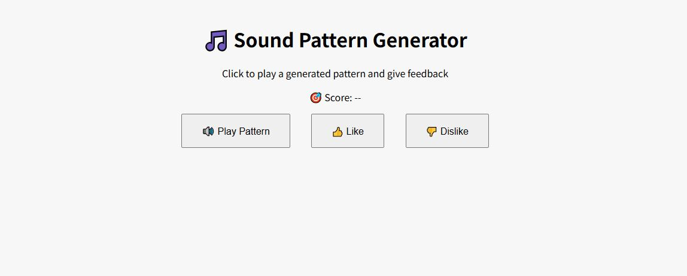

# 🎼 Sound Pattern Generator

An interactive experiment to generate simple musical patterns and learn user preferences using TensorFlow.js.  
This project is part of the [CANW](https://github.com/satoshi-create/complexity-and-network-webdesign) ecosystem — exploring emergent web design through complexity and networks.

---

## 🎯 Goals

- ✅ Generate and play simple 5-note patterns in the browser
- ✅ Collect real-time feedback from the user (Like/Dislike)
- ✅ Learn personal preferences with a lightweight neural network
- ✅ Visualize preference score in real-time

---

## 🛠️ Technologies

- [Tone.js](https://tonejs.github.io/) — Web Audio API wrapper for music synthesis
- [TensorFlow.js](https://www.tensorflow.org/js) — Neural network for user preference learning
- Plain HTML / JS — No framework needed, easy to extend

---

## 🚀 MVP Steps

| Step | Description |
|------|-------------|
| 1️⃣ | Generate a random 5-note sequence from a predefined scale |
| 2️⃣ | Play the pattern with Tone.js |
| 3️⃣ | Allow the user to rate the pattern (👍 Like / 👎 Dislike) |
| 4️⃣ | Train a small neural network (`tf.sequential`) with feedback |
| 5️⃣ | Predict preference for the next pattern and display the score |

> All this is done in the browser, with no backend required!

---

## 📸 Screenshot

---

## 🔮 Next Ideas

- 🎵 Generate patterns with higher predicted preference
- 📊 Visualize learning over time (e.g. graph of predicted scores)
- 🌸 Collaborate with [Haiku Classifier](../haiku-classifier) to create poetic soundscapes
- 🧬 Try genetic algorithm or evolutionary selection of patterns

---

## 🌐 Part of the CANW Ecosystem

This project lives under the [`tensorflowjs-playground`](../README.md) directory of  
[📡 CANW — Complexity and Network Web Design](https://github.com/satoshi-create/complexity-and-network-webdesign).

> “Sound emerges from structure and choice — just like ideas.”

---

## 🤝 Contributions Welcome

- Try it out, share feedback
- Propose new pattern generation methods
- Fork and remix it with your own musical logic!

